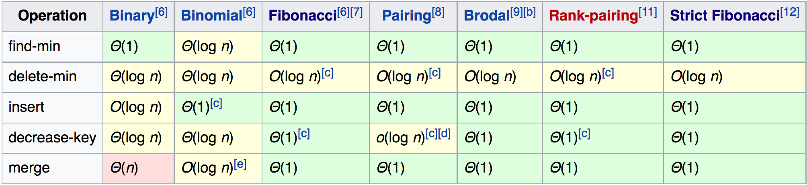

# 使用 C++ 实现 Binary Heap

作为一个曾经的 ACM 选手，不会写堆是一种“难以启齿的柔弱”……毕竟 C++ 的优先队列（[priority_queue](http://en.cppreference.com/w/cpp/container/priority_queue)）封装的很好呀。为了实习面试，学习一下堆的相关算法。

如下图所示，这是一个最大堆（[Max Heap](https://en.wikipedia.org/wiki/Heap_(data_structure))）。

```VUE
<template>
  <binary-tree :info="info"></binary-tree>
</template>

<script>
  export default {
    data() {
      return {
        info: [[[2], 12, [8]], 15, [[4], 7]]
      }
    }
  }
</script>
```

最大堆要求父节点的值要比子节点的值要大，并且在插入和删除的过程中始终保持这样的关系。作为树的根节点，其值比所有的子节点的值要大。而最小堆与之相反。下面详细介绍操作堆的基本步骤。

### 插入过程

在插入的过程中，首先将要插入的节点放置在最下方的叶子位置，再调整该位置直至堆满足条件。

```VUE
<template>
  <binary-tree :info="info"></binary-tree>
</template>

<script>
  const s = {
    value: 13,
    types: ['green']
  };
  
  export default {
    data() {
      return {
        info: [[[2], 12, [8]], 15, [[4], 7, [s]]]
      }
    }
  }
</script>
```

如上图所示。当 13 处于叶子位置时，其父节点 $7 < 13$，故而不符合条件，需要调整 13 和 7 的位置。交换这两个节点：

```VUE
<template>
  <binary-tree :info="info"></binary-tree>
</template>

<script>
  const s = {
    value: 13,
    types: ['green']
  };
  const w = {
    value: 7,
    types: ['blue']
  };
  
  export default {
    data() {
      return {
        info: [[[2], 12, [8]], 15, [[4], s, [w]]]
      }
    }
  }
</script>
```

因为 7 为父节点时，堆是符合条件的，因此 7 所有的子节点的值 $v$ 都满足 $v \le 7$，换为 13 后仍然符合条件。交换后，13 小于其父节点 15 的值，进而无需交换，此时堆保持合法。

最复杂的情况下（插入一个最大值），插入操作需要进行 $h$ 次交换操作，$h$ 为树的高度。二叉堆中树的高度为 $\log n$，$n$ 为堆中元素数目。进而插入操作的复杂度为 $O(\log n)$。

### 删除过程

```VUE
<template>
  <binary-tree :info="info"></binary-tree>
</template>

<script>
  const d = {
    value: 15,
    types: ['red']
  };
  export default {
    data() {
      return {
        info: [[[2], 12, [8]], d, [[4], 13, [7]]]
      }
    }
  }
</script>
```

如上图所示，现在将最大值 15 删除。删除 15 后，我们依旧需要保持堆的属性。所以选择一个叶子节点，将其移动到树的根位置：

```VUE
<template>
  <binary-tree :info="info"></binary-tree>
</template>

<script>
  const s = {
    value: 7,
    types: ['green']
  };
  export default {
    data() {
      return {
        info: [[[2], 12, [8]], s, [[4], 13]]
      }
    }
  }
</script>
```

为了继续保持该堆，需要对 7 的位置进行调整。$7 < 12$ 且 $7 < 13$，这里会选择一个能让大小关系继续保持的节点与 7 进行交换，也就是 13。交换完成后：

```VUE
<template>
  <binary-tree :info="info"></binary-tree>
</template>

<script>
  const s = {
    value: 7,
    types: ['green']
  };
  const w = {
    value: 13,
    types: ['blue']
  }
  
  export default {
    data() {
      return {
        info: [[[2], 12, [8]], w, [[4], s]]
      }
    }
  }
</script>
```

此时 7 所处的位置，子节点只有 4，且 $4 < 7$，进而操作完毕。

同样地，删除操作的复杂度也是 $O(\log n)$。

### 建堆过程

最简单的建堆方法。直接从一个空的堆开始，一个一个插入即可。每次插入的复杂度为 $\log n$。当然，$n$ 是逐渐增加的。整体复杂度为 $O(n \log n)$，$n$ 为堆的大小。

当然，这不是最好的方法。可以参看 C++ STL 的源代码中 make_queue 函数的源代码，复杂度可以做到 $O(n)$。

依然用上面的数据举例，首先将数据放置到堆的各个位置中：

```VUE
<template>
  <binary-tree :info="info"></binary-tree>
</template>

<script>
  export default {
    data() {
      return {
        info: [[[12], 2, [15]], 8, [[7], 4, [13]]]
      }
    }
  }
</script>
```

现在需要用最快的方法将堆维护到合法状态。这里使用的算法是：

1. 选择一个节点，该节点的子节点均为合法的堆；
2. 执行该节点的 maintain 操作，类似于删除根节点后的维护过程；
3. 重复第 1 步，直至所有的节点均为合法的堆。

对于选择需要维护且可以维护的节点，最简单的方法是通过深度去选择，优先选择深度大的节点，例如叶子节点。叶子节点均合法，故而实际操作中最先选择的是最深的叶子节点的父节点，例如下图：

```VUE
<template>
  <binary-tree :info="info"></binary-tree>
</template>

<script>
  const s = {
    value: 4,
    types: ['green']
  };
  export default {
    data() {
      return {
        info: [[[12], 2, [15]], 8, [[7], s, [13]]]
      }
    }
  }
</script>
```

该节点值为 4，其子节点为两个叶子节点，值分别为 7 和 9。$4 \lt 7 \lt 13$，故而 4 与  13交换：

```VUE
<template>
  <binary-tree :info="info"></binary-tree>
</template>

<script>
  const s = {
    value: 4,
    types: ['green']
  };
  const w = {
    value: 13,
    types: ['blue']
  };
  export default {
    data() {
      return {
        info: [[[12], 2, [15]], 8, [[7], w, [s]]]
      }
    }
  }
</script>
```

同样地，对左边的 2 节点进行操作，交换 2 和 15：

```VUE
<template>
  <binary-tree :info="info"></binary-tree>
</template>

<script>
  const s = {
    value: 2,
    types: ['green']
  };
  const w = {
    value: 15,
    types: ['blue']
  };
  export default {
    data() {
      return {
        info: [[[12], w, [s]], 8, [[7], 13, [4]]]
      }
    }
  }
</script>
```

最后，对根节点进行维护，交换 8 和 15；

```VUE
<template>
  <binary-tree :info="info"></binary-tree>
</template>

<script>
  const s = {
    value: 8,
    types: ['green']
  };
  const w = {
    value: 15,
    types: ['blue']
  };
  export default {
    data() {
      return {
        info: [[[12], s, [2]], w, [[7], 13, [4]]]
      }
    }
  }
</script>
```

继续比较 8、12 和 2，进而交换 8 和 12：

```VUE
<template>
  <binary-tree :info="info"></binary-tree>
</template>

<script>
  const s = {
    value: 8,
    types: ['green']
  };
  const w = {
    value: 12,
    types: ['blue']
  };
  export default {
    data() {
      return {
        info: [[[s], w, [2]], 15, [[7], 13, [4]]]
      }
    }
  }
</script>
```

至此整个堆的维护操作完毕，建堆完成。

分析复杂度。直观来看，进行了 $n / 2$ 次的维护操作，每次操作是 $\log$ 级别的复杂度，那么整体复杂度还是 $O(\log n)$？

这个问题 [StackOverflow 上还有相关讨论](http://stackoverflow.com/questions/6299859/how-can-stdmake-heap-be-implemented-while-making-at-most-3n-comparisons)，可以看看。仔细分析，每一次调整堆的大小也是不同的。最开始调整的堆的高度只有 1（叶子节点），这样的堆有 $n/2$ 个；再来就是高度为 2 的堆，有 $n/4$ 个；重复该过程。最后计算渐进复杂度：

$$
1 \times \frac{n}{2} + 2 \times \frac{n}{4} + \cdots + k \times \frac {n}{2^k} = n\sum_{k=0}^{\lceil \log(n)\rceil} {\frac{k}{2^k}}
$$

后面这个式子，求极限的值为 2，可以参看 StackOverflow 上提到的推导过程，这里不详述了。最后的结论就是，建堆的复杂度为 $O(n)$。

### 代码实现

具体实现过程中，对于树的表示，直接使用 vector。vecotr[0] 为根节点，vector[1]、vector[2] 为其两个子节点，以此类推。这样做的好处是，计算父节点、寻找子节点都足够快，vector 中实现交换、查找第一个元素、弹出最后一个元素的复杂度都是 1，支持动态增长，非常适合用来实现堆。代码如下：

```c++
#ifndef HEAP
#define HEAP
#include <iostream>
using namespace std;

template<typename T>
class Heap {
  private:
    vector<T> vec;

    inline int parent(int x) {
        return (x - 1) / 2;
    }

    inline int left(int x) {
        return x * 2 + 1;
    }

    inline int right(int x) {
        return x * 2 + 2;
    }

    void heapify_up(int idx) {
        int p = parent(idx);
        if (idx && vec[p] < vec[idx]) {
            swap(vec[p], vec[idx]);
            heapify_up(p);
        }
    }

    void heapify_down(int idx) {
        int l = left(idx), r = right(idx);
        int largest = idx;

        if (l < size() && vec[l] > vec[idx]) {
            largest = l;
        }

        if (r < size() && vec[r] > vec[largest]) {
            largest = r;
        }

        if (largest != idx) {
            swap(vec[largest], vec[idx]);
            heapify_down(largest);
        }
    }

  public:
    Heap() {}
    Heap(vector<T> vec): vec(vec) { maintain(); }

    int size() {
        return vec.size();
    }

    T top() {
        return vec[0];
    }

    T pop() {
        T ret = top();

        vec[0] = vec.back();
        vec.pop_back();
        heapify_down(0);

        return ret;
    }

    void push(T val) {
        vec.push_back(val);
        heapify_up(vec.size() - 1);
    }

    void maintain() {
        for (int i = parent(size()); i >=0; -- i) {
            heapify_down(i);
        }
    }
};

#endif
```

### 展望

堆的实现也有很多种，[Wikipedia 上有详细的介绍](https://en.wikipedia.org/wiki/Heap_(data_structure))。这里也有一张各种堆实现的复杂度对比（图片来自 Wikipedia，版权归其所有）：



基础数据结构很多人做，而且做了很多年了，同时是越来越不好研究出新东西了。当然，如果量子计算机大规模铺开，应该会带来算法和数据结构的很多新可能。
