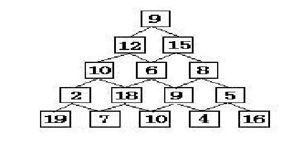

# 泛化的动态规划

[动态规划（Dynamic Programming）][DP]，业界简称 [DP][]，是一种解决最优问题的思想，并非特指某个算法。而由 [DP][] 思想泛化出来的算法，就解决了很多很多日常生活中的问题，比如最优化分配，比如导航，比如 `git diff` 命令。

[动态规划][DP]的一个明显的特征是，当前的问题可以被分解为若干个子问题 ，子问题是较易求解的，且求解的最优值于原问题无影响（[无后效性][]）；子问题求解完毕后，可以比较容易地通过子问题的解推导原问题的解。下面依次介绍一些题目阐述该理论。

## 一、经典题

### 1.1 [数塔][number_tower]

印象中我做的第一道 [DP][] 题，经典中的经典（堪比 [Max Sum][max_sum]）。题目描述：给定如下所示的层高为 $h$ 的数塔。要求从顶层走到底层，若每一步只能走到相邻的结点，则经过的结点的数字之和最大是多少？

观察数塔的结构。从上往下看，每一个节点，每次可以选择往左下走或者右下走。原问题为从顶层走到底层，经过的节点的数字之和最大是多少。换句话说，需要求得从走到底层后，每个节点上能达到的最大和是多少，再求出这些节点上最大和的最大值。

原问题有了，而这个原问题又可以分解为走到任意节点上能达到的最大和是多少。这里定义，$val[i][j]$ 和 $sum[i][j]$ 分别表示第 $i$ 层、第 $j$ 个节点上的值和达到该节点时的最大和，定义最高的节点的层数为 $0$，定义每层第一个节点的序号为 $0$。显然：
$$
sum[0][0] = val[0][0]
$$
而对于 $0 \lt i$ 且 $0 \lt j \lt i$：
$$
sum[i][j] = val[i][j] + \max(sum[i-1][j - 1], sum[i-1][j])
$$
对于 $0 \lt i$ 且 $j == 0$：
$$
sum[i][j] = val[i][j] + sum[i-1][j]
$$
对于 $0 \lt i$ 且 $j == i$：
$$
sum[i][j] = val[i][j] + sum[i - 1][j - 1]
$$
最后的结果：
$$
answer = \max (sum[h-1][j]), 0 \le j \lt h
$$
子问题是求解 $sum[i][j]$ 的值，而 $sum[i][j]$ 的值可以比较容易地从 $sum[i-1][j-1]$ 和 $sum[i-1][j]$ 的值推导得出。最后按照顺序求解 $sum[i][j]$ 的值，整体复杂度为 $O(h^2)$。按照这个思路编码就可以了。

注意子问题的求解，无论 $sum[i][j]$ 选择从 $sum[i-1][j-1]$ 走过来，还是 $sum[i-1][j]$ 走过来，对后面其他子问题的求解没有任何影响，这也就是[无后效性][]。

等大家先过了这道题……

大家都可以看到，上面阐述的解决子问题的过程中掺杂了很多边界的判断，这并不优雅。能不能通过某种方式规避呢？程序上规避的方法比较简单的是，将空缺的左上角和右上角填充为最小值，然而这还是不够优雅。

这里就可以提出另一个重要的结论了：子问题的定义影响整个问题的求解过程和求解复杂度。现在将子问题重新定义，定义 $sum[i][j]$ 为从底层走上来，走到 $i$ 行 $j$ 节点经过的最大和。则当 $i == h - 1$：
$$
sum[i][j] = val[i][j]
$$
当 $0 \le i \lt h - 1$：
$$
sum[i][j] = val[i][j] + \max (sum[i + 1][j], sum[i + 1][j + 1])
$$
最终答案就是 $sum[0][0]$。

与此类似的问题还有：[下沙的沙子有几粒？][number_of_sand]，[免费馅饼][free_pie]。

### 1.2 方格取数系列

先上简单版的。给定一个正整数数组 $arr$，数组长度为 $n$。现在需要从该数组中取出一些数，使得这些数的和最大。要求取 $arr[i]$ 时，不可以同时取 $arr[i - 1]$ 和 $arr[i + 1]$。

例如，$arr = [1, 2, 1, 1, 1, 2, 7, 6]$，可以尝试手动找一找。

再思考，如何将其分解为容易求解的子问题，子问题是否可以[无后效性][]。

如果说纠结的地方，这里最让我们纠结的是，选择了一个数字后，它后面的一个数字就不可选了。这是有后效性呀。

为了解决这个矛盾，用力过猛的方案是，将子问题定义为求取某些数的状态下得到的值。说的清楚点，就是 DFS。例如定义数组 $select$ 记录取数的状态。$select[i]$ 表示选择第 $i$ 个数，$select = [0, 1, 0, 1, 0, 1, 0, 1]$ 表示选择偶数位上的 2、1、2 和 6。状态转移就类似：
$$
[x, x, x, 0] \rightarrow [x, x, x, 0, 1]
$$

$$
[x, x, x, x] \rightarrow [x, x, x, x, 0]
$$

这里的 $x$ 表示任意值。按照如上的状态转移，从所有合法的状态中，找出可以继续取数的状态，取数或不取数后增加一个状态，继续。使用 DFS + 回溯，状态用一个数组就可以保存了，很完美的样子，除了复杂度高达 $O(2^n)$。

仔细观察状态转移的式子。当打算取 $arr[4]$ 时，其实并不关心前三个数是否取过的状态。进而，前面的状态使可以**合并**的（状态压缩）。使用 $(length, end)$ 表示当前的状态，$length$ 表示当前的长度，$end$ 表示当前长度下最后一个数是否取用。那么 $[x, x, x, 0]$ 可以表示为 $(4, 0)$，$[x, x, x, x, 1]$ 可以表示为 $(5, 1)$。上述的状态转移可以改写为：
$$
(4, 0) \rightarrow (5, 1)
$$

$$
(4, 0) \rightarrow (5, 0)
$$

$$
(4, 1) \rightarrow (5, 0)
$$

这样问题就很清晰了。代码中使用 $sum[i][j]$ 表示状态 $(i, j)$，则有：
$$
sum[i][0] = \max (sum[i-1][0], sum[i-1][1])
$$

$$
sum[i][1] = arr[i] + sum[i-1][0]
$$

注意边界条件，最终答案即为 $\max (sum[n-1][0], sum[n-1][1])$。复杂度为 $O(n)$。

好，想想是否可以换种方式定义子问题。

定义子问题为从起点开始，选择到第 $i$ 个数为止，且必选第 $i$ 个数得到的最大和为 $sum[i]$。则有：
$$
sum[i] = arr[i] + \max(sum[j]), 0 \le j \le i-2
$$
最终答案为  $\max(sum[i]), 0 \le i \lt n$。对于 $\max(sum[j])$ 可以使用一个变量记录，边计算边更新。最终复杂度也是 $O(n)$。

持续纠结于后效性问题的可以换个思路，从后一个数字选不选的问题开始考虑。如果我打算要后一个数字，那么前一个数字一定不能要；如果我不要后一个数字，那么前一个数字要不要都可以，选择和值较大的就好。

子问题，或者说子状态的定义，需要尽可能的规避后效性。思路上，并不是选择了当前的数字后一个数字就不可取，而是我打算选择当前数字的时候，我要从前一个数字不取的情况下转移过来。

>  并不是没钱就不能买房，而是想买房的时候你需要有钱……

然后选择带来的后效性影响范围可能超出想象。升级上面的问题，如果在大小为 $n\times n$ 矩阵 $mat$ 里取数，取某个位置的数后，其上下左右位置不可取，求最终取的数的最大和（[方格取数(1)][select_in_square_1]）。

|  2   |  4   |  2   |  1   |
| :--: | :--: | :--: | :--: |
|  8   |  3   |  4   |  5   |
|  8   |  1   |  7   |  2   |
|  4   |  9   |  2   |  4   |

子问题如何定义？子状态如何设计？

如果按照从上至下、从左至右的顺序进行选数，最暴力的思想是记录每个数是否已经选择过了，然后对当前的 $mat[i][j]$，选或者不选，更新状态并继续往下搜索。遇到的每个数都会有两种选择，为了使得状态无后效性而充分的记录当前矩阵整体取数的状态，整体复杂度为 $O(2^{n^2})$。还是 DFS。

无法接受的复杂度。不过幸好这里还是可以合并状态的。每次状态转移时需要关注的是否取数的格子也就只有 $mat[i][k], 0 \le k \lt j$ 和 $mat[i-1][k], j \le k \lt n$。每次转移的状态数至多为 $2^n$，转移一共有 $n^2$ 次，进而复杂度为 $O(n^2 2^n)$。

这一类问题，也就是著名的[轮廓线 DP 问题][]。总结起来，一是尽力地规避后效性，二是极力地压缩当前的状态。

类似的问题还有：[炮兵阵地][]， [Pebbles][]。

### 1.3 背包问题系列

（等填坑）

### 二、不像 [DP][] 的题

### 2.1 最短路

给定一幅图 $G$，顶点集为 $N$，边集为 $E$，每条边有长度。现在图中选择两个顶点 $A$ 和 $B$，求 $A$ 和 $B$ 之间的最短路。

定义 $dis[X]$ 为 $A$ 到 $X$ 的最短路，那么原问题即为求 $dis[B]$。该问题可以分解为数个子问题，即求 $dis[X], X \in N$。而对应的状态转移为：
$$
dis[Y] = \min(dis[X] + length(X\rightarrow Y)), (X \rightarrow Y) \in E
$$
而其中包含的一个小技巧是，题目所求的是最短路，可以通过已经确定了的 $dis[X]$ 推导暂时不确定的 $dis[Y]$。为了保证解的确定性，所以用上优先队列，从优先队列中弹出的点一定是确定了 $dis[X]$ 的点。

增加难度，如果这样的最短路带有其他约束呢？例如路可能是马路，也可能是铁路，现在允许走的铁路数上限为 $K$。那么可以定义 $dis[X][k]$ 为 $A$ 到 $X$ 且经过 $k$ 条铁路的最短路，原问题即为求 $\max(dis[B][k]), 0 \le k \le K$。对应的状态转移为：
$$
dis[Y][k+1] = \min(dis[X] + length(X \rightarrow Y)), (X\rightarrow Y) \in RailRoad
$$

$$
dis[Y][k] = \min(dis[X] + length(X \rightarrow Y)), (X\rightarrow Y) \in Road
$$

再增加一点难度，现在要降低预算，拆除 $A$ 到其他点的部分铁路段，要求拆除铁路后，$A$ 到任意点的最短距离不变。问最多可以拆掉多少条铁路。（题目源自 [CodeForces 449B][]）

那么原问题又发生了变化。可以定义 $dis[X][R]$ 为 $A$ 到 $X$ 的最短距离，$R == 0$ 表示不经过马路，$R==1$ 表示经过马路。如果 $dis[X][1] >= dis[X][0]$，说明这段的铁路可以拆掉了，因为我可以通过走马路以相同或者更少的距离到达 $X$。状态转移还是类似的，提供一份[样例代码][sample_code_1]。

多约束的最优值问题，一般都是在原有问题的基础上增加记录约束的维度。增加维度也就意味着状态的倍增，进而产生复杂度的增加。理想状态下自然是不增加维度最好不过了。上面的问题中，问题使得不走铁路走马路更受欢迎，进而可以直接将马路在你心里变得短一点点，比如减去 $10^{-6}$。这样求最短路的过程中，总是会优先选择马路。最后将最短距离小于铁路距离的所有铁路删除即可。

（未完待续。。。）

[DP]: https://en.wikipedia.org/wiki/Dynamic_programming	"DP"
[无后效性]: https://www.zhihu.com/question/43361359	"无后效性"
[max_sum]: http://acm.hdu.edu.cn/showproblem.php?pid=1003	"Max Sum"
[number_tower]: http://acm.hdu.edu.cn/showproblem.php?pid=2084	"数塔"
[number_of_sand]: http://acm.hdu.edu.cn/showproblem.php?pid=1267	"下沙的沙子有几粒？"
[free_pie]: http://acm.hdu.edu.cn/showproblem.php?pid=1176	"免费馅饼"
[select_in_square_1]: http://acm.hdu.edu.cn/showproblem.php?pid=1565	"方格取数(1)"
[轮廓线 DP 问题]: http://files.cnblogs.com/files/unber/%E5%9F%BA%E4%BA%8E%E8%BF%9E%E9%80%9A%E6%80%A7%E7%8A%B6%E6%80%81%E5%8E%8B%E7%BC%A9%E7%9A%84%E5%8A%A8%E6%80%81%E8%A7%84%E5%88%92%E9%97%AE%E9%A2%98_Cdq.ppt
[Pebbles]: http://acm.hdu.edu.cn/showproblem.php?pid=2167
[炮兵阵地]: http://poj.org/problem?id=1185
[CodeForces 449B]: http://codeforces.com/contest/449/problem/B
[sample_code_1]: https://gist.github.com/SF-Zhou/3794e442c0c728ebaded398f3c8bf3f6

