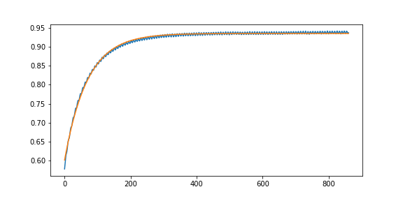

# 指数函数 Exp 的拟合

最近遇到一个有趣的问题。已知函数形如：
$$
y = m\exp(\alpha x) + b
$$
并给定多组 $(x, y)$ 的采样值，求参数 $(\alpha, m, b)$。

下面是一组 `demo` 数据：

```python
y = [0.07083, 0.07015, 0.06852, 0.35591, 0.57764, 0.58666, 0.59715, 0.6065, 0.6126, 0.61695, 0.61948, 0.62376, 0.62977, 0.63797, 0.64594, 0.65188, 0.65451, 0.65714, 0.65849, 0.66306, 0.66962, 0.67725, 0.68327, 0.68699, 0.68809, 0.6895, 0.69227, 0.69728, 0.70394, 0.70924, 0.71304, 0.71446, 0.71495, 0.7166, 0.72043, 0.7261, 0.73139, 0.73602, 0.7383, 0.7368, 0.73853, 0.74128, 0.74678, 0.75281, 0.75639, 0.75887, 0.75842, 0.75842, 0.75995, 0.76348, 0.76935, 0.77311, 0.7765, 0.7763, 0.77566, 0.7767, 0.77916, 0.78417, 0.78911, 0.79204, 0.79304, 0.79181, 0.79093, 0.79432, 0.79777, 0.80238, 0.80581, 0.80739, 0.80619, 0.80528, 0.80657, 0.80848, 0.8135, 0.81761, 0.81917, 0.81895, 0.81732, 0.81723, 0.81964, 0.82344, 0.82792, 0.83053, 0.83041, 0.82964, 0.82803, 0.82992, 0.83272, 0.83768, 0.8396, 0.8407, 0.83974, 0.83855, 0.83839, 0.8414, 0.84429, 0.84849, 0.84998, 0.84857, 0.84769, 0.84662, 0.84824, 0.85257, 0.85554, 0.85841, 0.85727, 0.85562, 0.85475, 0.85546, 0.85856, 0.86197, 0.86494, 0.86492, 0.86345, 0.8618, 0.86155, 0.86396, 0.86848, 0.87133, 0.87283, 0.87083, 0.86858, 0.86889, 0.86958, 0.87263, 0.87647, 0.87817, 0.87735, 0.87587, 0.87419, 0.87453, 0.87663, 0.88047, 0.88334, 0.88339, 0.88129, 0.87941, 0.87945, 0.88088, 0.88473, 0.88777, 0.88832, 0.8875, 0.88478, 0.88404, 0.8854, 0.88744, 0.89135, 0.89292, 0.89211, 0.88996, 0.88803, 0.88904, 0.89065, 0.8946, 0.89652, 0.89661, 0.89553, 0.89253, 0.8919, 0.89379, 0.89697, 0.90014, 0.90062, 0.89917, 0.89682, 0.89554, 0.89646, 0.89894, 0.90237, 0.90415, 0.90381, 0.90108, 0.8989, 0.89972, 0.90181, 0.90407, 0.90739, 0.90649, 0.90473, 0.90255, 0.90146, 0.90357, 0.90677, 0.90937, 0.90992, 0.90866, 0.90579, 0.90441, 0.90493, 0.90759, 0.91087, 0.91286, 0.91062, 0.9086, 0.90741, 0.90693, 0.90894, 0.91238, 0.91349, 0.91489, 0.91234, 0.90946, 0.90889, 0.91045, 0.91314, 0.91547, 0.91711, 0.91556, 0.9116, 0.91136, 0.91144, 0.91474, 0.9174, 0.91788, 0.9174, 0.91492, 0.9131, 0.91293, 0.91422, 0.91811, 0.91991, 0.91992, 0.91745, 0.91505, 0.91447, 0.91594, 0.91798, 0.92102, 0.92147, 0.92033, 0.91686, 0.91557, 0.91668, 0.9187, 0.9223, 0.92373, 0.92231, 0.92007, 0.91697, 0.9171, 0.91897, 0.92247, 0.92428, 0.92399, 0.92202, 0.91914, 0.91791, 0.92026, 0.9224, 0.92498, 0.92561, 0.92383, 0.9215, 0.91878, 0.91974, 0.92275, 0.92503, 0.92726, 0.92594, 0.9231, 0.92064, 0.92001, 0.92234, 0.92585, 0.92789, 0.92739, 0.92474, 0.92268, 0.92067, 0.92218, 0.9255, 0.92756, 0.92912, 0.92668, 0.92392, 0.92293, 0.92187, 0.92554, 0.92871, 0.92944, 0.92861, 0.92564, 0.92356, 0.92254, 0.92535, 0.92817, 0.93001, 0.93022, 0.92808, 0.92485, 0.92375, 0.92431, 0.92775, 0.93006, 0.93119, 0.93023, 0.92629, 0.92468, 0.92519, 0.92732, 0.93081, 0.93183, 0.93074, 0.92795, 0.9257, 0.925, 0.92692, 0.92984, 0.93255, 0.93115, 0.92977, 0.92647, 0.92543, 0.92693, 0.92935, 0.93263, 0.93344, 0.93063, 0.92921, 0.92643, 0.92691, 0.92911, 0.93187, 0.93358, 0.93203, 0.93012, 0.92717, 0.9261, 0.92871, 0.93094, 0.93442, 0.93335, 0.93112, 0.92889, 0.92639, 0.92751, 0.93023, 0.93303, 0.934, 0.93253, 0.92966, 0.92689, 0.92751, 0.93047, 0.93303, 0.93482, 0.93343, 0.93079, 0.92838, 0.92764, 0.93019, 0.93251, 0.93511, 0.93484, 0.93222, 0.93035, 0.92863, 0.92903, 0.93182, 0.93475, 0.93528, 0.93351, 0.93089, 0.92903, 0.92844, 0.93143, 0.93436, 0.93624, 0.93535, 0.93207, 0.92956, 0.92942, 0.9309, 0.93476, 0.93563, 0.93587, 0.93343, 0.93039, 0.92922, 0.92991, 0.93273, 0.93577, 0.93633, 0.93495, 0.93124, 0.92953, 0.9297, 0.93157, 0.9351, 0.93636, 0.935, 0.933, 0.92997, 0.93002, 0.93121, 0.93412, 0.93719, 0.93605, 0.93423, 0.9314, 0.92948, 0.93031, 0.93377, 0.93694, 0.93655, 0.93518, 0.93297, 0.93001, 0.93075, 0.93262, 0.93492, 0.93812, 0.93647, 0.93324, 0.93165, 0.93033, 0.93146, 0.93579, 0.9371, 0.93695, 0.93471, 0.93186, 0.93016, 0.93199, 0.93454, 0.93617, 0.93793, 0.93631, 0.93289, 0.93116, 0.93086, 0.9336, 0.93627, 0.93766, 0.93745, 0.93473, 0.93196, 0.93147, 0.93285, 0.93609, 0.93783, 0.93756, 0.9351, 0.93301, 0.93132, 0.93139, 0.93505, 0.93711, 0.93801, 0.93679, 0.93324, 0.93158, 0.93137, 0.93353, 0.93749, 0.93829, 0.9375, 0.93539, 0.93223, 0.93199, 0.93334, 0.9361, 0.93834, 0.93826, 0.9364, 0.93374, 0.93171, 0.93279, 0.93485, 0.93855, 0.93864, 0.93743, 0.93469, 0.93192, 0.93246, 0.93401, 0.93715, 0.93948, 0.93794, 0.93573, 0.93276, 0.93148, 0.93337, 0.93636, 0.93872, 0.93829, 0.93659, 0.93436, 0.93234, 0.93299, 0.93557, 0.9381, 0.93984, 0.93768, 0.93468, 0.93251, 0.93239, 0.93495, 0.93752, 0.93931, 0.9386, 0.93619, 0.93289, 0.93167, 0.93465, 0.93632, 0.93917, 0.93935, 0.93645, 0.93375, 0.93272, 0.9326, 0.93591, 0.93835, 0.93978, 0.93825, 0.93529, 0.93339, 0.93338, 0.93548, 0.93768, 0.93912, 0.93928, 0.93585, 0.9335, 0.93292, 0.93396, 0.93755, 0.93888, 0.93928, 0.93783, 0.93368, 0.93319, 0.93295, 0.93557, 0.93807, 0.93914, 0.9378, 0.93546, 0.9328, 0.93231, 0.93458, 0.93807, 0.93872, 0.93822, 0.93612, 0.93294, 0.93264, 0.93373, 0.93661, 0.93924, 0.93879, 0.93755, 0.93402, 0.9326, 0.93328, 0.936, 0.93863, 0.93932, 0.93819, 0.93485, 0.93279, 0.93263, 0.93447, 0.93707, 0.94027, 0.93861, 0.93638, 0.93366, 0.93274, 0.93463, 0.93673, 0.9391, 0.9397, 0.93699, 0.93418, 0.93275, 0.93341, 0.93618, 0.93884, 0.94003, 0.93764, 0.93602, 0.93296, 0.9326, 0.93517, 0.93848, 0.93932, 0.93988, 0.93612, 0.9337, 0.93254, 0.93402, 0.93684, 0.93918, 0.93962, 0.93772, 0.93467, 0.9329, 0.93318, 0.9358, 0.93811, 0.93977, 0.93866, 0.93503, 0.93391, 0.93258, 0.93465, 0.93801, 0.94014, 0.93907, 0.93745, 0.93353, 0.93307, 0.93447, 0.93716, 0.93922, 0.93976, 0.93766, 0.93479, 0.93273, 0.93315, 0.93636, 0.93869, 0.9395, 0.93896, 0.93591, 0.93335, 0.93331, 0.93599, 0.93833, 0.94013, 0.93917, 0.93699, 0.934, 0.93305, 0.93439, 0.93695, 0.93944, 0.94001, 0.93763, 0.93537, 0.9328, 0.93427, 0.93643, 0.93897, 0.94026, 0.93824, 0.93578, 0.93381, 0.93279, 0.9352, 0.93803, 0.93952, 0.93975, 0.93715, 0.93424, 0.93281, 0.93398, 0.93732, 0.93922, 0.94004, 0.93802, 0.9351, 0.93282, 0.9335, 0.93663, 0.93874, 0.93996, 0.93928, 0.9361, 0.93436, 0.93359, 0.93545, 0.93759, 0.93957, 0.94009, 0.93699, 0.93466, 0.93369, 0.93401, 0.93808, 0.93963, 0.93992, 0.93858, 0.93464, 0.934, 0.93443, 0.93646, 0.93967, 0.94021, 0.93933, 0.9362, 0.93412, 0.93409, 0.93546, 0.93878, 0.94047, 0.93995, 0.93803, 0.93503, 0.93401, 0.93519, 0.93738, 0.9402, 0.93973, 0.93896, 0.93621, 0.93367, 0.93449, 0.93679, 0.93953, 0.94073, 0.93939, 0.93688, 0.93425, 0.93423, 0.9363, 0.93856, 0.94105, 0.93968, 0.938, 0.93533, 0.9339, 0.93556, 0.93734, 0.94019, 0.94131, 0.93834, 0.93626, 0.93442, 0.93429, 0.93713, 0.93937, 0.94151, 0.9396, 0.93655, 0.93431, 0.9335, 0.93587, 0.93823, 0.94031, 0.94016, 0.93705, 0.93527, 0.93319, 0.93465, 0.93832, 0.94012, 0.94032, 0.93941, 0.93554, 0.93482, 0.93452, 0.93708, 0.93952, 0.94098, 0.93998, 0.93674, 0.93479, 0.93419, 0.93567, 0.93916, 0.94039, 0.94044, 0.93864, 0.93463, 0.93446, 0.93528, 0.93781, 0.94031, 0.94056, 0.93912, 0.93603, 0.93488, 0.93471, 0.93695, 0.9401, 0.94118, 0.94035, 0.93758, 0.93448, 0.93406, 0.93627, 0.93936, 0.94095, 0.94041, 0.93885, 0.93544, 0.93449, 0.93569, 0.93817, 0.94072, 0.94056, 0.93973, 0.93626, 0.93433, 0.93471, 0.93707, 0.93942, 0.94183, 0.93964, 0.93824, 0.93461, 0.93424, 0.93639, 0.93897, 0.94098, 0.94103, 0.93834, 0.93643, 0.9349, 0.9356, 0.93844, 0.94109, 0.94137, 0.93893, 0.93681, 0.93524, 0.93513, 0.9375, 0.93988, 0.9412, 0.94037, 0.93726, 0.93593, 0.93439, 0.93569, 0.93935, 0.94139, 0.94176, 0.93856, 0.93568, 0.93485, 0.9357, 0.93837, 0.941, 0.94137, 0.9396, 0.9368, 0.93493, 0.93422, 0.93694, 0.9404, 0.9411, 0.94109, 0.93813, 0.93505, 0.93572, 0.9365, 0.93954, 0.94177, 0.9412, 0.9387, 0.93638, 0.93514, 0.93591, 0.93816, 0.94149, 0.94062, 0.94037, 0.93695, 0.93522, 0.93554, 0.93733]
```

大家可以尝试自己做一下。

### 1. 理想情况

抛开采样值不谈，如果给定的是精确值，需要几组数据才能求得参数？函数中的三个参数是不可消去的，所以至少需要三组数据。

假定给定三组数据是 $(x_1, y_1), (x_2, y_2), (x_3, y_3)$ 且 $x_1 < x_2 < x_3$。先考虑简单的情况，假设 $x_2 - x_1 = x_3 - x_2$。根据 $y_1, y_2, y_3$ 的大小关系，可得 $\alpha$ 和 $m$ 的正负性。参数 $b$ 可以通过减法消去，参数 $h$ 可以通过除法消去，可得：
$$
\begin{aligned}
\frac {h\exp(\alpha x_2) - h\exp(\alpha x_1)} {h\exp(\alpha x_3) - h\exp(\alpha x_2)} &= \frac {y_2 - y_1} {y_3 - y_2} \\
\frac {1 - \exp(\alpha (x_1- x_2))} {\exp(\alpha (x_3 - x_2)) - 1} &= \frac {y_2 - y_1} {y_3 - y_2} \\
\end{aligned}
$$
定义 $x_2 - x_1 = x_3 - x_2 = \Delta > 0$。那么：
$$
\frac {1 - \exp(-\alpha \Delta)} {\exp(\alpha \Delta) - 1} = \frac {1} {\exp(\alpha \Delta)} = \frac {y_2 - y_1} {y_3 - y_2}
$$
可得：
$$
\alpha = \frac {1} {\Delta} {\log \frac {y_3 - y_2}{y_2 - y_1}}
$$
解得 $\alpha$ 后便可以轻松推导出 $m$ 和 $b$ 的值。

可以随便写一段 Python 验证一下：

```python
def exp_func(a, m, b, x):
    return np.exp(a * x) * m + b


def check_formula_1(a, m, b):
    xs = [1, 2, 3]
    ys = [exp_func(a, m, b, x) for x in xs]

    x1, x2, x3 = xs
    y1, y2, y3 = ys

    ca = np.log((y3 - y2) / (y2 - y1)) / (x3 - x2)

    assert abs(ca - a) < 1e-6, "ca = {:.4f}, a = {:.4f}, diff = {:.1e}".format(ca, a, abs(ca - a))
    return ca

for a in np.arange(-10, 10, 0.5):
    if a == 0:
        continue
    for m in np.arange(-10, 10, 0.5):
        if m == 0:
            continue
        for b in np.arange(-10, 10, 0.5):
            check_formula_1(a, m, b)
```

以上的计算基于假设 $x_2 - x_1 = x_3 - x_2$，如果是任意的 $x_1, x_2, x_3$ 呢？

使用同样的方法，可得：
$$
\begin{aligned}
\frac {h\exp(\alpha x_3) - h\exp(\alpha x_1)} {h\exp(\alpha x_2) - h\exp(\alpha x_1)} &= \frac {y_3 - y_1} {y_2 - y_1} \\
\frac {\exp(\alpha (x_3- x_1)) - 1} {\exp(\alpha (x_2 - x_1)) - 1} &= \frac {y_3 - y_1} {y_2 - y_1} \\
\end{aligned}
$$
右侧仍然为常数，然而左侧的式子，很难再推导下去了。使用积分的方式推导，得到的也是同样的式子。仍然无法得到 $\alpha$ 关于这三点的公式解。

直觉告诉我，肯定是可以求解的，然而直接通过公式推导并不容易计算。所以，[待填坑] :D

### 2. 实际情况

给定的数据中的值并非精确值，而是采样后的近似，并且包含了噪声。所以上述的方法并不适用。而求解的目标，可以定义为：
$$
\arg {(\alpha, m, b)} \min {\sum {(\hat y - y)^2}}
$$
上述的 $\hat y$ 即为近似解：
$$
\hat y = m\exp(\alpha x) + b
$$
而实际上，当 $\alpha$ 确定时，定义 $X = \exp(\alpha x)$，则：
$$
\hat y = mX + b
$$
上式转化为了一个非常熟悉的问题了。线性回归里最基础的问题也就是这个，然后可以通过矩阵求解。将 $X$ 加入一列 1，参数 $m$ 和 $b$ 合并为 $w$，最后：
$$
\begin{aligned}
Xw &= y \\
X^TXw &= X^Ty \\
w &= (X^TX)^{-1}X^Ty
\end{aligned}
$$
换句话说，当 $\alpha$ 确定时，可求得使得目标函数最小的参数 $m$ 和 $b$。所以只剩下一个问题，确定 $\alpha$。所以目标函数可以改写为：
$$
\arg{(\alpha)} \min \sum {(\hat y - y)^2}
$$
比较幸运的是，这个函数像是个凸函数（没有严格证明）。所以数据规模较小的时候，工程做法直接三分即可。如果希望数学推导的话，应该是求目标函数导数为 0 的点，不过看起来没有那么简单。

三分代码很容易实现，不贴了。最后贴一下拟合得到的函数图像。

