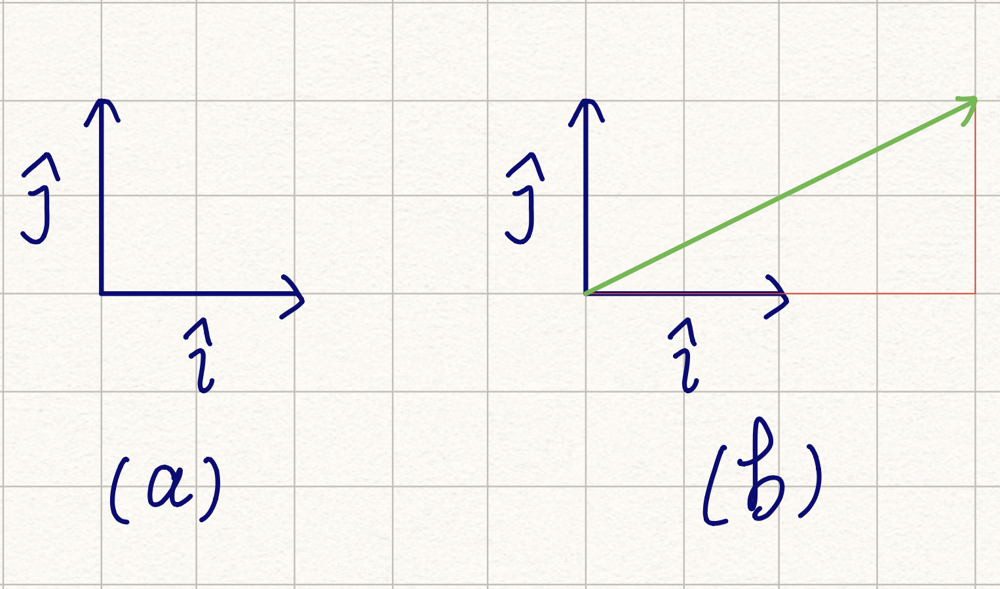
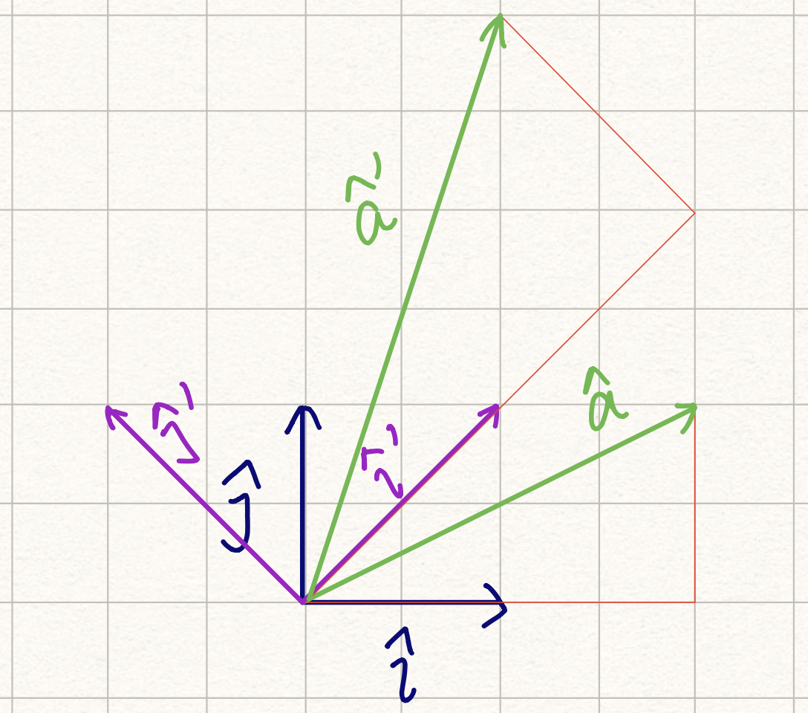

# 特征值、特征向量和奇异值分解

最近准备各种笔试，顺便复习了一下矩阵的相关知识。找到了一份非常棒的学习视频：[线性代数的本质](https://space.bilibili.com/88461692#!/channel/detail?cid=9450&order=1&page=1)。这份学习材料是 [3Blue1Brown](http://www.3blue1brown.com/) 制作的，视频中会使用几何的方式揭示矩阵操作的本质。在 [YouTube](https://www.youtube.com/channel/UCYO_jab_esuFRV4b17AJtAw) 和 [Bilibili](https://space.bilibili.com/88461692?from=search&seid=13156855510233886526#!/) 上有官方提供的视频，都有中文字幕。视频中提到的特征值、特征向量还有基变换，都给了关于矩阵的全新的理解。所以在这里总结一下。

## 一、基与向量

一开始的时候，世界是虚无的。所以基 $\hat i$ 和 $\hat j$ 被定义了，如图 (a) 所示。

有了基之后，空间里的向量都可以轻松地被表示出来。(b) 图中绿色的向量可以表示为 $(2 \hat i, \hat j)$。

## 二、矩阵和变换

想象一下，现在把基 $\hat i$ 和 $\hat j$ 拉到 $\hat i'$ 和 $\hat j'$ 的位置，如图 (c) 所示。图 (b) 中绿色的向量也同时被拉伸了。

拉伸后的向量 $\hat a'$，使用新的基表示，仍然是 $(2 \hat i', \hat j')$。同时，$\hat i'$ 和 $\hat j'$ 可以使用原先的基表示：

$$
\begin {aligned}
\hat i' &= \hat i + \hat j \\
\hat j' &= -\hat i + \hat j
\end {aligned}
$$

也就是 $\hat i' = (\hat i, \hat j)$，$\hat j' = (-\hat i, \hat j)$。所以：

$$
\hat a' = 2 \hat i' + \hat j' = \hat i + 3 \hat j
$$

简单来说，变换后的向量 $\hat a'$，使用原先的基表示，为 $(\hat i, 3 \hat j)$。

总结一下，变换后，空间中的向量与新的基的系数关系没有发生改变。而基本身改变了，向量在原来基中的表示发生对应的变化。这种变化，就是两个基变换的叠加。这种变换，就可以表示为矩阵：

$$
\begin{bmatrix} \hat i / \hat i' & -\hat i / \hat j' \\ \hat j / \hat i' & \hat j / \hat j' \end{bmatrix} \hat a' =
\begin{bmatrix} \hat i / \hat i' & -\hat i / \hat j' \\ \hat j / \hat i' & \hat j / \hat j' \end{bmatrix} \begin{bmatrix} 2 \hat i'\\ \hat j' \end{bmatrix} = \begin{bmatrix} \hat i\\ 3\hat j \end{bmatrix}
$$

简化一下，变换可以记录为：$\begin{bmatrix}1 & -1 \\ 1 & 1\end{bmatrix}$。而变换可以从两个角度看：

1. 可以计算变换后，原先空间中的向量变换后到位置；
2. 可以计算在新的基下，一个向量映射到原先基中的位置。

## 三、基变换

在基 $(\hat i', \hat j')$ 中，向量 $\hat a'$ 可以通过乘上变换矩阵，得到在基 $(\hat i, \hat j)$ 中的表示：

$$
\begin{bmatrix} 1 & -1 \\ 1 & 1  \end{bmatrix}
\begin{bmatrix} 2 \\ 1 \end{bmatrix} =
\begin{bmatrix} 1 \\ 3 \end{bmatrix}
$$

变换矩阵的两列分别是基 $(\hat i', \hat j')$ 在基 $(\hat i, \hat j)$ 中的表示。

那反过来呢？如果已知基 $(\hat i, \hat j)$ 中的向量 $\hat a'$ 的表示，如何得到在基 $(\hat i', \hat j')$ 中的表示？

使用同样的方法。构建从基 $(\hat i', \hat j')$ 到 $(\hat i, \hat j)$ 变换矩阵。

$$
\begin {aligned}
\hat i &= \frac {1}{2} \hat i' - \frac {1}{2} \hat j \\
\hat j &= \frac {1}{2} \hat i' + \frac {1}{2} \hat j'
\end {aligned}
$$

则变换矩阵为：$\begin{bmatrix} 1/2 & 1/2 \\ -1/2 & 1/2 \end{bmatrix}$，则：

$$
\begin{bmatrix} 1/2 & 1/2 \\ -1/2 & 1/2 \end{bmatrix}
\begin{bmatrix} 1 \\ 3 \end{bmatrix} =
\begin{bmatrix} 2 \\ 1 \end{bmatrix}
$$

变换矩阵对任意向量都满足，进而可以推导出矩阵 $\begin{bmatrix} 1/2 & 1/2 \\ -1/2 & 1/2 \end{bmatrix}$ 和矩阵 $\begin{bmatrix}1 & -1 \\ 1 & 1\end{bmatrix}$ 互为逆矩阵。

也可以这样解释。定义基 $(\hat i, \hat j)$ 为 基 $A$，基 $(\hat i', \hat j')$ 为基 $B$，定义变换矩阵 $\begin{bmatrix}1 & -1 \\ 1 & 1\end{bmatrix}$ 为 $A_{fromB}$，定义变换矩阵 $\begin{bmatrix} 1/2 & 1/2 \\ -1/2 & 1/2 \end{bmatrix}$ 为 $B_{fromA}$。对于基 $B$ 中的任意向量 $\hat V_B$，有：

$$
\begin{aligned}
A_{fromB} \hat V_B &= \hat V_A \\
B_{fromA} \hat V_A &= \hat V_B \\
B_{fromA} A_{fromB} \hat V_B &= \hat V_B \\
B_{fromA} A_{fromB} &= E
\end{aligned}
$$

## 四、特征值和特征向量

对于某个变换 $T$，变换前后方向相同或相反的向量 $\hat v$，称之为变换的特征向量；向量缩放的比例称之为特征值。根据方向不变，可得出：

$$
T \hat v = \lambda \hat v
$$

根据上式，可得出：

$$
(T - \lambda I)\hat v = 0
$$

从而推导出 $\det(T-\lambda I) = 0$，进而求得特征值 $\lambda$ 的值。带入原公式，求得特征向量。值得注意的是，特征向量并不唯一，毕竟在同一个方向上的向量是无限的。

类似于上文提到的变换 $\begin{bmatrix}1 & -1 \\ 1 & 1\end{bmatrix}$，因为改变了所有向量的方向，故而没有特征向量和特征值；类似于变换 $\begin{bmatrix}1 & 1\\ 0 & 1\end{bmatrix}$，X 轴上的所有向量的方向均没有发生改变，其他向量均有水平方向的拉伸，称之为切变，仅有一个大小为 1 特征值和一个方向的特征向量；而其他变换一般均有两个方向的特征向量。

举个例子🌰，变换 $T = \begin{bmatrix}0 & 1 \\ 1 & 1\end{bmatrix}$，根据公式可求得两个特征值为 $\frac {1 + \sqrt 5}{2}$ 和 $\frac {1 - \sqrt 5}{2}$。进而取两个方向上的特征向量，这里选择 $\begin{bmatrix}2 \\ 1 + \sqrt 5\end{bmatrix}$ 和 $\begin{bmatrix}2 \\ 1 - \sqrt 5\end{bmatrix}$。经过变换后，这两个方向上的向量只会发生缩放，缩放比例为特征值的大小，方向不会改变。

那么，如果以这两个向量为基呢？仍然令原基为基 $A$，新基为 $B$。易知：

$$
\begin{aligned}
A_{fromB} &= \begin{bmatrix}2 & 2\\ 1 + \sqrt 5 & 1 - \sqrt 5\end{bmatrix} \\
B_{fromA} &= A_{fromB}^{-1}
\end{aligned}
$$

可知在新基中，变换 $T$ 的表示为：

$$
T' = B_{fromA} T A_{fromB} = \begin{bmatrix}\frac {1+\sqrt 5} {2} & 0 \\ 0 & \frac {1-\sqrt 5}{2}\end{bmatrix}
$$

这是一个标准的对角矩阵。$T'$ 为该变换在新基中的表示，也可以重新映射回原基中：

$$
T = A_{fromB}T'B_{fromA}
$$

最神奇的事情发生了。如果连续执行 $n$ 次 $T$ 变换，与在新基中连续执行 $n$ 次 $T'$ 变换的效果是一致的：

$$
T^n = A_{fromB} T'{^n} B_{fromA}
$$

而 $T'$ 是对角矩阵，求 $n$ 次方即为求对角线上元素的 $n$ 次方。通过这种方式可以极大地降低计算复杂度。

仔细观察 $T^n$ 的结果，可以手算一下 $n$ 较小时的值。实际上，$T$ 变换可以求 Fibonacci 数列，$T^n$ 右上角的数即为 Fibonacci 数列的第 $n$ 项。使用特征值和特征向量，可以求得 Fibonacci 数列的通项公式。由：

$$
T^n = \begin{bmatrix}2 & 2\\ 1 + \sqrt 5 & 1 - \sqrt 5\end{bmatrix}
\begin{bmatrix}
  (\frac {1+\sqrt 5} {2})^n & 0 \\
  0 & (\frac {1-\sqrt 5}{2})^n
\end{bmatrix}
\begin{bmatrix}
\frac {5-\sqrt 5} {20} & \frac {\sqrt 5}{10} \\
\frac {5+\sqrt 5} {20} & -\frac {\sqrt 5}{10}
\end{bmatrix}
$$

可知：

$$
\begin{aligned}
T^n[0, 1] &= 2(\frac {1+\sqrt 5} {2})^n \frac {\sqrt 5} {10} -
2(\frac {1-\sqrt 5} {2})^n \frac {\sqrt 5} {10} \\
&= \frac {(\frac {1+\sqrt5} {2})^n - (\frac {1-\sqrt5} {2})^n} {\sqrt 5}
\end{aligned}
$$

## 五、奇异值分解

与特征值类似的，还有奇异值，对应的矩阵分解称之为奇异值分解（Singular Value Decomposition，SVD）：

$$
M = U\Sigma V^*
$$

$V^*$、$\Sigma$ 和 $U$ 的作用分别是旋转到 $V$ 的正交基、按照 $\Sigma$ 进行拉伸、旋转到 $U$ 的正交基，三个操作合成的效果与 $M$ 一致。$V$ 和 $U$ 分别是 $M^*M$ 和 $M M^*$ 的特征向量。$\Sigma$ 同样为对角矩阵，对角线上的数称为奇异值，从大到小排列，为 $M^*M$ 和 $M M^*$ 的特征值的非负平方根。

在维基百科上，有一个很清晰动画图示，点[这里](https://en.wikipedia.org/wiki/Singular-value_decomposition)查看。

首先，需要理解清楚 $U$ 和 $V$ 的作用。对于一个单位正交基矩阵 $V$，假设：

$$
V = \begin{bmatrix}
a & c \\
b & d
\end{bmatrix}
$$

单位基意味着 $a^2 + b^2 = 1$，$c^2 + d^2 = 1$；正交意味着向量 $\begin{bmatrix} a\\ b \end{bmatrix}$ 和 $\begin{bmatrix} c\\ d \end{bmatrix}$ 垂直，即 $ac + bd = 0$。比较神奇的是：

$$
V^TV = \begin{bmatrix}
a & b \\
c & d
\end{bmatrix}
\begin{bmatrix}
a & c \\
b & d
\end{bmatrix}
=
\begin{bmatrix}
1 & 0 \\
0 & 1
\end{bmatrix}
$$

也就是说，$V^T = V^{-1}$。$V^*$ 称为 $V$ 的共轭矩阵，对于单位矩阵来说，$V^* = V^{-1}$。定义原基为 $A$，假设原基中的向量为 $\hat v_{A}$，其在基 $V$ 下的表示为：

$$
\hat v_{V} = V^*\hat v_{A} = V^{-1} \hat v_{A} = V^T \hat v_{A}
$$

在新基中，向量的长度并不会发生变化（可以自己推导一下），因此也可以认为只是进行了旋转操作。后面再通过对角矩阵 $\Sigma$，向量在新基中实现了缩放。如果 $\Sigma$ 中对应的值为 0，则同时实现了投影。最后通过单位正交基矩阵 $U$，再次完成一次旋转。

奇异值分解得到的三个矩阵，分别完成旋转、缩放和投影、旋转。另外，对于任意一个矩阵，都能完成奇异值分解，特征值就不一定了。网上也有关于[奇异值和特征值的区别的讨论](https://www.zhihu.com/question/19666954)。

[待填坑]

### 参考文献

1. [奇异值分解（We Recommend a Singular Value Decomposition）](http://www.flickering.cn/%e6%95%b0%e5%ad%a6%e4%b9%8b%e7%be%8e/2015/01/%e5%a5%87%e5%bc%82%e5%80%bc%e5%88%86%e8%a7%a3%ef%bc%88we-recommend-a-singular-value-decomposition%ef%bc%89/)，[火光摇曳](http://www.flickering.cn/)
2. [奇异值分解，维基百科]([https://zh.wikipedia.org/wiki/%E5%A5%87%E5%BC%82%E5%80%BC%E5%88%86%E8%A7%A3](https://zh.wikipedia.org/wiki/奇异值分解))
