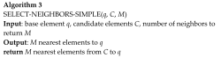

# [Reading] Hierarchical Navigable Small World graphs
### Abstract

> We present a new approach for the approximate K-nearest neighbor search based on navigable small world graphs with controllable hierarchy (Hierarchical NSW, HNSW). The proposed solution is fully graph-based, without any need for additional search structures, which are typically used at the coarse search stage of the most proximity graph techniques. Hierarchical NSW incrementally builds a multi-layer structure consisting from hierarchical set of proximity graphs (layers) for nested subsets of the stored elements. The maximum layer in which an element is present is selected randomly with an exponentially decaying probability distribution. This allows producing graphs similar to the previously studied Navigable Small World (NSW) structures while additionally having the links separated by their characteristic distance scales. Starting search from the upper layer together with utilizing the scale separation boosts the performance compared to NSW and allows a logarithmic complexity scaling. Additional employment of a heuristic for selecting proximity graph neighbors significantly increases performance at high recall and in case of highly clustered data. Performance evaluation has demonstrated that the proposed general metric space search index is able to strongly outperform previous opensource state-of-the-art vector-only approaches. Similarity of the algorithm to the skip list structure allows straightforward balanced distributed implementation.

### Motivation

The ways of improving the NSW search complexity can be identified through the analysis of the routing process.  The routing can be divided into two phases: "zoom-out" and "zoom-in". The average degree of a node can stay relatively small, which leads to an increased probability of being stuck in a distant false local minimum. One can avoid the described problem in NSW by starting the search from a node with the maximum degree, directly going to the "zoom-in" phase of the search. However, it still has only a polylogarithmic complexity scalability of a single greedy search at best.

The average number of hops scales logarithmically, while the average degree of the nodes on the greedy path also scales logarithmically. Thus we get an overall polylogarithmic dependence of the resulting complexity.

The idea of **Hierarchical NSW** algorithm is to separate the links according to their length scale into different layers and then search in a multilayer graph. The algorithm greedily traverses through the elements from the upper layer until a local minimum is reached. After that, the search switches to the lower layer (which has shorter links), restarts from the element which was the local minimum in the previous layer and the process repeats. The maximum number of connections per element in all layers can be made constant, thus allowing a logarithmic complexity scaling of routing in a navigable small world network.

One way to form such a layered structure is to explicitly set links with different length scales by introducing layers. For every element we select an integer level $l$ which defines the maximum layer for which the element belongs to. If we set an exponentially decaying probability of $l$, we get a logarithmic scaling of the expected number of layers in the structure.

### Algorithm

### References

1. [Malkov, Yury A., and Dmitry A. Yashunin. "Efficient and robust approximate nearest neighbor search using Hierarchical Navigable Small World graphs." *IEEE transactions on pattern analysis and machine intelligence* (2018).](https://arxiv.org/pdf/1603.09320.pdf)
2. [GitHub nmslib/hnswlib](https://github.com/nmslib/hnswlib).

