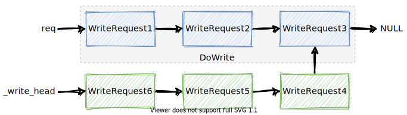

# bRPC 源码分析「三、网络通信」


### 1. Single Connection

bRPC 支持短连接、连接池和单连接，前两种是非常通用的方案。而单连接是指进程内所有 client 与一台 server 最多只有一个连接，在该连接上同时处理多个请求，不要求回复返回顺序与请求发送顺序一致。

对于连接池，请求时 client 端从连接池中取出一个可用的连接并独占使用，写入请求，server 端在该连接上收到请求后进行处理，最后在该连接上写入回复。对该连接来说，读和写并不会同时发生，实际工作模式是半双工的。而对于单连接，可以连续地在该连接上写入请求并同时读取回复，工作模式是全双工的，不过需要有通过回复定位请求的能力，可以通过 UUID 解决。连续的写入和读取也可以形成更好的批量效果，减少系统调用次数。在多线程环境下，bRPC 的单连接读写操作做到了 [wait-free](http://en.wikipedia.org/wiki/Non-blocking_algorithm#Wait-freedom)。

### 2. Message Sending

“消息”是指向连接写出的有边界的二进制串。使用单连接的场景中，多线程可能会向同一个连接发送消息，该操作显然是非原子的，这时候就需要高效率地排队不同线程发送的数据包。bRPC 中使用了一个 MPSC 队列实现该需求，具体步骤如下：

1. 为每个连接维护一个 MPSC 的单向链表，当线程需要写消息时尝试获取该连接的独占写入权限（原子操作），成功获取权限的线程执行一次写入，而获取权限失败的线程仅将消息插入到该链表的头部（原子操作），并挂起等待回复；
2. 获得写入权限的线程根据连接对应的链表，批量地写入本线程以及其他线程发送的数据包，尽可能多的写入数据，但只写入一次防止本线程的请求产生过长的延迟，如果写入时连接的缓冲池已满无法写入，则启动一个新的 KeepWrite bthread 执行后续的写入操作；
3. KeepWrite bthread 负责将链表中的所有数据包写入连接直到链表为空，当连接缓冲池已满时则挂起等待 epoll 唤醒。

下面对照代码进行分析。单连接的实现位于 [src/brpc/socket.cpp](https://github.com/apache/incubator-brpc/blob/0.9.7/src/brpc/socket.cpp)，写入的流程为：

```c++
// socket.cpp，写入 IOBuf
int Socket::Write(butil::IOBuf *data, const WriteOptions *options_in) {
  WriteOptions opt;
  if (options_in) {
    opt = *options_in;
  }
  if (data->empty()) {
    return SetError(opt.id_wait, EINVAL);
  }
  if (opt.pipelined_count > MAX_PIPELINED_COUNT) {
    LOG(ERROR) << "pipelined_count=" << opt.pipelined_count << " is too large";
    return SetError(opt.id_wait, EOVERFLOW);
  }
  if (Failed()) {
    const int rc = ConductError(opt.id_wait);
    if (rc <= 0) {
      return rc;
    }
  }

  if (!opt.ignore_eovercrowded && _overcrowded) {
    return SetError(opt.id_wait, EOVERCROWDED);
  }

  // 对象池中获取一个 WriteRequest 对象
  WriteRequest *req = butil::get_object<WriteRequest>();
  if (!req) {
    return SetError(opt.id_wait, ENOMEM);
  }

  req->data.swap(*data);  // move 数据到 request 中
  // Set `req->next' to UNCONNECTED so that the KeepWrite thread will
  // wait until it points to a valid WriteRequest or NULL.
  // 先将 next 指针设为非法，后续判断依赖该操作
  req->next = WriteRequest::UNCONNECTED;
  req->id_wait = opt.id_wait;
  req->set_pipelined_count_and_user_message(opt.pipelined_count,
                                            DUMMY_USER_MESSAGE, opt.with_auth);
  return StartWrite(req, opt);  // 调用写入
}

int Socket::StartWrite(WriteRequest *req, const WriteOptions &opt) {
  // Release fence makes sure the thread getting request sees *req
  // 将链表头原子地替换为待写入的 request，原先的头部返回给 prev_head
  WriteRequest *const prev_head =
      _write_head.exchange(req, butil::memory_order_release);
  if (prev_head != NULL) {
    // Someone is writing to the fd. The KeepWrite thread may spin
    // until req->next to be non-UNCONNECTED. This process is not
    // lock-free, but the duration is so short(1~2 instructions,
    // depending on compiler) that the spin rarely occurs in practice
    // (I've not seen any spin in highly contended tests).
    // 如果 prev_head 非空，说明有其他线程拿到了权限在执行写入。
    // 此时将 next 指针设为 prev_head。
    // 该操作前 next 指向 WriteRequest::UNCONNECTED，写入的线程可以 spin 等待。
    req->next = prev_head;
    return 0;
  }

  int saved_errno = 0;
  bthread_t th;
  SocketUniquePtr ptr_for_keep_write;
  ssize_t nw = 0;

  // We've got the right to write.
  // 获得连接的写入权限，将指向改为 NULL
  // 下方所有操作均保证在单线程环境下执行
  req->next = NULL;

  // Connect to remote_side() if not.
  // 尝试连接对机
  int ret = ConnectIfNot(opt.abstime, req);
  if (ret < 0) {
    saved_errno = errno;
    SetFailed(errno, "Fail to connect %s directly: %m", description().c_str());
    goto FAIL_TO_WRITE;
  } else if (ret == 1) {
    // We are doing connection. Callback `KeepWriteIfConnected'
    // will be called with `req' at any moment after
    return 0;
  }

  // NOTE: Setup() MUST be called after Connect which may call app_connect,
  // which is assumed to run before any SocketMessage.AppendAndDestroySelf()
  // in some protocols(namely RTMP).
  req->Setup(this);  // 不确定功能，暂时搁置

  if (ssl_state() != SSL_OFF) {
    // Writing into SSL may block the current bthread, always write
    // in the background.
    // 对于 SSL，始终使用后台写入
    goto KEEPWRITE_IN_BACKGROUND;
  }

  // Write once in the calling thread. If the write is not complete,
  // continue it in KeepWrite thread.
  if (_conn) {
    butil::IOBuf *data_arr[1] = {&req->data};
    nw = _conn->CutMessageIntoFileDescriptor(fd(), data_arr, 1);
  } else {
    // 执行一次写入，默认 size_hint 为 1MB
    nw = req->data.cut_into_file_descriptor(fd());
  }
  if (nw < 0) {
    // RTMP may return EOVERCROWDED
    if (errno != EAGAIN && errno != EOVERCROWDED) {
      saved_errno = errno;
      // EPIPE is common in pooled connections + backup requests.
      PLOG_IF(WARNING, errno != EPIPE) << "Fail to write into " << *this;
      SetFailed(saved_errno, "Fail to write into %s: %s", description().c_str(),
                berror(saved_errno));
      goto FAIL_TO_WRITE;  // 失败时跳转
    }
  } else {
    AddOutputBytes(nw);
  }
  if (IsWriteComplete(req, true, NULL)) {
    // 判断所有写入完成，直接返回
    ReturnSuccessfulWriteRequest(req);
    return 0;
  }

KEEPWRITE_IN_BACKGROUND:
  // 写入未完成，启动后台 bthread 继续执行写入操作
  ReAddress(&ptr_for_keep_write);  // 复制当前指针到新的 SocketUniquePtr
  req->socket = ptr_for_keep_write.release();
  if (bthread_start_background(&th, &BTHREAD_ATTR_NORMAL, KeepWrite, req) !=
      0) {
    LOG(FATAL) << "Fail to start KeepWrite";
    // bthread 启动失败的情况下继续同步调用写入
    KeepWrite(req);
  }
  return 0;

FAIL_TO_WRITE:
  // `SetFailed' before `ReturnFailedWriteRequest' (which will calls
  // `on_reset' callback inside the id object) so that we immediately
  // know this socket has failed inside the `on_reset' callback
  ReleaseAllFailedWriteRequests(req);
  errno = saved_errno;
  return -1;
}

// iobuf_inl.h
inline ssize_t IOBuf::cut_into_file_descriptor(int fd, size_t size_hint) {
  return pcut_into_file_descriptor(fd, -1, size_hint);
}

// iobuf.cpp
ssize_t IOBuf::pcut_into_file_descriptor(int fd, off_t offset,
                                         size_t size_hint) {
  if (empty()) {
    return 0;
  }

  const size_t nref = std::min(_ref_num(), IOBUF_IOV_MAX);
  struct iovec vec[nref];  // 将 IOBuf 转为 iovec，批量写入
  size_t nvec = 0;
  size_t cur_len = 0;

  do {
    IOBuf::BlockRef const &r = _ref_at(nvec);
    vec[nvec].iov_base = r.block->data + r.offset;
    vec[nvec].iov_len = r.length;
    ++nvec;
    cur_len += r.length;
  } while (nvec < nref && cur_len < size_hint);  // size_hint 非精确限制

  ssize_t nw = 0;

  if (offset >= 0) {
    static iobuf::iov_function pwritev_func = iobuf::get_pwritev_func();
    nw = pwritev_func(fd, vec, nvec, offset);
  } else {
    nw = ::writev(fd, vec, nvec);  // 非阻塞批量写入
  }
  if (nw > 0) {
    pop_front(nw);  // 写入成功的部分 pop 掉
  }
  return nw;
}
```

`KeepWrite` 的流程为：

```c++
void *Socket::KeepWrite(void *void_arg) {
  g_vars->nkeepwrite << 1;
  WriteRequest *req = static_cast<WriteRequest *>(void_arg);
  SocketUniquePtr s(req->socket);  // 恢复 socket 的 unique_ptr

  // When error occurs, spin until there's no more requests instead of
  // returning directly otherwise _write_head is permantly non-NULL which
  // makes later Write() abnormal.
  WriteRequest *cur_tail = NULL;
  do {
    // req was written, skip it.
    if (req->next != NULL && req->data.empty()) {
      WriteRequest *const saved_req = req;
      req = req->next;
      // 已经写完的包及时从链表中剔除，并回复
      s->ReturnSuccessfulWriteRequest(saved_req);
    }
    const ssize_t nw = s->DoWrite(req);  // 尝试执行写入
    if (nw < 0) {
      if (errno != EAGAIN && errno != EOVERCROWDED) {
        const int saved_errno = errno;
        PLOG(WARNING) << "Fail to keep-write into " << *s;
        s->SetFailed(saved_errno, "Fail to keep-write into %s: %s",
                     s->description().c_str(), berror(saved_errno));
        break;
      }
    } else {
      s->AddOutputBytes(nw);
    }
    // Release WriteRequest until non-empty data or last request.
    while (req->next != NULL && req->data.empty()) {
      WriteRequest *const saved_req = req;
      req = req->next;
      s->ReturnSuccessfulWriteRequest(saved_req);
    }
    // TODO(gejun): wait for epollout when we actually have written
    // all the data. This weird heuristic reduces 30us delay...
    // Update(12/22/2015): seem not working. better switch to correct code.
    // Update(1/8/2016, r31823): Still working.
    // Update(8/15/2017): Not working, performance downgraded.
    // if (nw <= 0 || req->data.empty()/*note*/) {
    if (nw <= 0) {
      g_vars->nwaitepollout << 1;
      bool pollin = (s->_on_edge_triggered_events != NULL);
      // NOTE: Waiting epollout within timeout is a must to force
      // KeepWrite to check and setup pending WriteRequests periodically,
      // which may turn on _overcrowded to stop pending requests from
      // growing infinitely.
      const timespec duetime =
          butil::milliseconds_from_now(WAIT_EPOLLOUT_TIMEOUT_MS);
      const int rc = s->WaitEpollOut(s->fd(), pollin, &duetime);
      if (rc < 0 && errno != ETIMEDOUT) {
        const int saved_errno = errno;
        PLOG(WARNING) << "Fail to wait epollout of " << *s;
        s->SetFailed(saved_errno, "Fail to wait epollout of %s: %s",
                     s->description().c_str(), berror(saved_errno));
        break;
      }
    }
    if (NULL == cur_tail) {
      for (cur_tail = req; cur_tail->next != NULL; cur_tail = cur_tail->next)
        ;
    }
    // Return when there's no more WriteRequests and req is completely
    // written.
    // 判断是否全部写完
    if (s->IsWriteComplete(cur_tail, (req == cur_tail), &cur_tail)) {
      CHECK_EQ(cur_tail, req);
      s->ReturnSuccessfulWriteRequest(req);
      return NULL;
    }
  } while (1);

  // Error occurred, release all requests until no new requests.
  s->ReleaseAllFailedWriteRequests(req);
  return NULL;
}

ssize_t Socket::DoWrite(WriteRequest *req) {
  // Group butil::IOBuf in the list into a batch array.
  butil::IOBuf *data_list[DATA_LIST_MAX];
  size_t ndata = 0;
  for (WriteRequest *p = req; p != NULL && ndata < DATA_LIST_MAX; p = p->next) {
    data_list[ndata++] = &p->data;  // 收集一批待写入的数据包后批量写入
  }

  if (ssl_state() == SSL_OFF) {
    // Write IOBuf in the batch array into the fd.
    if (_conn) {
      return _conn->CutMessageIntoFileDescriptor(fd(), data_list, ndata);
    } else {
      ssize_t nw = butil::IOBuf::cut_multiple_into_file_descriptor(
          fd(), data_list, ndata);
      return nw;
    }
  }

  CHECK_EQ(SSL_CONNECTED, ssl_state());
  if (_conn) {
    // TODO: Separate SSL stuff from SocketConnection
    return _conn->CutMessageIntoSSLChannel(_ssl_session, data_list, ndata);
  }
  int ssl_error = 0;
  ssize_t nw = butil::IOBuf::cut_multiple_into_SSL_channel(
      _ssl_session, data_list, ndata, &ssl_error);
  switch (ssl_error) {
  case SSL_ERROR_NONE:
    break;

  case SSL_ERROR_WANT_READ:
    // Disable renegotiation
    errno = EPROTO;
    return -1;

  case SSL_ERROR_WANT_WRITE:
    errno = EAGAIN;
    break;

  default: {
    const unsigned long e = ERR_get_error();
    if (e != 0) {
      LOG(WARNING) << "Fail to write into ssl_fd=" << fd() << ": "
                   << SSLError(ERR_get_error());
      errno = ESSL;
    } else {
      // System error with corresponding errno set
      PLOG(WARNING) << "Fail to write into ssl_fd=" << fd();
    }
    break;
  }
  }
  return nw;  // 返回成功写入的长度
}

// Check if there're new requests appended.
// If yes, point old_head to to reversed new requests and return false;
// If no:
//    old_head is fully written, set _write_head to NULL and return true;
//    old_head is not written yet, keep _write_head unchanged and return false;
// `old_head' is last new_head got from this function or (in another word)
// tail of current writing list.
// `singular_node' is true iff `old_head' is the only node in its list.
bool Socket::IsWriteComplete(Socket::WriteRequest *old_head, bool singular_node,
                             Socket::WriteRequest **new_tail) {
  CHECK(NULL == old_head->next);
  // Try to set _write_head to NULL to mark that the write is done.
  WriteRequest *new_head = old_head;
  WriteRequest *desired = NULL;
  bool return_when_no_more = true;
  if (!old_head->data.empty() || !singular_node) {
    // 当前写入链表还不能判断已经写完（当前节点非空或者链表不止一个节点）
    desired = old_head;
    // Write is obviously not complete if old_head is not fully written.
    return_when_no_more = false;
  }
  // CAS 检查是否存在需要写入的数据包
  if (_write_head.compare_exchange_strong(new_head, desired,
                                          butil::memory_order_acquire)) {
    // No one added new requests.
    if (new_tail) {
      *new_tail = old_head;
    }
    return return_when_no_more;
  }
  // CAS 失败，new_head 获得最新的写入链表头部
  CHECK_NE(new_head, old_head);
  // Above acquire fence pairs release fence of exchange in Write() to make
  // sure that we see all fields of requests set.

  // Someone added new requests.
  // Reverse the list until old_head.
  WriteRequest *tail = NULL;
  WriteRequest *p = new_head;
  // 翻转链表，从 new_head 到 old_head 翻转
  do {
    while (p->next == WriteRequest::UNCONNECTED) {
      // TODO(gejun): elaborate this
      // 如前文提到的，p->next 短时间内可能指向 UNCONNECTED，需要 spin 等待
      sched_yield();
    }
    WriteRequest *const saved_next = p->next;
    p->next = tail;
    tail = p;
    p = saved_next;
    CHECK(p != NULL);
  } while (p != old_head);

  // Link old list with new list.
  old_head->next = tail;
  // Call Setup() from oldest to newest, notice that the calling sequence
  // matters for protocols using pipelined_count, this is why we don't
  // calling Setup in above loop which is from newest to oldest.
  for (WriteRequest *q = tail; q; q = q->next) {
    q->Setup(this);
  }
  // 链表翻转完成后，头部是 old_head，尾部是 new_head，new_head 指向 NULL
  // 这一段将会在下次写入时批量完成
  if (new_tail) {
    *new_tail = new_head;
  }
  return false;
}
```



### 3. Message Receiving

传统 RPC 框架一般通过独立的 IO 线程监听并读取连接上的数据，存在的问题是单一时间内一个线程只能读取一个连接，当多个繁忙的连接聚集在同一个 IO 线程中时，会导致部分的连接的读取被延迟，影响可用性。bRPC 中使用 `EventDispatcher` 监听连接是否可用，当连接可读时，会在当前线程启动一个新的 bthread 并立即切换过去执行读取操作，使其有更好的缓存局部性。而 `EventDispatcher` 所在的 bthread  会重新加入 bthread 的队列中，依赖 work stealing 继续在其他线程中执行。该方法使得 bRPC 读取同一个连接时产生的竞争是 [wait-free](http://en.wikipedia.org/wiki/Non-blocking_algorithm#Wait-freedom) 的。当从连接上解析出多个数据包时，也会立即启动新的 bthread 并发处理这些数据包。这样连接间和连接内的消息在 bRPC 中都获得了并发处理，在高负载时仍能及时处理不同来源的消息，减少长尾。

先来看 `EventDispatcher` 的代码（仅保留 Linux 平台实现）：

```c++
// event_dispatcher.cpp
DEFINE_int32(event_dispatcher_num, 1, "Number of event dispatcher");  // 默认 1

EventDispatcher &GetGlobalEventDispatcher(int fd) {
  pthread_once(&g_edisp_once, InitializeGlobalDispatchers);
  if (FLAGS_event_dispatcher_num == 1) {
    return g_edisp[0];
  }
  int index = butil::fmix32(fd) % FLAGS_event_dispatcher_num;
  return g_edisp[index];
}

void InitializeGlobalDispatchers() {
  g_edisp = new EventDispatcher[FLAGS_event_dispatcher_num];
  for (int i = 0; i < FLAGS_event_dispatcher_num; ++i) {
    const bthread_attr_t attr =
        FLAGS_usercode_in_pthread ? BTHREAD_ATTR_PTHREAD : BTHREAD_ATTR_NORMAL;
    CHECK_EQ(0, g_edisp[i].Start(&attr));  // 启动 EventDispatcher
  }
  // This atexit is will be run before g_task_control.stop() because above
  // Start() initializes g_task_control by creating bthread (to run
  // epoll/kqueue).
  CHECK_EQ(0, atexit(StopAndJoinGlobalDispatchers));
}

// Dispatch edge-triggered events of file descriptors to consumers
// running in separate bthreads.
class EventDispatcher {
  friend class Socket;

public:
  EventDispatcher();

  virtual ~EventDispatcher();

  // Start this dispatcher in a bthread.
  // Use |*consumer_thread_attr| (if it's not NULL) as the attribute to
  // create bthreads running user callbacks.
  // Returns 0 on success, -1 otherwise.
  virtual int Start(const bthread_attr_t *consumer_thread_attr);

  // True iff this dispatcher is running in a bthread
  bool Running() const;

  // Stop bthread of this dispatcher.
  void Stop();

  // Suspend calling thread until bthread of this dispatcher stops.
  void Join();

  // When edge-triggered events happen on `fd', call
  // `on_edge_triggered_events' of `socket_id'.
  // Notice that this function also transfers ownership of `socket_id',
  // When the file descriptor is removed from internal epoll, the Socket
  // will be dereferenced once additionally.
  // Returns 0 on success, -1 otherwise.
  int AddConsumer(SocketId socket_id, int fd);

  // Watch EPOLLOUT event on `fd' into epoll device. If `pollin' is
  // true, EPOLLIN event will also be included and EPOLL_CTL_MOD will
  // be used instead of EPOLL_CTL_ADD. When event arrives,
  // `Socket::HandleEpollOut' will be called with `socket_id'
  // Returns 0 on success, -1 otherwise and errno is set
  int AddEpollOut(SocketId socket_id, int fd, bool pollin);

  // Remove EPOLLOUT event on `fd'. If `pollin' is true, EPOLLIN event
  // will be kept and EPOLL_CTL_MOD will be used instead of EPOLL_CTL_DEL
  // Returns 0 on success, -1 otherwise and errno is set
  int RemoveEpollOut(SocketId socket_id, int fd, bool pollin);

private:
  DISALLOW_COPY_AND_ASSIGN(EventDispatcher);

  // Calls Run()
  static void *RunThis(void *arg);

  // Thread entry.
  void Run();

  // Remove the file descriptor `fd' from epoll.
  int RemoveConsumer(int fd);

  // The epoll to watch events.
  int _epfd;

  // false unless Stop() is called.
  volatile bool _stop;

  // identifier of hosting bthread
  bthread_t _tid;

  // The attribute of bthreads calling user callbacks.
  bthread_attr_t _consumer_thread_attr;

  // Pipe fds to wakeup EventDispatcher from `epoll_wait' in order to quit
  int _wakeup_fds[2];
};

EventDispatcher::EventDispatcher()
    : _epfd(-1), _stop(false), _tid(0),
      _consumer_thread_attr(BTHREAD_ATTR_NORMAL) {
  _epfd = epoll_create(1024 * 1024);
  if (_epfd < 0) {
    PLOG(FATAL) << "Fail to create epoll";
    return;
  }

  CHECK_EQ(0, butil::make_close_on_exec(_epfd));

  _wakeup_fds[0] = -1;
  _wakeup_fds[1] = -1;
  if (pipe(_wakeup_fds) != 0) {
    // 用于 stop 操作时唤醒 epoll
    PLOG(FATAL) << "Fail to create pipe";
    return;
  }
}

int EventDispatcher::Start(const bthread_attr_t *consumer_thread_attr) {
  if (_epfd < 0) {
    LOG(FATAL) << "epoll was not created";
    return -1;
  }

  if (_tid != 0) {
    LOG(FATAL) << "Already started this dispatcher(" << this
               << ") in bthread=" << _tid;
    return -1;
  }

  // Set _consumer_thread_attr before creating epoll/kqueue thread to make sure
  // everyting seems sane to the thread.
  _consumer_thread_attr =
      (consumer_thread_attr ? *consumer_thread_attr : BTHREAD_ATTR_NORMAL);

  // Polling thread uses the same attr for consumer threads (NORMAL right
  // now). Previously, we used small stack (32KB) which may be overflowed
  // when the older comlog (e.g. 3.1.85) calls com_openlog_r(). Since this
  // is also a potential issue for consumer threads, using the same attr
  // should be a reasonable solution.
  // 启动 bthread 处理
  int rc =
      bthread_start_background(&_tid, &_consumer_thread_attr, RunThis, this);
  if (rc) {
    LOG(FATAL) << "Fail to create epoll/kqueue thread: " << berror(rc);
    return -1;
  }
  return 0;
}

void *EventDispatcher::RunThis(void *arg) {
  ((EventDispatcher *)arg)->Run();
  return NULL;
}

void EventDispatcher::Run() {
  while (!_stop) {
    epoll_event e[32];
    const int n = epoll_wait(_epfd, e, ARRAY_SIZE(e), -1);  // 注意没有设定超时

    if (_stop) {
      // epoll_ctl/epoll_wait should have some sort of memory fencing
      // guaranteeing that we(after epoll_wait) see _stop set before
      // epoll_ctl.
      break;
    }
    if (n < 0) {
      if (EINTR == errno) {
        // We've checked _stop, no wake-up will be missed.
        continue;
      }
      PLOG(FATAL) << "Fail to epoll_wait epfd=" << _epfd;
      break;
    }
    for (int i = 0; i < n; ++i) {
      if (e[i].events & (EPOLLIN | EPOLLERR | EPOLLHUP)) {
        // We don't care about the return value.
        // 处理读取事件
        Socket::StartInputEvent(e[i].data.u64, e[i].events,
                                _consumer_thread_attr);
      }
    }
    for (int i = 0; i < n; ++i) {
      if (e[i].events & (EPOLLOUT | EPOLLERR | EPOLLHUP)) {
        // We don't care about the return value.
        // 处理写入事件
        Socket::HandleEpollOut(e[i].data.u64);
      }
    }
  }
}

void EventDispatcher::Stop() {
  _stop = true;

  if (_epfd >= 0) {
    epoll_event evt = {EPOLLOUT, {NULL}};
    // 停止时插入一个可写的 pipe fd，唤醒无超时的 epoll_wait
    epoll_ctl(_epfd, EPOLL_CTL_ADD, _wakeup_fds[1], &evt);
  }
}

// 增加读取事件监听
int EventDispatcher::AddConsumer(SocketId socket_id, int fd) {
  if (_epfd < 0) {
    errno = EINVAL;
    return -1;
  }
  epoll_event evt;
  evt.events = EPOLLIN | EPOLLET;  // 边缘触发
  evt.data.u64 = socket_id;  // 直接存储 socket_id
  return epoll_ctl(_epfd, EPOLL_CTL_ADD, fd, &evt);
}

// 增加写入事件监听
int EventDispatcher::AddEpollOut(SocketId socket_id, int fd, bool pollin) {
  if (_epfd < 0) {
    errno = EINVAL;
    return -1;
  }

  epoll_event evt;
  evt.data.u64 = socket_id;
  evt.events = EPOLLOUT | EPOLLET;
  if (pollin) {
    evt.events |= EPOLLIN;
    if (epoll_ctl(_epfd, EPOLL_CTL_MOD, fd, &evt) < 0) {
      // This fd has been removed from epoll via `RemoveConsumer',
      // in which case errno will be ENOENT
      return -1;
    }
  } else {
    if (epoll_ctl(_epfd, EPOLL_CTL_ADD, fd, &evt) < 0) {
      return -1;
    }
  }
  return 0;
}
```

多线程下并发调用 `epoll_wait` 与 `epoll_ctl` 是线程安全的，可以参考文献 2。bRPC 默认会启动一个 bthread 执行 `EventDispatcher` 的事件循环，创建连接时会将连接加入到 `EventDispatcher` 中：

```c++
// socket.cpp
int Socket::Create(const SocketOptions &options, SocketId *id) {
  ...
  if (m->ResetFileDescriptor(options.fd) != 0) {
    const int saved_errno = errno;
    PLOG(ERROR) << "Fail to ResetFileDescriptor";
    m->SetFailed(saved_errno, "Fail to ResetFileDescriptor: %s",
                 berror(saved_errno));
    return -1;
  }
  ...
}

int Socket::ResetFileDescriptor(int fd) {
  // Reset message sizes when fd is changed.
  _last_msg_size = 0;
  _avg_msg_size = 0;
  // MUST store `_fd' before adding itself into epoll device to avoid
  // race conditions with the callback function inside epoll
  _fd.store(fd, butil::memory_order_release);
  _reset_fd_real_us = butil::gettimeofday_us();
  // 判断 fd 是否合法
  if (!ValidFileDescriptor(fd)) {
    return 0;
  }
  // OK to fail, non-socket fd does not support this.
  if (butil::get_local_side(fd, &_local_side) != 0) {
    _local_side = butil::EndPoint();
  }

  // FIXME : close-on-exec should be set by new syscalls or worse: set right
  // after fd-creation syscall. Setting at here has higher probabilities of
  // race condition.
  butil::make_close_on_exec(fd);

  // Make the fd non-blocking.
  // 非阻塞模式
  if (butil::make_non_blocking(fd) != 0) {
    PLOG(ERROR) << "Fail to set fd=" << fd << " to non-blocking";
    return -1;
  }
  // turn off nagling.
  // OK to fail, namely unix domain socket does not support this.
  butil::make_no_delay(fd);
  if (_tos > 0 && setsockopt(fd, IPPROTO_IP, IP_TOS, &_tos, sizeof(_tos)) < 0) {
    PLOG(FATAL) << "Fail to set tos of fd=" << fd << " to " << _tos;
  }

  if (FLAGS_socket_send_buffer_size > 0) {
    int buff_size = FLAGS_socket_send_buffer_size;
    socklen_t size = sizeof(buff_size);
    if (setsockopt(fd, SOL_SOCKET, SO_SNDBUF, &buff_size, size) != 0) {
      PLOG(FATAL) << "Fail to set sndbuf of fd=" << fd << " to " << buff_size;
    }
  }

  if (FLAGS_socket_recv_buffer_size > 0) {
    int buff_size = FLAGS_socket_recv_buffer_size;
    socklen_t size = sizeof(buff_size);
    if (setsockopt(fd, SOL_SOCKET, SO_RCVBUF, &buff_size, size) != 0) {
      PLOG(FATAL) << "Fail to set rcvbuf of fd=" << fd << " to " << buff_size;
    }
  }

  if (_on_edge_triggered_events) {
    // 监听连接的读取事件
    if (GetGlobalEventDispatcher(fd).AddConsumer(id(), fd) != 0) {
      PLOG(ERROR) << "Fail to add SocketId=" << id() << " into EventDispatcher";
      _fd.store(-1, butil::memory_order_release);
      return -1;
    }
  }
  return 0;
}
```

当发现有可用读取事件时，事件循环会调用连接对应的 `StartInputEvent` 函数：

```c++
// socket.cpp
int Socket::StartInputEvent(SocketId id, uint32_t events,
                            const bthread_attr_t &thread_attr) {
  SocketUniquePtr s;
  if (Address(id, &s) < 0) {
    return -1;
  }
  if (NULL == s->_on_edge_triggered_events) {
    // Callback can be NULL when receiving error epoll events
    // (Added into epoll by `WaitConnected')
    return 0;
  }
  if (s->fd() < 0) {
    CHECK(!(events & EPOLLIN)) << "epoll_events=" << events;
    return -1;
  }

  // Passing e[i].events causes complex visibility issues and
  // requires stronger memory fences, since reading the fd returns
  // error as well, we don't pass the events.
  // _nevent 记录当前待处理的事件数量，保证至多有一个 bthread 处理读取事件
  if (s->_nevent.fetch_add(1, butil::memory_order_acq_rel) == 0) {
    // According to the stats, above fetch_add is very effective. In a
    // server processing 1 million requests per second, this counter
    // is just 1500~1700/s
    g_vars->neventthread << 1;

    bthread_t tid;
    // transfer ownership as well, don't use s anymore!
    Socket *const p = s.release();

    bthread_attr_t attr = thread_attr;
    attr.keytable_pool = p->_keytable_pool;
    // 启动一个新的 bthread 处理读取事件
    if (bthread_start_urgent(&tid, &attr, ProcessEvent, p) != 0) {
      LOG(FATAL) << "Fail to start ProcessEvent";
      ProcessEvent(p);
    }
  }
  return 0;
}

void *Socket::ProcessEvent(void *arg) {
  // the enclosed Socket is valid and free to access inside this function.
  SocketUniquePtr s(static_cast<Socket *>(arg));
  // 调用 _on_edge_triggered_events 处理事件
  s->_on_edge_triggered_events(s.get());
  return NULL;
}
```

`_on_edge_triggered_events` 有 `OnNewConnections` 和 `OnNewMessages` 两种取值，前者负责处理新连接，将在下一节详述，这里先看后者负责收消息的处理：

```c++
// 处理新消息
void InputMessenger::OnNewMessages(Socket *m) {
  // Notes:
  // - If the socket has only one message, the message will be parsed and
  //   processed in this bthread. nova-pbrpc and http works in this way.
  // - If the socket has several messages, all messages will be parsed (
  //   meaning cutting from butil::IOBuf. serializing from protobuf is part of
  //   "process") in this bthread. All messages except the last one will be
  //   processed in separate bthreads. To minimize the overhead, scheduling
  //   is batched(notice the BTHREAD_NOSIGNAL and bthread_flush).
  // - Verify will always be called in this bthread at most once and before
  //   any process.
  InputMessenger *messenger = static_cast<InputMessenger *>(m->user());
  const InputMessageHandler *handlers = messenger->_handlers;
  int progress = Socket::PROGRESS_INIT;

  // Notice that all *return* no matter successful or not will run last
  // message, even if the socket is about to be closed. This should be
  // OK in most cases.
  std::unique_ptr<InputMessageBase, RunLastMessage> last_msg;
  bool read_eof = false;
  while (!read_eof) {
    const int64_t received_us = butil::cpuwide_time_us();
    const int64_t base_realtime = butil::gettimeofday_us() - received_us;

    // Calculate bytes to be read.
    size_t once_read = m->_avg_msg_size * 16;
    if (once_read < MIN_ONCE_READ) {
      once_read = MIN_ONCE_READ;
    } else if (once_read > MAX_ONCE_READ) {
      once_read = MAX_ONCE_READ;
    }

    // Read.
    // 从连接中读取数据
    const ssize_t nr = m->DoRead(once_read);
    if (nr <= 0) {
      if (0 == nr) {
        // Set `read_eof' flag and proceed to feed EOF into `Protocol'
        // (implied by m->_read_buf.empty), which may produce a new
        // `InputMessageBase' under some protocols such as HTTP
        LOG_IF(WARNING, FLAGS_log_connection_close)
            << *m << " was closed by remote side";
        read_eof = true;
      } else if (errno != EAGAIN) {
        if (errno == EINTR) {
          continue; // just retry
        }
        const int saved_errno = errno;
        PLOG(WARNING) << "Fail to read from " << *m;
        m->SetFailed(saved_errno, "Fail to read from %s: %s",
                     m->description().c_str(), berror(saved_errno));
        return;
      } else if (!m->MoreReadEvents(&progress)) {
        // 当没有更多可读取的消息时，bthread 退出
        return;
      } else { // new events during processing
        continue;
      }
    }

    m->AddInputBytes(nr);

    // Avoid this socket to be closed due to idle_timeout_s
    m->_last_readtime_us.store(received_us, butil::memory_order_relaxed);

    size_t last_size = m->_read_buf.length();
    int num_bthread_created = 0;
    while (1) {
      size_t index = 8888;
      // 尝试解析消息
      ParseResult pr = messenger->CutInputMessage(m, &index, read_eof);
      if (!pr.is_ok()) {
        if (pr.error() == PARSE_ERROR_NOT_ENOUGH_DATA) {
          // incomplete message, re-read.
          // However, some buffer may have been consumed
          // under protocols like HTTP. Record this size
          m->_last_msg_size += (last_size - m->_read_buf.length());
          break;
        } else if (pr.error() == PARSE_ERROR_TRY_OTHERS) {
          LOG(WARNING) << "Close " << *m << " due to unknown message: "
                       << butil::ToPrintable(m->_read_buf);
          m->SetFailed(EINVAL, "Close %s due to unknown message",
                       m->description().c_str());
          return;
        } else {
          LOG(WARNING) << "Close " << *m << ": " << pr.error_str();
          m->SetFailed(EINVAL, "Close %s: %s", m->description().c_str(),
                       pr.error_str());
          return;
        }
      }

      m->AddInputMessages(1);
      // Calculate average size of messages
      const size_t cur_size = m->_read_buf.length();
      if (cur_size == 0) {
        // _read_buf is consumed, it's good timing to return blocks
        // cached internally back to TLS, otherwise the memory is not
        // reused until next message arrives which is quite uncertain
        // in situations that most connections are idle.
        m->_read_buf.return_cached_blocks();
      }
      m->_last_msg_size += (last_size - cur_size);
      last_size = cur_size;
      const size_t old_avg = m->_avg_msg_size;
      if (old_avg != 0) {
        m->_avg_msg_size =
            (old_avg * (MSG_SIZE_WINDOW - 1) + m->_last_msg_size) /
            MSG_SIZE_WINDOW;
      } else {
        m->_avg_msg_size = m->_last_msg_size;
      }
      m->_last_msg_size = 0;

      if (pr.message() == NULL) { // the Process() step can be skipped.
        continue;
      }
      pr.message()->_received_us = received_us;
      pr.message()->_base_real_us = base_realtime;

      // This unique_ptr prevents msg to be lost before transfering
      // ownership to last_msg
      DestroyingPtr<InputMessageBase> msg(pr.message());
      // 处理新消息
      QueueMessage(last_msg.release(), &num_bthread_created, m->_keytable_pool);
      if (handlers[index].process == NULL) {
        LOG(ERROR) << "process of index=" << index << " is NULL";
        continue;
      }
      m->ReAddress(&msg->_socket);
      m->PostponeEOF();
      msg->_process = handlers[index].process;
      msg->_arg = handlers[index].arg;

      if (handlers[index].verify != NULL) {
        int auth_error = 0;
        if (0 == m->FightAuthentication(&auth_error)) {
          // Get the right to authenticate
          if (handlers[index].verify(msg.get())) {
            m->SetAuthentication(0);
          } else {
            m->SetAuthentication(ERPCAUTH);
            LOG(WARNING) << "Fail to authenticate " << *m;
            m->SetFailed(ERPCAUTH, "Fail to authenticate %s",
                         m->description().c_str());
            return;
          }
        } else {
          LOG_IF(FATAL, auth_error != 0)
              << "Impossible! Socket should have been "
                 "destroyed when authentication failed";
        }
      }
      if (!m->is_read_progressive()) {
        // Transfer ownership to last_msg
        last_msg.reset(msg.release());
      } else {
        QueueMessage(msg.release(), &num_bthread_created, m->_keytable_pool);
        bthread_flush();
        num_bthread_created = 0;
      }
    }
    if (num_bthread_created) {
      bthread_flush();
    }
  }

  if (read_eof) {
    m->SetEOF();
  }
}

static void QueueMessage(InputMessageBase *to_run_msg, int *num_bthread_created,
                         bthread_keytable_pool_t *keytable_pool) {
  if (!to_run_msg) {
    return;
  }
  // Create bthread for last_msg. The bthread is not scheduled
  // until bthread_flush() is called (in the worse case).

  // TODO(gejun): Join threads.
  bthread_t th;
  bthread_attr_t tmp =
      (FLAGS_usercode_in_pthread ? BTHREAD_ATTR_PTHREAD : BTHREAD_ATTR_NORMAL) |
      BTHREAD_NOSIGNAL;
  tmp.keytable_pool = keytable_pool;
  // 启动新的 bthread 处理解析出来的消息
  if (bthread_start_background(&th, &tmp, ProcessInputMessage, to_run_msg) ==
      0) {
    ++*num_bthread_created;
  } else {
    ProcessInputMessage(to_run_msg);
  }
}
```

### 4. Maintain Connection

`Socket` 的 `Connect` 过程：

```c++
int Socket::ConnectIfNot(const timespec* abstime, WriteRequest* req) {
  if (_fd.load(butil::memory_order_consume) >= 0) {
    return 0;
  }

  // Have to hold a reference for `req'
  // 范围内保证 Socket 存活
  SocketUniquePtr s;
  ReAddress(&s);
  req->socket = s.get();
  if (_conn) {
    if (_conn->Connect(this, abstime, KeepWriteIfConnected, req) < 0) {
      return -1;
    }
  } else {
    // Connect，注意设定了 KeepWriteIfConnected 的回调，data = req
    if (Connect(abstime, KeepWriteIfConnected, req) < 0) {
      return -1;
    }
  }
  s.release();
  return 1;
}

int Socket::Connect(const timespec* abstime, int (*on_connect)(int, int, void*),
                    void* data) {
  if (_ssl_ctx) {
    _ssl_state = SSL_CONNECTING;
  } else {
    _ssl_state = SSL_OFF;
  }
  butil::fd_guard sockfd(socket(AF_INET, SOCK_STREAM, 0));
  if (sockfd < 0) {
    PLOG(ERROR) << "Fail to create socket";
    return -1;
  }
  CHECK_EQ(0, butil::make_close_on_exec(sockfd));
  // We need to do async connect (to manage the timeout by ourselves).
  // 非阻塞
  CHECK_EQ(0, butil::make_non_blocking(sockfd));

  // 尝试连接，非阻塞一般返回 EINPROGRESS
  struct sockaddr_in serv_addr;
  bzero((char*)&serv_addr, sizeof(serv_addr));
  serv_addr.sin_family = AF_INET;
  serv_addr.sin_addr = remote_side().ip;
  serv_addr.sin_port = htons(remote_side().port);
  const int rc =
      ::connect(sockfd, (struct sockaddr*)&serv_addr, sizeof(serv_addr));
  if (rc != 0 && errno != EINPROGRESS) {
    PLOG(WARNING) << "Fail to connect to " << remote_side();
    return -1;
  }
  if (on_connect) {
    // 因为设定了 on_connect = KeepWriteIfConnected，走该路径。
    // 这个构造了一个新的 EpollOutRequest，注意它的生命周期。
    EpollOutRequest* req = new (std::nothrow) EpollOutRequest;
    if (req == NULL) {
      LOG(FATAL) << "Fail to new EpollOutRequest";
      return -1;
    }
    req->fd = sockfd;
    req->timer_id = 0;
    req->on_epollout_event = on_connect;  // 设定了 on_connect
    req->data = data;  // 这里的 data 也就是传进来的 WriteRequest
    // A temporary Socket to hold `EpollOutRequest', which will
    // be added into epoll device soon
    SocketId connect_id;
    SocketOptions options;
    options.user = req;
    // 使用 EpollOutRequest 构造一个临时的 Socket，用来处理 connect
    if (Socket::Create(options, &connect_id) != 0) {
      LOG(FATAL) << "Fail to create Socket";
      delete req;
      return -1;
    }
    // From now on, ownership of `req' has been transferred to
    // `connect_id'. We hold an additional reference here to
    // ensure `req' to be valid in this scope
    SocketUniquePtr s;  // 保证 Socket 的存活
    CHECK_EQ(0, Socket::Address(connect_id, &s));

    // Add `sockfd' into epoll so that `HandleEpollOutRequest' will
    // be called with `req' when epoll event reaches
    // 将 connect_id 加入 Epoll 中，当连接可用或失败时，会调用 Socket::HandleEpollOut
    if (GetGlobalEventDispatcher(sockfd).AddEpollOut(connect_id, sockfd,
                                                     false) != 0) {
      const int saved_errno = errno;
      PLOG(WARNING) << "Fail to add fd=" << sockfd << " into epoll";
      s->SetFailed(saved_errno, "Fail to add fd=%d into epoll: %s", (int)sockfd,
                   berror(saved_errno));
      return -1;
    }

    // Register a timer for EpollOutRequest. Note that the timeout
    // callback has no race with the one above as both of them try
    // to `SetFailed' `connect_id' while only one of them can succeed
    // It also work when `HandleEpollOutRequest' has already been
    // called before adding the timer since it will be removed
    // inside destructor of `EpollOutRequest' after leaving this scope
    if (abstime) {
      // 增加超时的处理
      int rc = bthread_timer_add(&req->timer_id, *abstime,
                                 HandleEpollOutTimeout, (void*)connect_id);
      if (rc) {
        LOG(ERROR) << "Fail to add timer: " << berror(rc);
        s->SetFailed(rc, "Fail to add timer: %s", berror(rc));
        return -1;
      }
    }

  } else {
    if (WaitEpollOut(sockfd, false, abstime) != 0) {
      PLOG(WARNING) << "Fail to wait EPOLLOUT of fd=" << sockfd;
      return -1;
    }
    if (CheckConnected(sockfd) != 0) {
      return -1;
    }
  }
  return sockfd.release();
}

// Epoll 回调
int Socket::HandleEpollOut(SocketId id) {
  SocketUniquePtr s;
  // Since Sockets might have been `SetFailed' before they were
  // added into epoll, these sockets miss the signal inside
  // `SetFailed' and therefore must be signalled here using
  // `AddressFailedAsWell' to prevent waiting forever
  if (Socket::AddressFailedAsWell(id, &s) < 0) {
    // Ignore recycled sockets
    return -1;
  }

  EpollOutRequest* req = dynamic_cast<EpollOutRequest*>(s->user());
  if (req != NULL) {
    // 对于 Connect，这里可以拿到之前创建的 EpollOutRequest 对象
    return s->HandleEpollOutRequest(0, req);
  }

  // Currently `WaitEpollOut' needs `_epollout_butex'
  // TODO(jiangrujie): Remove this in the future
  s->_epollout_butex->fetch_add(1, butil::memory_order_relaxed);
  bthread::butex_wake_except(s->_epollout_butex, 0);
  return 0;
}

int Socket::HandleEpollOutRequest(int error_code, EpollOutRequest* req) {
  // Only one thread can `SetFailed' this `Socket' successfully
  // Also after this `req' will be destroyed when its reference
  // hits zero
  if (SetFailed() != 0) {
    return -1;
  }
  // We've got the right to call user callback
  // The timer will be removed inside destructor of EpollOutRequest
  // 将之前创建的 connect_id 从 Epoll 中删除
  GetGlobalEventDispatcher(req->fd).RemoveEpollOut(id(), req->fd, false);
  // 调用回调函数，也就是 on_connect，也就是 KeepWriteIfConnected
  return req->on_epollout_event(req->fd, error_code, req->data);
}

int Socket::KeepWriteIfConnected(int fd, int err, void* data) {
  WriteRequest* req = static_cast<WriteRequest*>(data);
  Socket* s = req->socket;
  if (err == 0 && s->ssl_state() == SSL_CONNECTING) {
    // Run ssl connect in a new bthread to avoid blocking
    // the current bthread (thus blocking the EventDispatcher)
    bthread_t th;
    // 启动一个新的 bthread 执行 CheckConnectedAndKeepWrite
    google::protobuf::Closure* thrd_func =
        brpc::NewCallback(Socket::CheckConnectedAndKeepWrite, fd, err, data);
    if ((err = bthread_start_background(&th, &BTHREAD_ATTR_NORMAL, RunClosure,
                                        thrd_func)) == 0) {
      return 0;
    } else {
      // 注意这里 thrd_func 会内存泄漏，笔者给 brpc 交了一个 PR 了，等待合并
      PLOG(ERROR) << "Fail to start bthread";
      // Fall through with non zero `err'
    }
  }
  CheckConnectedAndKeepWrite(fd, err, data);
  return 0;
}

void Socket::CheckConnectedAndKeepWrite(int fd, int err, void* data) {
  butil::fd_guard sockfd(fd);
  WriteRequest* req = static_cast<WriteRequest*>(data);
  Socket* s = req->socket;
  CHECK_GE(sockfd, 0);
  if (err == 0 && s->CheckConnected(sockfd) == 0 &&
      s->ResetFileDescriptor(sockfd) == 0) {
    if (s->_app_connect) {
      s->_app_connect->StartConnect(req->socket, AfterAppConnected, req);
    } else {
      // Successfully created a connection
      AfterAppConnected(0, req);
    }
    // Release this socket for KeepWrite
    sockfd.release();
  } else {
    if (err == 0) {
      err = errno ? errno : -1;
    }
    AfterAppConnected(err, req);
  }
}

void Socket::AfterAppConnected(int err, void* data) {
  WriteRequest* req = static_cast<WriteRequest*>(data);
  if (err == 0) {
    Socket* const s = req->socket;
    SharedPart* sp = s->GetSharedPart();
    if (sp) {
      sp->num_continuous_connect_timeouts.store(0, butil::memory_order_relaxed);
    }
    // requests are not setup yet. check the comment on Setup() in Write()
    req->Setup(s);
    bthread_t th;
    // 最终启动一个新的 bthread 执行 KeepWrite
    if (bthread_start_background(&th, &BTHREAD_ATTR_NORMAL, KeepWrite, req) !=
        0) {
      PLOG(WARNING) << "Fail to start KeepWrite";
      KeepWrite(req);
    }
  } else {
    SocketUniquePtr s(req->socket);
    if (err == ETIMEDOUT) {
      SharedPart* sp = s->GetOrNewSharedPart();
      if (sp->num_continuous_connect_timeouts.fetch_add(
              1, butil::memory_order_relaxed) +
              1 >=
          FLAGS_connect_timeout_as_unreachable) {
        // the race between store and fetch_add(in another thread) is
        // OK since a critial error is about to return.
        sp->num_continuous_connect_timeouts.store(0,
                                                  butil::memory_order_relaxed);
        err = ENETUNREACH;
      }
    }

    s->SetFailed(err, "Fail to connect %s: %s", s->description().c_str(),
                 berror(err));
    s->ReleaseAllFailedWriteRequests(req);
  }
}
```

`Socket` 的 `Accept` 流程：

```c++
// server.cpp
int Server::StartInternal(const butil::ip_t& ip,
                          const PortRange& port_range,
                          const ServerOptions *opt) {
  ...
  // 启动监听
  butil::fd_guard sockfd(tcp_listen(_listen_addr));
  // 将监听的 sockfd 所有权转移给 Accetpor 对象
  if (_am->StartAccept(sockfd, _options.idle_timeout_sec,
                       _default_ssl_ctx) != 0) {
    LOG(ERROR) << "Fail to start acceptor";
    return -1;
  }
  ...
}

// acceptor.cpp
int Acceptor::StartAccept(int listened_fd, int idle_timeout_sec,
                          const std::shared_ptr<SocketSSLContext>& ssl_ctx) {
  ...
  SocketOptions options;
  options.fd = listened_fd;
  options.user = this;  // socket user 的设定
  options.on_edge_triggered_events = OnNewConnections;  // 触发函数的设定
  if (Socket::Create(options, &_acception_id) != 0) {
    // Close-idle-socket thread will be stopped inside destructor
    LOG(FATAL) << "Fail to create _acception_id";
    return -1;
  }
  ...
}

// Epoll 发现 listened_fd 可用时，触发 OnNewConnections
void Acceptor::OnNewConnections(Socket* acception) {
  int progress = Socket::PROGRESS_INIT;
  do {
    // 处理新连接直到 EAGAIN
    OnNewConnectionsUntilEAGAIN(acception);
    if (acception->Failed()) {
      return;
    }
    // 需要处理完当前所有的可读事件
  } while (acception->MoreReadEvents(&progress));
}

void Acceptor::OnNewConnectionsUntilEAGAIN(Socket* acception) {
  while (1) {
    struct sockaddr in_addr;
    socklen_t in_len = sizeof(in_addr);
    // accept 接收 client 端的 connect 请求
    butil::fd_guard in_fd(accept(acception->fd(), &in_addr, &in_len));
    if (in_fd < 0) {
      // no EINTR because listened fd is non-blocking.
      if (errno == EAGAIN) {
        // 直到 EAGAIN
        return;
      }
      // Do NOT return -1 when `accept' failed, otherwise `_listened_fd'
      // will be closed. Continue to consume all the events until EAGAIN
      // instead.
      // If the accept was failed, the error may repeat constantly,
      // limit frequency of logging.
      PLOG_EVERY_SECOND(ERROR)
          << "Fail to accept from listened_fd=" << acception->fd();
      continue;
    }

    Acceptor* am = dynamic_cast<Acceptor*>(acception->user());
    if (NULL == am) {
      LOG(FATAL) << "Impossible! acception->user() MUST be Acceptor";
      acception->SetFailed(EINVAL,
                           "Impossible! acception->user() MUST be Acceptor");
      return;
    }

    SocketId socket_id;
    SocketOptions options;
    options.keytable_pool = am->_keytable_pool;
    options.fd = in_fd;
    options.remote_side = butil::EndPoint(*(sockaddr_in*)&in_addr);
    options.user = acception->user();  // 也就是 Acceptor 对象
    options.on_edge_triggered_events = InputMessenger::OnNewMessages;  // 后续新消息通过 OnNewMessages 处理
    options.initial_ssl_ctx = am->_ssl_ctx;
    if (Socket::Create(options, &socket_id) != 0) {
      LOG(ERROR) << "Fail to create Socket";
      continue;
    }
    in_fd.release();  // transfer ownership to socket_id

    // There's a funny race condition here. After Socket::Create, messages
    // from the socket are already handled and a RPC is possibly done
    // before the socket is added into _socket_map below. This is found in
    // ChannelTest.skip_parallel in test/brpc_channel_unittest.cpp (running
    // on machines with few cores) where the _messenger.ConnectionCount()
    // may surprisingly be 0 even if the RPC is already done.

    SocketUniquePtr sock;
    if (Socket::AddressFailedAsWell(socket_id, &sock) >= 0) {
      bool is_running = true;
      {
        BAIDU_SCOPED_LOCK(am->_map_mutex);
        is_running = (am->status() == RUNNING);
        // Always add this socket into `_socket_map' whether it
        // has been `SetFailed' or not, whether `Acceptor' is
        // running or not. Otherwise, `Acceptor::BeforeRecycle'
        // may be called (inside Socket::OnRecycle) after `Acceptor'
        // has been destroyed
        am->_socket_map.insert(socket_id, ConnectStatistics());
      }
      if (!is_running) {
        LOG(WARNING) << "Acceptor on fd=" << acception->fd()
                     << " has been stopped, discard newly created " << *sock;
        sock->SetFailed(ELOGOFF,
                        "Acceptor on fd=%d has been stopped, "
                        "discard newly created %s",
                        acception->fd(), sock->description().c_str());
        return;
      }
    }  // else: The socket has already been destroyed, Don't add its id
       // into _socket_map
  }
}

inline bool Socket::MoreReadEvents(int* progress) {
    // Fail to CAS means that new events arrived.
    // CAS 失败的话意味着有新的连接需要继续处理
    return !_nevent.compare_exchange_strong(
        *progress, 0, butil::memory_order_release,
            butil::memory_order_acquire);
}
```

### References

1. ["bRPC IO", *incubator-brpc*](https://github.com/apache/incubator-brpc/blob/master/docs/cn/io.md)
2. ["epoll_wait(2)", *Linux Manual Page*](https://man7.org/linux/man-pages/man2/epoll_wait.2.html)

