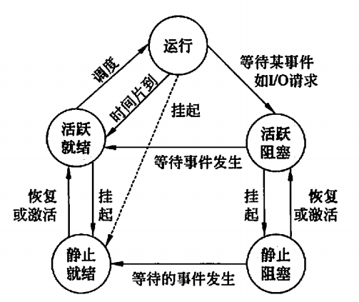
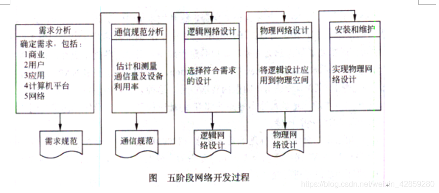

# 计算机技术与软件专业技术资格考试

[TOC]

## 计算机组成与体系结构

### 1. Flynn 分类法

1. 指令流
2. 数据流
3. 多倍性

Flynn 根据不同的指令流-数据流，把计算机分成 4 类：

1. SISD
2. SIMD
3. MISD
4. MIMD

### 2. 多级存储体系

1. 寄存器
2. Cache
3. 主存
4. 外存

存取方式：

1. 顺序存取：磁带
2. 直接存取：磁盘
3. 随机存取：内存
4. 相联存取：Cache

RAID：独立磁盘冗余阵列

1. RAID 0：无冗余、无校验
2. RAID 1：镜像
3. RAID 2： 纠错海明码
4. RAID 3/4：奇偶校验码，有独立校验盘
5. RAID 5：奇偶校验码，无独立校验盘
6. RAID 6：专用异步校验盘
7. RAID 7：RAID 6 优化，高传输速率
8. RAID 10：RAID 0 + RAID 1

Cache 映射方法：

1. 全相联
2. 组相联
3. 直接映射：哈希，高冲突

组数计算：Cache 容量 / 每组大小

Cache 淘汰算法：

1. 随机
2. FIFO
3. LRU

Cache 写操作：

1. 写直达 write through
2. 写回 write back
3. 标记

### 3. 输入输出方式

工作方式：

1. 程序控制方式：CPU 直接利用 IO 指令编程，轮询结果，方法简单，硬件开销小
2. 程序中断方式：IO 系统完成后使用中断通知 CPU，无需等待提高效率
3. DMA
4. 通道方式
5. 输入输出处理机

常见接口：

1. ESDI
2. IDE
3. SCSI
4. PCMCIA
5. IEEE-1394：火线
6. USB

### 4. 体系结构

|              | CISC   | RISC                     |
| ------------ | ------ | ------------------------ |
| 指令数       | 多     | 少                       |
| 指令复杂度   | 高     | 低                       |
| 指令长度     | 变化   | 短且固定                 |
| 指令执行周期 | 变化   | 高度流水线，一个机器周期 |
| 指令格式     | 复杂   | 简单                     |
| 寻址方式     | 多     | 极少                     |
| 寄存器数量   | 一般   | 大量                     |
| 译码方式     | 微程序 | 硬件电路                 |
| 编译系统要求 | 低     | 高                       |
| Cache        | 一般   | 指令+数据                |

流水线：

1. 吞吐率
2. 加速比
3. 效率：实际时空区 / 占用时空区

影响因素：

1. 转移指令
2. 资源冲突
3. 响应中断

多处理机系统：

1. 恒等置换：Identity
2. 交换置换：2^0
3. 方体置换：2^k
4. Shuffle：循环左移
5. 蝶式置换：最高最低交l换
6. 位序颠倒置换

## 操作系统

### 1. 类型与结构

1. 批处理操作系统
2. 分时操作系统
3. 实时操作系统
4. 网络操作系统
5. 分布式操作系统

结构：

1. 无序结构
2. 层次结构
3. 面向对象结构
4. 对称多处理结构
5. 微内核结构

微内核技术的主要优点：

1. 统一的接口，在用户态和核心态之间无须进程识别
2. 可伸缩性好，能适应硬件更新和应用变化
3. 可移植性好，所有与具体机器特征相关的代码，全部隔离在微内核中，如果操作系统要移植到不同的硬件平台上，只需修改微内核中极少代码即可
4. 实时性好，微内核可以方便地支持实时处理
5. 安全可靠性高，微内核将安全性作为系统内部特性来进行设计，对外仅使用少量应用编程接口
6. 支持分布式系统，支持多处理器的体系结构和高度并行的应用程序
7. 真正面向对象的操作系统

### 2. 处理器管理

进程：

1. 一个程序关于某个数据集的一次运行
2. 系统资源分配、调度和管理的最小单位
3. 由程序、数据和进程控制块（Process Control Block）组成

PCB：

1. 进程存在的唯一标志
2. 调度信息和执行信息

三态模型：

1. 运行态
2. 就绪态
3. 等待态

五态模型：

1. 运行
2. 活跃阻塞
3. 静止阻塞
4. 静止就绪
5. 活跃就绪

挂起进程特征：

1. 该进程不能立即被执行
2. 挂起进程可能会等待一个事件，但所等待的事件是独立于挂起条件的，事件结束并不能导致进程具备执行条件
3. 进程进入挂起状态是由于操作系统、父进程或进程本身阻止它的运行
4. 结束进程挂起状态的命令只能通过操作系统或父进程发出
5. 阻塞态：进入阻塞态通常是因为在等待 I/0 完成或等待分配到所需资源

信号量：

1. 信号量：一种特殊的变量，表现形式是一个整型 S 和一个队列
2. P 操作：S = S - 1，若 S < 0，进程暂停执行，进入等待队列
3. V 操作：S = S + 1，若 S <= 0，唤醒等待队列中的一个进程

## 一、UML

统一建模语言，有三个主要的模型：

1. **功能模型**：从用户的角度展示系统的功能，包括用例图
2. **对象模型**：采用对象，属性，操作，关联等概念展示系统的结构和基础，包括类别图、对象图
3. **动态模型**：展现系统的内部行为。包括序列图，活动图，状态图

UML 一共定义了 14 种图形：

* 结构性图形：强调系统式的建模
  * 静态图
    * 类图
    * 对象图
    * 包图
  * 实现图
    * 组件图
    * 部署图
  * 剖面图
  * 复合结构图
* 行为式图形：强调系统模型中触发的事件
  * 用例图
  * 活动图
  * 状态图
* 交互式图形：强调系统模型中的资料流程
  * 序列图
  * 通信图
  * 交互概述图
  * 定时图

### 1.1 类图

描述系统中对象的类型以及它们之间存在的各种静态关系：

1. **关联**：代表类型之间的关系
2. **继承**：面向对象设计中的继承
3. **聚合**：面向对象设计中的一种对象组合的形式

### 1.2 对象图

实例化的对象，表达特定时刻的实例。

### 1.3 包图

显示包和包之间的依赖关系的结构性图表。

### 1.4 组件图

描绘软件组件的体系结构以及它们之间的依赖关系，包括运行时组件、可执行组件和源代码组件。

### 1.5 部署图

对运行时配置进行建模，并可视化应用程序中 产出的分布，表达硬件配置和软件组件之间的关系。

### 1.6 剖面图

创建特定于域和平台的原型，并定义它们之间的关系。

### 1.7 复合结构图

用于微观视角的系统建模，显示了一个类的内部结构和这个结构所实现的协作。复合结构是一组相互关联的元素，它们在运行时进行协作以达到某种目的。每个元素在协作中都有一些定义的角色。

### 1.8 用例图

从用例的角度描述系统的功能需求，它是系统预期功能（用例）及其环境（参与者）的模型，将系统需要与系统如何满足这些需求相关联。

### 1.9 活动图

用于展示工作流程，描述了目标系统的控制流程，比如探索复杂的业务规则和操作。

### 1.10 状态图

描绘允许的状态和转换以及影响这些转换的事件，它有助于可视化对象的整个生命周期。

### 1.11 序列图

根据时间序列展示对象如何进行协作。基本元素包括对象、生命线和消息。

### 1.12 通信图

模拟用例的动态行为，侧重于显示对象的协作而不是时间顺序。

### 1.13 交互概览图

侧重于交互控制流程的概述。

### 1.14 定时图

显示了既定时间内对象的行为，时间从左到右增加，生命线显示在垂直排列的独立隔间中。

## 二、网络

### 2.1 OSI 模型

1. 物理层 Physical Layer：参与数据传输的物理设备，将数据转换为字节流
2. 数据链路层 Data Link Layer：负责促进同一网络之间的数据传输，数据帧 Data Frame
3. 网络层 Network Layer：负责促进两个网络之间的数据传输，决定路径和路由，IP 协议、ICMP 协议
4. 传输层 Transport Layer：负责两个设备间的端到端通信，依照协议传输数据，例如 TCP/UDP
5. 会话层 Session Layer：负责在数据传输中设置和维护计算机网络中两台计算机之间的通信连接
6. 表示层 Presentation Layer：把数据转换为能与接收者的系统格式兼容并适合传输的格式
7. 应用层 Application Layer：提供为应用软件而设计的接口，例如 HTTP、FTP、SSH、SMTP

### 2.2 TCP/IP 参考模型

1. 网络连结层：物理层 + 数据链路层
2. 网际互连层：网络层
3. 传输层：传输层
4. 应用层：会话层 + 表示层 + 应用层

### 2.3 网络开发

电信号在电缆中的传播速度是 $2.0 * 10^8m/s$。

## 三、法律法规

### 3.1 软件著作权

软件著作权因程序的完成而自动产生，具有独创性，即软件系独立开发完成，不是依现有软件抄袭、复制而来，不必履行任何形式的登记和注册手续。

### 3.2 商标

特点：

1. 专有性
2. 地域性
3. 时效性

商标注册优先级：

1. 申请在先
2. 协商解决
3. 抽签决定

## 四、计算机组成

### 4.1 缓存

块冲突概率由低变高：

1. 全相联映像
2. 组相联映像
3. 直接映像

## 五、系统分析

### 5.1 业务流程图

### 5.2 软件配置项

1. 环境类，指软件开发环境或软件维护环境，例如编译器、操作系统、编辑器、数据库管理系统、开发工具、项目管理工具、文档编制工具等
2. 定义类，是需求分析与定义阶段结束后得到的工作产品，例如需求规格说明、项目开发计划、设计标准或设计准则、验收测试计划等
3. 设计类，设计阶段结束后得到的工作产品，例如系统设计规格说明、程序规格说明、数据库设计、编码标准、用户界面标准、测试标准、系统测试计划、用户手册等
4. 测试类，系统测试完成后的工作产品，例如系统测试数据、系统测试结果、操作手册、安装手册等
5. 维护类，进入维护阶段以后产生的工作产品。

## 六、数据库

实体：现实世界中客观存在并可以被区别的事物
属性：实体所具有的某一特性，表的某一列
元组：表中的一行
码：表中可以唯一确定一个元组的某个属性组
主属性：包含在任何一个候选码中的属性
第一范式：属性不可分，所有关系数据库均是
第二范式：非主属性完全依赖于码，非码主属性不能确定任何一个非主属性
第三范式：消除传递依赖
模式：视图-外模式、基本表-模式、存储文件-内模式

### 6.1 数据库建模

1. 业务用例设计，使用用例图建立业务模型
2. 逻辑数据模型设计，确定应用系统所需的持久数据，设计出关系数据库中表达持久数据的实体类及其联系，并将他们映射为数据库表和视图等
3. 物理数据模型设计，使用组件图、配置图等设计数据库的物理模型
4. 物理实现设计，根据物理数据模型建立具体数据库环境下的数据库表和视图等

## References

1. ["什么是统一建模语言（UML）", *Visual Paradigm*](https://www.visual-paradigm.com/cn/guide/uml-unified-modeling-language/what-is-uml/)
1. ["什么是 OSI 模型", *Cloudflare*](https://www.cloudflare.com/zh-cn/learning/ddos/glossary/open-systems-interconnection-model-osi/)

