# 计算机技术与软件专业技术资格考试

[TOC]

## 一、UML

统一建模语言，有三个主要的模型：

1. **功能模型**：从用户的角度展示系统的功能，包括用例图
2. **对象模型**：采用对象，属性，操作，关联等概念展示系统的结构和基础，包括类别图、对象图
3. **动态模型**：展现系统的内部行为。包括序列图，活动图，状态图

UML 一共定义了 14 种图形：

* 结构性图形：强调系统式的建模
  * 静态图
    * 类图
    * 对象图
    * 包图
  * 实现图
    * 组件图
    * 部署图
  * 剖面图
  * 复合结构图
* 行为式图形：强调系统模型中触发的事件
  * 用例图
  * 活动图
  * 状态图
* 交互式图形：强调系统模型中的资料流程
  * 时序图
  * 通信图
  * 交互概述图
  * 时间图

### 1.1 类图

描述系统中对象的类型以及它们之间存在的各种静态关系：

1. **关联**：代表类型之间的关系
2. **继承**：面向对象设计中的继承
3. **聚合**：面向对象设计中的一种对象组合的形式

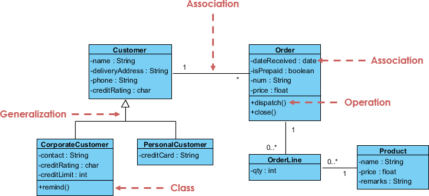

### 1.2 对象图

实例化的对象，表达特定时刻的实例。

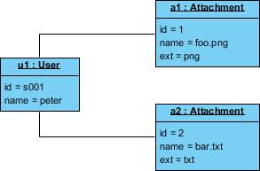

### 1.3 包图

显示包和包之间的依赖关系的结构性图表。

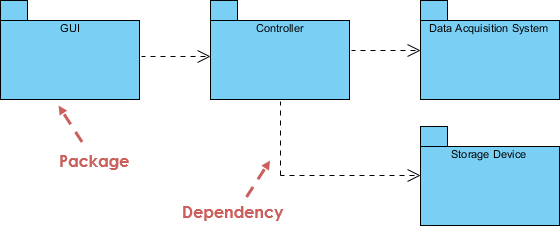

### 1.4 组件图

描绘软件组件的体系结构以及它们之间的依赖关系，包括运行时组件、可执行组件和源代码组件。

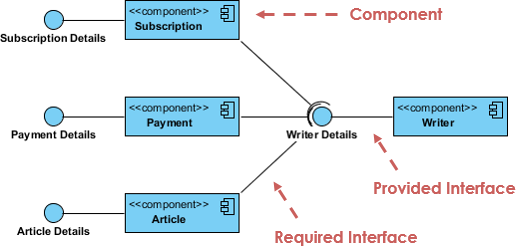

### 1.5 部署图

对运行时配置进行建模，并可视化应用程序中 产出的分布，表达硬件配置和软件组件之间的关系。

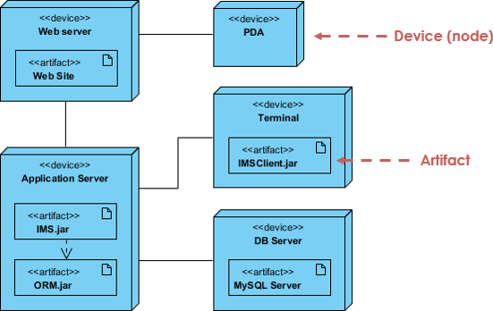

### 1.6 剖面图

创建特定于域和平台的原型，并定义它们之间的关系。

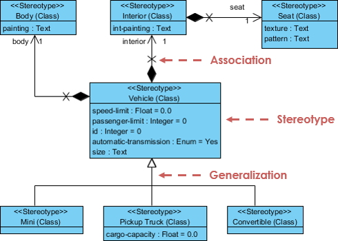

### 1.7 复合结构图

用于微观视角的系统建模，显示了一个类的内部结构和这个结构所实现的协作。复合结构是一组相互关联的元素，它们在运行时进行协作以达到某种目的。每个元素在协作中都有一些定义的角色。

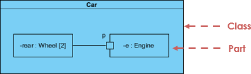

### 1.8 用例图

从用例的角度描述系统的功能需求，它是系统预期功能（用例）及其环境（参与者）的模型，将系统需要与系统如何满足这些需求相关联。

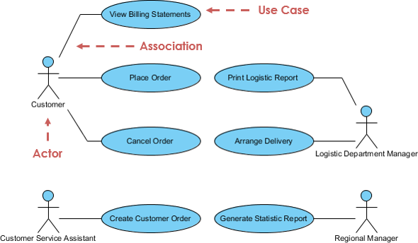

### 1.9 活动图

用于展示工作流程，描述了目标系统的控制流程，比如探索复杂的业务规则和操作。

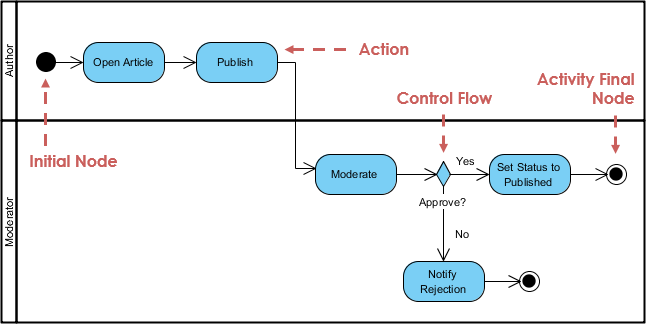

### 1.10 状态图

描绘允许的状态和转换以及影响这些转换的事件，它有助于可视化对象的整个生命周期。

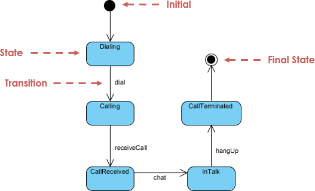

### 1.11 时序图

根据时间序列展示对象如何进行协作。

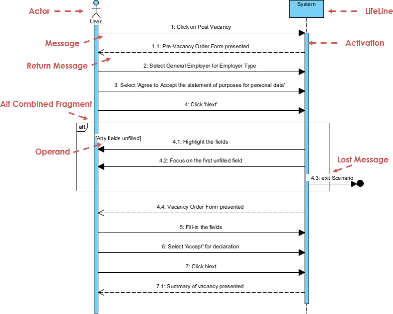

### 1.12 通信图

模拟用例的动态行为，侧重于显示对象的协作而不是时间顺序。

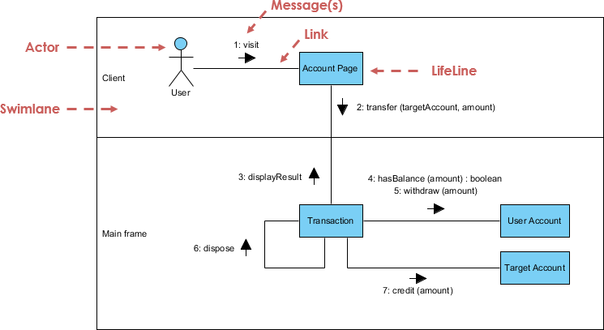

### 1.13 交互概览图

侧重于交互控制流程的概述。

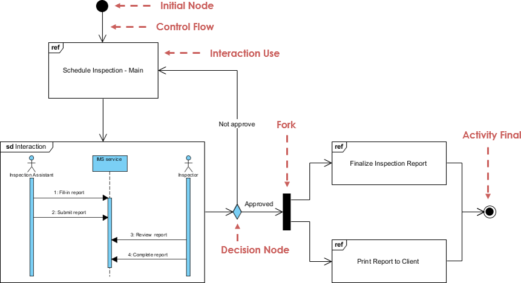

### 1.14 时间图

显示了既定时间内对象的行为，时间从左到右增加，生命线显示在垂直排列的独立隔间中。

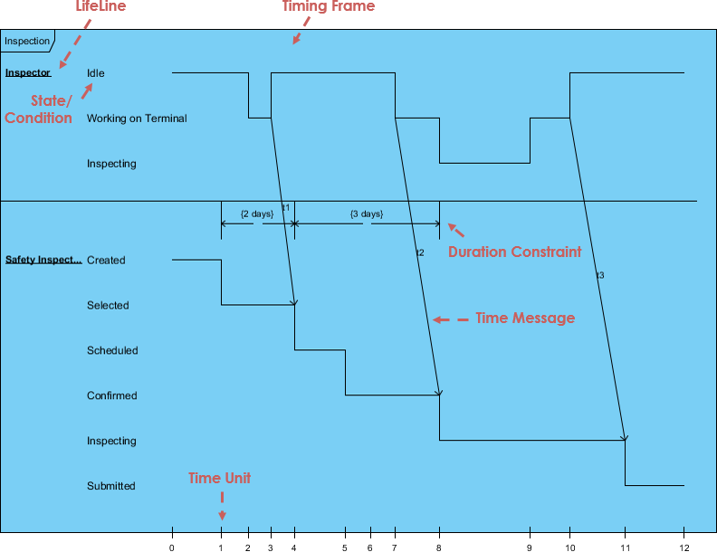

## 二、网络

### 2.1 OSI 模型

1. 物理层 Physical Layer：参与数据传输的物理设备，将数据转换为字节流
2. 数据链路层 Data Link Layer：负责促进同一网络之间的数据传输，数据帧 Data Frame
3. 网络层 Network Layer：负责促进两个网络之间的数据传输，决定路径和路由，IP 协议
4. 传输层 Transport Layer：负责两个设备间的端到端通信，依照协议传输数据，例如 TCP/UDP
5. 会话层 Session Layer：负责在数据传输中设置和维护计算机网络中两台计算机之间的通信连接
6. 表示层 Presentation Layer：把数据转换为能与接收者的系统格式兼容并适合传输的格式
7. 应用层 Application Layer：提供为应用软件而设计的接口，例如 HTTP、FTP、SSH、SMTP

### 2.2 TCP/IP 参考模型

1. 网络连结层：物理层 + 数据链路层
2. 网际互连层：网络层
3. 传输层：传输层
4. 应用层：会话层 + 表示层 + 应用层

## References

1. ["什么是统一建模语言（UML）", *Visual Paradigm*](https://www.visual-paradigm.com/cn/guide/uml-unified-modeling-language/what-is-uml/)
1. ["什么是 OSI 模型", *Cloudflare*](https://www.cloudflare.com/zh-cn/learning/ddos/glossary/open-systems-interconnection-model-osi/)

