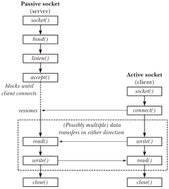
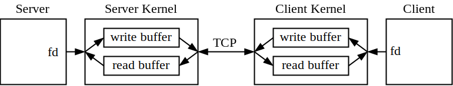

# Linux Socket 通信与 IO 多路复用

最近在进行 Linux 系统下 Socket 与 RPC 相关的工作，故系统化学习一下 Socket 方面的知识。主要参考文献为 《[The Linux Programming Interface](http://man7.org/tlpi/)》，中文版为《[Linux/UNIX 系统编程手册](https://www.epubit.com/bookDetails?id=N6862)》，可以在线购买电子版。本文重点介绍 *Internet domain stream socket*，也就是 *TCP socket*。

### 1. TCP Socket 通信

TCP Socket 通信时的系统调用流程如下图所示。首先 Server 和 Client 均通过 `socket` 创建 Socket 并获得对应的文件描述符 `sockfd`；而后 Server 侧需绑定 `bind` 一个众所周知的地址，并使用 `listen` 将 `sockfd` 标记为 *Passive* 状态，最后通过 `accept` 接受 Client 的 `connect` 连接请求。Server 侧 `accept` 成功后会返回一个新的文件描述符 `fd`，对该文件描述符进行读写可以完成 Server 和 Client 的通信。



Unix 下一切皆文件（Everything is a file），对 Socket 文件描述符 `fd` 的操作与一般文件操作无异，常用系统调用 `read` / `write` / `close` / `fcntl` 均正常使用。Socket 相关的函数声明于 `sys/socket.h` 中，有详细的注释，这里摘录部分：

```c++
/* Create a new socket of type TYPE in domain DOMAIN, using
   protocol PROTOCOL.  If PROTOCOL is zero, one is chosen automatically.
   Returns a file descriptor for the new socket, or -1 for errors.  */
extern int socket (int __domain, int __type, int __protocol) __THROW;

/* Give the socket FD the local address ADDR (which is LEN bytes long).  */
extern int bind (int __fd, __CONST_SOCKADDR_ARG __addr, socklen_t __len)

/* Open a connection on socket FD to peer at ADDR (which LEN bytes long).
   For connectionless socket types, just set the default address to send to
   and the only address from which to accept transmissions.
   Return 0 on success, -1 for errors.

   This function is a cancellation point and therefore not marked with
   __THROW.  */
extern int connect (int __fd, __CONST_SOCKADDR_ARG __addr, socklen_t __len);

/* Prepare to accept connections on socket FD.
   N connection requests will be queued before further requests are refused.
   Returns 0 on success, -1 for errors.  */
extern int listen (int __fd, int __n) __THROW;

/* Await a connection on socket FD.
   When a connection arrives, open a new socket to communicate with it,
   set *ADDR (which is *ADDR_LEN bytes long) to the address of the connecting
   peer and *ADDR_LEN to the address's actual length, and return the
   new socket's descriptor, or -1 for errors.

   This function is a cancellation point and therefore not marked with
   __THROW.  */
extern int accept (int __fd, __SOCKADDR_ARG __addr,
		   socklen_t *__restrict __addr_len);
```

简单 Socket 通信举例（[在线运行](https://paiza.io/projects/CwP7rJLhNe4EuGXb0a6jpg?language=cpp)）。这里忽略了错误处理部分，仅展示系统调用流程：

```c++
#include <arpa/inet.h>
#include <string.h>
#include <sys/socket.h>
#include <unistd.h>

#include <chrono>
#include <string>
#include <thread>

#define ZERO_OR_RETURN(expr)                             \
  do {                                                   \
    int ret = (expr);                                    \
    if (ret != 0) {                                      \
      printf("ERR: line %d return %d\n", __LINE__, ret); \
      return ret;                                        \
    }                                                    \
  } while (0);

int Server(int port) {
  struct sockaddr_in server_addr;
  memset(&server_addr, 0, sizeof(server_addr));
  server_addr.sin_family = AF_INET;
  server_addr.sin_addr.s_addr = htonl(INADDR_ANY);
  server_addr.sin_port = htons(port);
  socklen_t server_len = sizeof(server_addr);

  int sockfd = socket(AF_INET, SOCK_STREAM, 0);
  printf("SERVER: Create Socket [%d]\n", sockfd);

  ZERO_OR_RETURN(bind(sockfd, (struct sockaddr *)&server_addr, server_len));
  printf("SERVER: Bind [%d] on [%d] port\n", sockfd, port);

  ZERO_OR_RETURN(listen(sockfd, 36));
  printf("SERVER: Listen [%d]\n", sockfd);

  struct sockaddr_in client_addr;
  socklen_t client_len = sizeof(client_addr);
  int fd = accept(sockfd, (struct sockaddr *)&client_addr, &client_len);
  printf("SERVER: Accept [%d]\n", fd);

  std::string buffer(1024, '\0');
  int r = read(fd, &buffer[0], buffer.size());
  buffer.resize(r);
  printf("SERVER: Recv [%s]\n", buffer.c_str());

  int w = write(fd, &buffer[0], buffer.size());
  buffer.resize(w);
  printf("SERVER: Send [%s]\n", buffer.c_str());

  ZERO_OR_RETURN(close(fd));
  ZERO_OR_RETURN(close(sockfd));
  return 0;
}

int Client(int port) {
  std::this_thread::sleep_for(std::chrono::milliseconds(100));

  struct sockaddr_in client_addr;
  memset(&client_addr, 0, sizeof(client_addr));
  client_addr.sin_family = AF_INET;
  client_addr.sin_addr.s_addr = htonl(INADDR_ANY);
  client_addr.sin_port = htons(port);
  socklen_t client_len = sizeof(client_addr);

  int sockfd = socket(AF_INET, SOCK_STREAM, 0);
  printf("CLIENT: Create Socket [%d]\n", sockfd);

  ZERO_OR_RETURN(connect(sockfd, (struct sockaddr *)&client_addr, client_len));
  printf("CLIENT: Connect [%d] on [%d] port\n", sockfd, port);

  std::string buffer("Hello Socket");
  int w = write(sockfd, &buffer[0], buffer.size());
  buffer.resize(w);
  printf("CLIENT: Send [%s]\n", buffer.c_str());

  int r = read(sockfd, &buffer[0], buffer.size());
  buffer.resize(r);
  printf("CLIENT: Recv [%s]\n", buffer.c_str());

  ZERO_OR_RETURN(close(sockfd));
  return 0;
}

int main() {
  srand(time(0));
  int port = rand() % 10000 + 10000;
  std::thread server(Server, port);
  std::thread client(Client, port);
  client.join();
  server.join();
  return 0;
}

/*
SERVER: Create Socket [4]
SERVER: Bind [4] on [12650] port
SERVER: Listen [4]
CLIENT: Create Socket [6]
CLIENT: Connect [6] on [12650] port
SERVER: Accept [5]
CLIENT: Send [Hello Socket]
SERVER: Recv [Hello Socket]
SERVER: Send [Hello Socket]
CLIENT: Recv [Hello Socket]
*/
```

### 2. 阻塞与 IO 多路复用

一切皆文件，实际上是一切皆字节流，本质上是可以进行 IO 操作的内核对象。既然是流，就会有读到空或者写到满的状态，即 `read buffer` 为空或 `write buffer` 已满。



这时有两种等待方式可以选择：

1. 阻塞：在调用处睡觉，当 buffer 可用时内核会叫醒你并返回，但睡觉时没法做别的事情；
2. 非阻塞：调用会立即返回，这时可以做别的事情，但并不知道何时 buffer 可用，需要自行定期检查（轮询）。

当只有一个流需要处理时，阻塞等待是可行的。但现实情况通常是需要处理多个流，这时如果继续使用阻塞等待，一个流将会阻塞其他所有流的处理。这时一个可行的方案是使用多线程/多进程，一个流的阻塞不影响其他流的处理。另一个可行的方案是将所有需要等待的流存在列表里，使用非阻塞模式，轮询，对可用的流进行相应的处理。

为了更清楚地描述这几种等待方式，这里引用[知乎上柴小喵的一个回答](https://www.zhihu.com/question/28594409/answer/52835876)并稍作修改：

> 假设你是一个老师，让 30 个学生做作业，然后批改学生的作业，你有下面几个选择：
>
> 1. **按顺序逐个检查和批改**，先等待 A 完成，批改 A 的作业；然后是 B，之后是 C、D，以此类推。这中间如果有一个学生做得慢，那么全班都会被耽误；
> 2. **创建 30 个分身**，每个分身等待一个学生做完，并对其作业批改，也就是多线程/多进程模式；
> 3. **依次检查学生是否完成，批改已经完成的作业**，先看 A 有没有做完，做完的话就批改他的；没做完就继续看 B 有没有做完，做完的话就批改他的；这样就不会闲着了，在班里晃几圈就可以，但老师始终没有休息，要么在检查要么在批改，可能检查了 20 个才会批改一份，做了很多无用功；
> 4. **在讲台休息，让学习委员把完成作业的同学名字记下来，而后找学习委员拿名单、批改名单上同学的作业**，这就是 IO 多路复用。

第四种就需要借助于系统调用 `select` / `poll` / `epoll`，本文仅介绍 `epoll`。`epoll` 的核心调用如下：

```c++
/* Creates an epoll instance.  Returns an fd for the new instance.
   The "size" parameter is a hint specifying the number of file
   descriptors to be associated with the new instance.  The fd
   returned by epoll_create() should be closed with close().  */
extern int epoll_create (int __size) __THROW;

/* Manipulate an epoll instance "epfd". Returns 0 in case of success,
   -1 in case of error ( the "errno" variable will contain the
   specific error code ) The "op" parameter is one of the EPOLL_CTL_*
   constants defined above. The "fd" parameter is the target of the
   operation. The "event" parameter describes which events the caller
   is interested in and any associated user data.  */
extern int epoll_ctl (int __epfd, int __op, int __fd,
		      struct epoll_event *__event) __THROW;

/* Wait for events on an epoll instance "epfd". Returns the number of
   triggered events returned in "events" buffer. Or -1 in case of
   error with the "errno" variable set to the specific error code. The
   "events" parameter is a buffer that will contain triggered
   events. The "maxevents" is the maximum number of events to be
   returned ( usually size of "events" ). The "timeout" parameter
   specifies the maximum wait time in milliseconds (-1 == infinite).

   This function is a cancellation point and therefore not marked with
   __THROW.  */
extern int epoll_wait (int __epfd, struct epoll_event *__events,
		       int __maxevents, int __timeout);
```

`epoll_create` 创建学习委员；`epoll_ctl` 则是注册班里的同学，学委就知道要记录哪些同学举手了；最后 `epoll_wait` 则是找学委拿名单。拿名单时学委可能还没有发现同学举手，这时可以选择一直等着学委记下第一个名字，或者限时 `timeout`，到时间也得把空名单拿上来。

学委记名字也是有技巧的，有两种方式：

1. 水平触发 `Level Triggered`，学委让完成作业并且还没有被批改的同学举手，老师要名单时学委自己把举手的同学名字记下来，这是相对勤奋的学委；
2. 边缘触发 `Edge Triggered`，学委让同学做完作业时，自己把名字写到名单上，老师拿名单时就直接把名单丢给老师。这样自己闲一点，但是如果老师拿了名单后忘了批改，这些同学的作业就没有机会被批改了。

### 3. Reactor 模式与协程

使用基于 `Epoll` 的 Reactor 模式，可以在单线程下“并发”地处理多个流。举个栗子🌰：

```c++
#include <arpa/inet.h>
#include <ctype.h>
#include <errno.h>
#include <fcntl.h>
#include <stdio.h>
#include <stdlib.h>
#include <string.h>
#include <sys/epoll.h>
#include <unistd.h>

#define ZERO_OR_RETURN(expr)            \
  do {                                  \
    int ret = (expr);                   \
    if (ret != 0) {                     \
      printf("%d %d\n", __LINE__, ret); \
      return ret;                       \
    }                                   \
  } while (0);

int main(int argc, char *argv[]) {
  struct sockaddr_in serv_addr;
  socklen_t serv_len = sizeof(serv_addr);
  int port = atoi(argv[1]);

  int lfd = socket(AF_INET, SOCK_STREAM, 0);
  memset(&serv_addr, 0, sizeof(serv_addr));
  serv_addr.sin_family = AF_INET;
  serv_addr.sin_addr.s_addr = htonl(INADDR_ANY);
  serv_addr.sin_port = htons(port);
  ZERO_OR_RETURN(bind(lfd, (struct sockaddr *)&serv_addr, serv_len));
  ZERO_OR_RETURN(listen(lfd, 36));

  struct sockaddr_in client_addr;
  socklen_t cli_len = sizeof(client_addr);

  int epfd = epoll_create(1024);
  struct epoll_event ev;
  ev.events = EPOLLIN;
  ev.data.fd = lfd;
  epoll_ctl(epfd, EPOLL_CTL_ADD, lfd, &ev);

  struct epoll_event all[1024];
  while (1) {
    int ret = epoll_wait(epfd, all, sizeof(all) / sizeof(all[0]), -1);
    for (int i = 0; i < ret; ++i) {
      int fd = all[i].data.fd;
      if (fd == lfd) {
        int cfd = accept(lfd, (struct sockaddr *)&client_addr, &cli_len);
        if (cfd == -1) {
          perror("> Accept Error");
          exit(1);
        }
        int flag = fcntl(cfd, F_GETFL);
        flag |= O_NONBLOCK;
        fcntl(cfd, F_SETFL, flag);
        struct epoll_event temp;
        temp.events = EPOLLIN | EPOLLET;
        temp.data.fd = cfd;
        epoll_ctl(epfd, EPOLL_CTL_ADD, cfd, &temp);
        char ip[64] = {0};
        printf("> New Client [%s:%d] => [%d]\n",
               inet_ntop(AF_INET, &client_addr.sin_addr.s_addr, ip, sizeof(ip)),
               ntohs(client_addr.sin_port), cfd);
      } else {
        if (!(all[i].events & EPOLLIN)) {
          continue;
        }
        char buffer[5] = {0};
        int len;
        while ((len = read(fd, buffer, sizeof(buffer))) > 0) {
          write(fd, buffer, len);
        }
        if (len == -1) {
          if (errno == EAGAIN) {
            // Buffer Data is Finished!;
          } else {
            perror("> Recv Error");
            exit(1);
          }
        }
        if (len == 0) {
          printf("> Client [%d] Disconnected!\n", fd);
          epoll_ctl(epfd, EPOLL_CTL_DEL, fd, NULL);
          close(fd);
        }
      }
    }
  }

  close(lfd);
  return 0;
}
```

上方是 Server 端的代码，可以使用 `netcat` 进行测试，或者使用下方的 Client 代码测试：

```c++
#include <arpa/inet.h>
#include <signal.h>
#include <string.h>
#include <unistd.h>

#include <atomic>
#include <chrono>
#include <string>
#include <thread>

#define ZERO_OR_RETURN(expr)            \
  do {                                  \
    int ret = (expr);                   \
    if (ret != 0) {                     \
      printf("%d %d\n", __LINE__, ret); \
      return ret;                       \
    }                                   \
  } while (0);

std::atomic<bool> quit{false};
std::atomic<int> alive{0};

void do_quit(int) {
  quit = true;
  while (alive > 0) {
    std::this_thread::sleep_for(std::chrono::milliseconds(30));
  }
  exit(0);
}

int main(int argc, char *argv[]) {
  if (argc == 0) {
    printf("%s [port=8000] [thread=1] [data_size=100]");
    return 0;
  }
  signal(SIGINT, do_quit);

  int port = argc >= 2 ? std::atoi(argv[1]) : 8000;
  int thread = argc >= 3 ? std::atoi(argv[2]) : 1;
  int data_size = argc >= 4 ? std::atoi(argv[3]) : 100;
  std::string data(data_size, '\0');
  for (char &ch : data) {
    ch = rand() % 26 + 'A';
  }

  std::atomic<int> qps{0};
  for (int i = 0; i < thread; ++i) {
    std::thread([&] {
      ++alive;
      struct sockaddr_in cli_addr;
      socklen_t cli_len = sizeof(cli_addr);
      memset(&cli_addr, 0, sizeof(cli_addr));
      cli_addr.sin_family = AF_INET;
      cli_addr.sin_addr.s_addr = htonl(INADDR_ANY);
      cli_addr.sin_port = htons(port);
      std::string buffer(data);

      int sock = socket(AF_INET, SOCK_STREAM, 0);
      ZERO_OR_RETURN(connect(sock, (struct sockaddr *)&cli_addr, cli_len));
      while (!quit) {
        int writen = 0;
        while (writen < data.size()) {
          int w = write(sock, &data[writen], data.size() - writen);
          writen += w;
        }
        int readed = 0;
        while (readed < data.size()) {
          int r = read(sock, &buffer[readed], data.size() - readed);
          readed += r;
        }
        if (data == buffer) {
          qps += 1;
        }
      }

      ZERO_OR_RETURN(close(sock));
      --alive;
    }).detach();
  }

  while (true) {
    std::this_thread::sleep_for(std::chrono::seconds(1));
    printf("QPS: %d\n", qps.load());
    qps = 0;
  }
}
```

Reactor 模式的核心思想是当事件发生时（流可用），来通知对象处理该事件（IO 操作），其他时间则可以休息。这与协程的风格是近似的，不同的是协程写出来的代码和同步的代码风格一致，当流阻塞时自动放弃执行权 `Yield`，当流可用时再恢复 `Resume`。实际上很多协程库的核心就是 `Epoll`，例如微信开源的 [libco](https://github.com/Tencent/libco)。这部分待笔者完善后继续补充。

### References

1. ["The Linux Programming Interface", *Michael Kerrisk*](http://man7.org/tlpi/)

