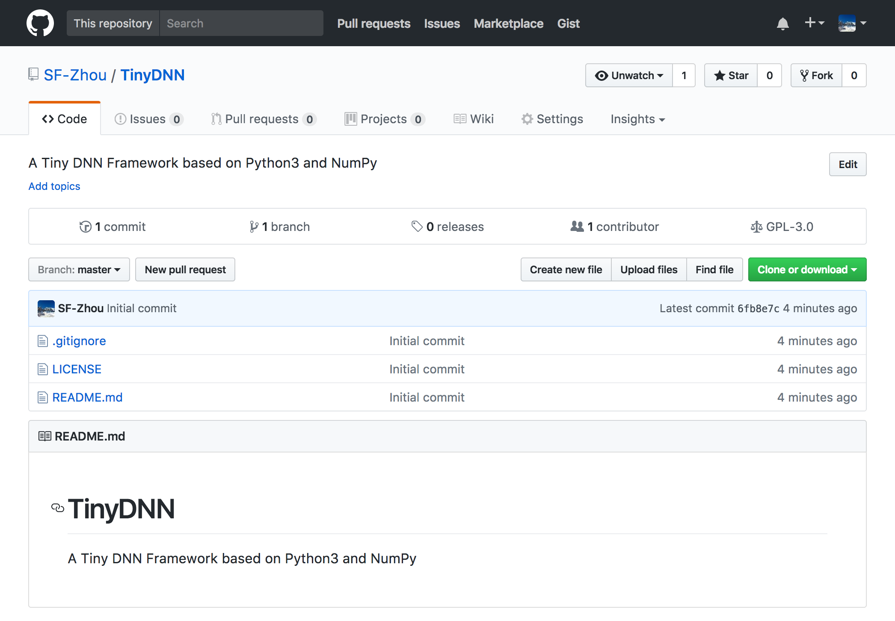

# 从零开始构建深度学习框架（一）

学完了 Andrew Ng 的深度学习课程，总觉得要巩固一下。自己搭一个简单的 DNN 框架不失为一个好方法。从今天开始，我会用 Python3 + NumPy 从零开始，逐步构建一个简单的深度学习框架。

## 一、简介

1. 项目名：[TinyDNN](https://github.com/SF-Zhou/TinyDNN)
2. 使用的工具
   1. Python3 + NumPy
   2. PyCharm CE
3. 会实现的模块
   1. Layer: input, full connect, softmax
   2. Activication: tanh, ReLU, sigmoid
   3. Net: consists of layers
   4. Solver: SGD, Adam
   5. Hyperparameters
4. 参考的现有框架
   1. [Caffe](http://caffe.berkeleyvision.org/)
   2. [TensorFlow](https://www.tensorflow.org/)
   3. [ConvNetJS](http://cs.stanford.edu/people/karpathy/convnetjs/)
5. 参考的资料
   1. [Deep Learning Specialization](https://www.coursera.org/specializations/deep-learning) on Coursera
6. 会使用到的数据集
   1. [MNIST](http://yann.lecun.com/exdb/mnist/), handwritten digits

## 二、开始

在 GitHub 上创建一个名为 [TinyDNN](https://github.com/SF-Zhou/TinyDNN) 的项目。

嗯，整个项目已经成功了大半，是不 :D

为了方便记录进度，GitHub 上的 repo 会打上 tag。例如今天是第一天，则会标记上 [day-01](https://github.com/SF-Zhou/TinyDNN/tree/day-01) 的 tag，方便查找某天的代码。

既然 FLAG 已经立下，我相信我会认真地实现该项目的。（这是另一个 FLAG）