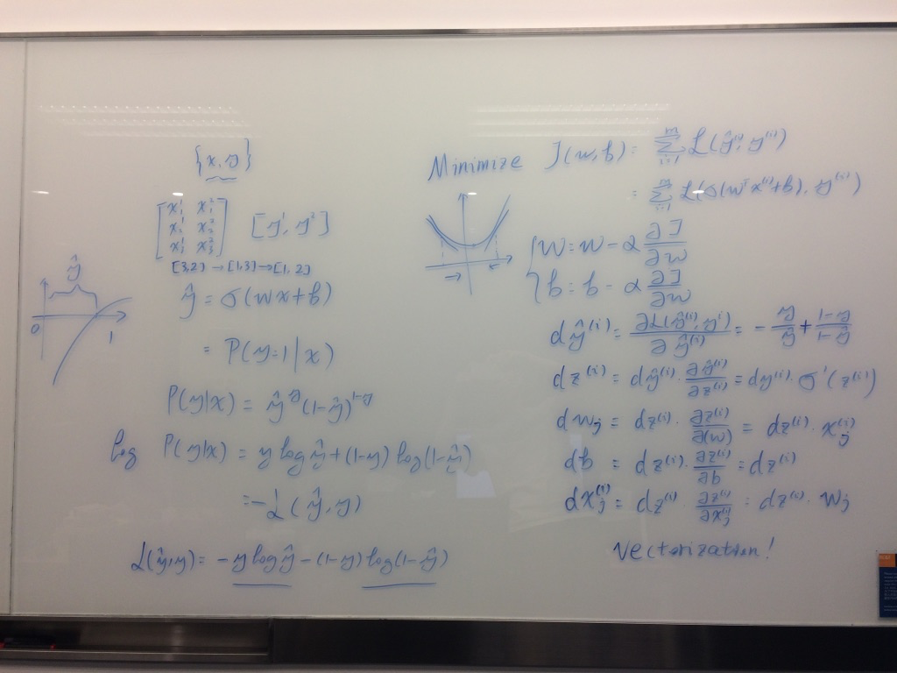

# 从零开始构建深度学习框架（二）

## 三、推导

在正式编码之前，推导一遍神经网络的核心公式。

For $\{x, y\}$, $x \in \mathbb{R}^n$, $y \in \{0, 1\}$

$$
\hat y = \sigma(w^Tx + b), \text{ where } \sigma(z) = \frac {1} {1+e^{-z}}
$$

Interpret $\hat{y}=P(y=1|x)$

$$
\begin{aligned}
P(y|x) &= \hat y ^ y (1 - \hat y) ^ {1 - y} \\
\log {P(y|x)} &= \log ( \hat y ^ y (1 - \hat y) ^ {1 - y}) \\
& = y \log {(\hat y)} + (1 - y) \log {(1 - \hat y)} \\
& = - \mathcal{L} (\hat y, y)
\end{aligned}
$$

Minimize $\mathcal{L} (\hat y, y)$

$$
\mathcal{L} (\hat y, y) = - y \log {(\hat y)} - (1 - y) \log {(1 - \hat y)}
$$

For multi $\{x, y\}$ pairs
$$
\begin{aligned}
J(w, b) &= \frac {1} {m} {\sum_{i=1}^{m}{\mathcal{L}(\hat y^{(i)}, y^{(i)})}} \\
& = \frac {1} {m} {\sum_{i=1}^{m}{\mathcal{L}(\sigma(w^Tx^{(i)} + b), y^{(i)})}}
\end{aligned}
$$
Minimize $J(w, b)$, use gradient decrease
$$
\begin{aligned}
w &= w - \alpha \frac {\partial J(w, b)} {\partial w} \\
b &= b -  \alpha \frac {\partial J(w, b)} {\partial b}
\end{aligned}
$$
Derivative
$$
\begin{aligned}
d\hat y &= \frac {\partial \mathcal {L(\hat y, y)}} {\partial \hat y} = - \frac {y}{\hat y} + \frac {1 - y}{1 - \hat y} \\
dz &= \frac {\partial \mathcal {L(\hat y, y)}} {\partial \hat y} \frac {\partial \hat y}{\partial z} = d\hat y \sigma'(z) \\
dw_j &= \frac {\partial \mathcal {L(\hat y, y)}} {\partial z} \frac {\partial z} {\partial w_j} = x_{j} dz \\
db &=  \frac {\partial \mathcal {L(\hat y, y)}} {\partial z} \frac {\partial z} {\partial b} = dz \\
dx_j &= \frac {\partial \mathcal {L(\hat y, y)}} {\partial z} \frac {\partial z} {\partial x_j} = w_{j} dz
\end{aligned}
$$



## 四、设计

初步实现的模块包括：

1. activation，实现 sigmoid / tanh / ReLU 等激活函数；
2. layer，核心部分，实现 forward / backward 计算；
3. net，组织 layer 形成网络，控制各项操作。

另外不可或缺的还有：

1. unit test，实现单元测试；
2. util，实现常用函数库；
3. examples，实现使用样例。

### 1. [activation](https://github.com/SF-Zhou/TinyDNN/tree/day-02/tiny_dnn/activation)

抽象出 Activation 接口，包含三个操作：

```python
import numpy as np


class Activation:
    @staticmethod
    def calculate(data_in: np.ndarray) -> np.ndarray:
        pass

    @staticmethod
    def derivative(data_in: np.ndarray) -> np.ndarray:
        pass

    @staticmethod
    def weight_initial(previous_dim: int, dim: int = None) -> float:
        pass
```

分别是直接计算、导数计算和权重项初值计算。导数根据激活函数的公式推导即可，而不同的激活函数，推荐的权重项目初值是不一样的，在 [Improving Deep Neural Networks: Hyperparameter tuning, Regularization and Optimization](https://www.coursera.org/learn/deep-neural-network/home) 第一周的课程 [Weight Initialization for Deep Networks](https://www.coursera.org/learn/deep-neural-network/lecture/RwqYe/weight-initialization-for-deep-networks) 中有讲述。

目前 activation 模块实现了 sigmoid 和 tanh 函数部分。并且实现了 get 操作，可以通过输入函数名返回 activation 对象。

```python
from .. import activation


def get(activation_type: str) -> 'Activation':
    activation_func = getattr(activation, '{}Activation'.format(activation_type.capitalize()), None)
    assert activation_func, '{} Activation Not Found'.format(activation_type.capitalize())
    return activation_func
```

### 2. [layer](https://github.com/SF-Zhou/TinyDNN/tree/day-02/tiny_dnn/layer)

layer 模块抽象出 Layer 接口，同样实现三个操作：

```python
import typing
import numpy as np


class Layer:
    def forward(self, data_in: np.ndarray, label: np.ndarray) -> typing.Tuple[np.ndarray, np.ndarray]:
        pass

    def backward(self, da: np.ndarray) -> np.ndarray:
        pass

    def update(self, learning_rate: float):
        pass
```

forward 函数实现正向的计算。宏观上从输入开始，每一层执行正向计算，直到输出层。继而计算 cost，并且反过来，每一层执行反向计算，得到参数的导数。

最后使用 update 函数更新参数。注意，初步实现的版本直接使用最简易的参数更新方法，进而 update 函数的输入只有 learning_rate。后期引入 Momentum 和 Adam 时，update 的参数应该是参数更新的策略。

核心的 [Full Connect Layer](https://github.com/SF-Zhou/TinyDNN/blob/day-02/tiny_dnn/layer/full_connect_layer.py) 实现得比较粗暴，会把使用到的参数都保存下来。核心的 forward 和 backward 部分如下：

```python
    def forward(self, data_in: np.ndarray, label: np.ndarray) -> typing.Tuple[np.ndarray, np.ndarray]:
        if not self.previous_neuron_number:
            previous_neuron_number, _ = data_in.shape
            self.previous_neuron_number = previous_neuron_number

        self.data_in = data_in
        self.z = np.dot(self.w, data_in)
        self.a = self.activation.calculate(self.z)
        return self.a, label

    def backward(self, da: np.ndarray) -> np.ndarray:
        m = self.data_in.shape[1]

        self.dz = da * self.activation.derivative(self.z)
        self.dw = np.dot(self.dz, self.data_in.T) / m
        self.db = np.mean(self.dz, axis=1, keepdims=True)
        return np.dot(self.w.T, self.dz)
```

net 部分目前也是简单的实现，不详细介绍了。

### 3. [unit test](https://github.com/SF-Zhou/TinyDNN/tree/day-02/tests)

编写单元测试，主要是为了保证开发过程中代码功能的正确性。部分数据计算的测试参考了 Andrew Ng 课程中的实验部分。对于 activation 的导数计算，也会使用 estimated derivative 的方法去进行验证。

测试可以使用 pytest 执行，另外 PyCharm 上也有很好的单元测试支持。

### 4. summary

今天标记为第二天，GitHub 上的 tag 为 [day-02](https://github.com/SF-Zhou/TinyDNN/tree/day-02/)。

代码里同样也实现了一个简单 example，跑起来效果还是可以的，就是速度有点慢。这也是因为项目本身不会太重视执行性能。代码中会经常用到 typing，以实现在 PyCharm 中准确的类型判断，代码提示会友好很多。

好了，还有很多功能需要实现，结构也需要改进。下一篇继续。

