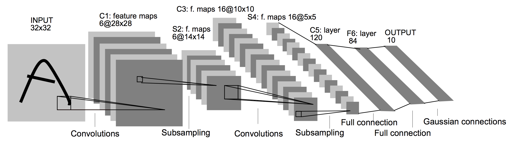
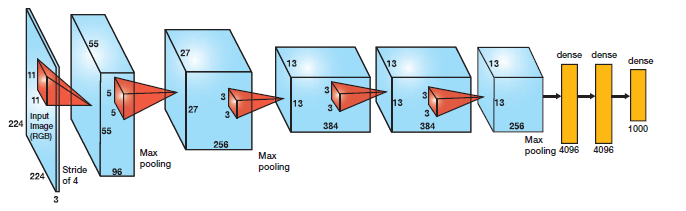
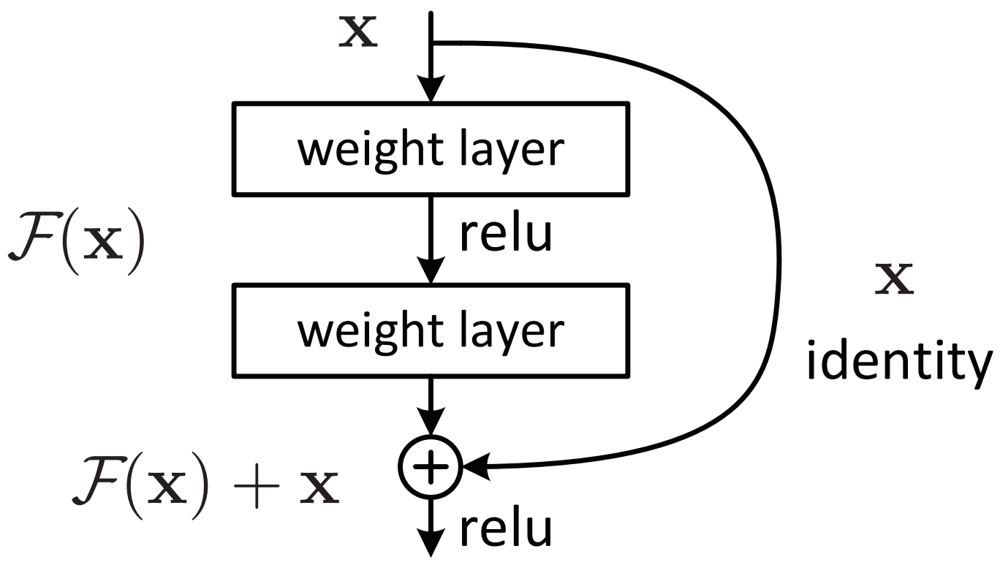
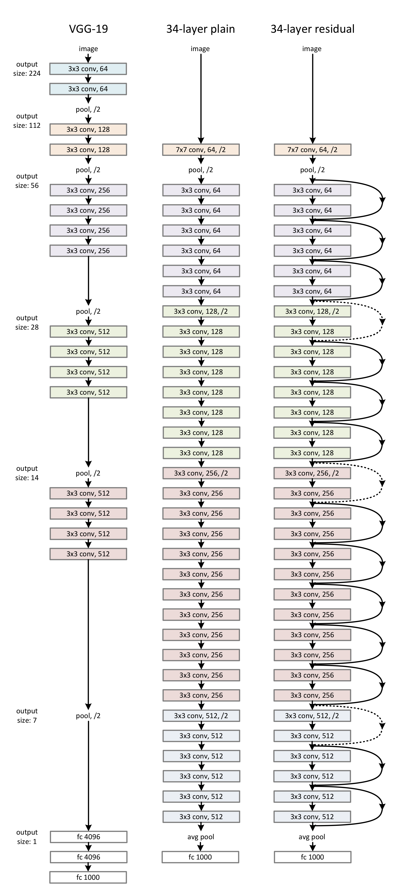
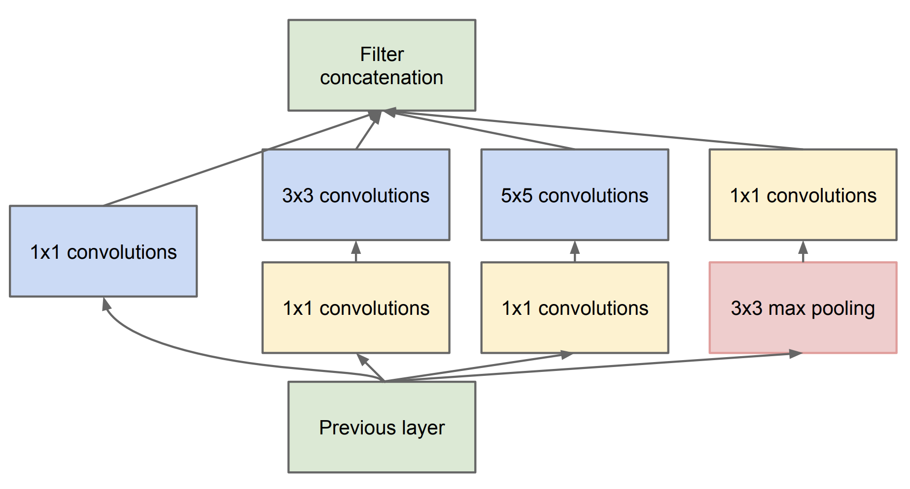
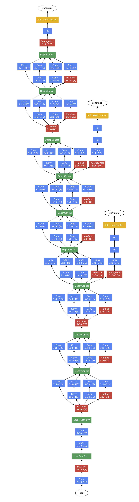
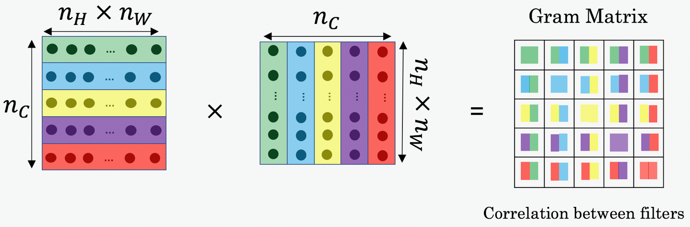

# Coursera: Convolutional Neural Networks

### 1. Basic CNN

Concept:

* Filter
* Padding
* Stride
* $\lfloor \frac {n+2p-f} {s} + 1 \rfloor$
* Volume
* Pooling

Why CNN?

1. Parameter Sharing
2. Sparsity of Connection

A visualization demo: [3D convolutional network visualization](http://scs.ryerson.ca/~aharley/vis/conv).

### 2. Classic Networks

[LeNets-5 1998](http://www.dengfanxin.cn/wp-content/uploads/2016/03/1998Lecun.pdf): ReLU, non-linearity activation after pooling layer

[AlexNet 2012](http://papers.nips.cc/paper/4824-imagenet-classification-with-deep-convolutional-neural-networks.pdf): Multi-GPUs, 60M parameters, easy to read

[VGG-16 2015](https://arxiv.org/pdf/1409.1556/): 138M parameters

### 3. [ResNets](http://openaccess.thecvf.com/content_cvpr_2016/papers/He_Deep_Residual_Learning_CVPR_2016_paper.pdf)

Residual Block:

34-Layer Residual:

Why ResNets Work?

$$
a^{[l+2]}=ReLU(z^{[l+2]}+a^{[l]})
$$

If $w^{[l+2]}=0, b^{[l+2]}=0$, then:

$$
a^{[l+2]}=ReLU(a^{[l]}) = a^{[l]}
$$

### 4. [Inception Network](http://openaccess.thecvf.com/content_cvpr_2015/papers/Szegedy_Going_Deeper_With_2015_CVPR_paper.pdf)

Inception Module with Dimensionality Reduction:

GoogLeNet:

### 5. Practical Advices

1. Using Open-Source Implementations
   1. Architectures
   2. Implementations
   3. Pretrained Models
2. Transfer Learning (Freeze Some Layers)
3. Data Augmentation
   1. Mirroring
   2. Random Cropping
   3. Color Shifting
   4. PCA Color Augmentation
4. More Hand-Engineering
   1. Hand Engineered Features / Architectures
   2. Ensembling
   3. Multi-Crop at Test Time (10-crop)

### 6. [YOLO](https://pjreddie.com/darknet/yolo/)

[Learning]

### 7. Face Recognition

* Face Verification, 1:1
* Face Recognition, 1:N

**Similarity** Function $d(im_0, im_1)$: degree of difference between images, same if

$$
d(im_0, im_1) \le \tau
$$

[Triplet Loss](https://www.cv-foundation.org/openaccess/content_cvpr_2015/papers/Schroff_FaceNet_A_Unified_2015_CVPR_paper.pdf): Anchor, Positive, Negative

$$
d(A, P) + \alpha \le d(A, N)
$$

$$
\mathcal{L}(A, P, N) = \max (d(A, P) - d(A, N) + \alpha, 0)
$$

$$
J = \sum_{i} {\mathcal{L}(A^{(i)}, P^{(i)}, N^{(i)})}
$$

### 8. [Neural Style Transfer](https://arxiv.org/pdf/1508.06576.pdf)

Content C, Style S, Generated Image G:

$$
J(G) = \alpha J_{content}(C, G) + \beta J_{style}(S, G)
$$

1. Initiate G randomly
2. Use gradient descent to minimize $J(G)$

$$
G = G - \frac {\partial} {\partial G} J(G)
$$

For Content Cost Function:

$$
J_{content}^{[l]}(C, G) = \frac {1}{4 n_{H}^{[l]} n_{W}^{[l]} n_{C}^{[l]}} \| a^{[l](C)}-a^{[l](G)} \|^2
$$

For Style Cost Function:

$$
G_{kk'}^{[l]} = \sum_{i}^{n_{H}^{[l]}} \sum_{j}^{n_{W}^{[l]}} a_{ijk}^{[l]} a_{ijk'}^{[l]}, k = 1, \cdots, n_{C}^{[l]}
$$

$$
J_{style}^{[l]}(S, G) = \frac {1}{(2 n_{H}^{[l]} n_{W}^{[l]} n_{C}^{[l]})^2} \sum_{k}^{n_C^{[l]}} \sum_{k'}^{n_C^{[l]}} {(G_{kk'}^{[l](S)} - G_{kk'}^{[l](G)})^2}
$$

