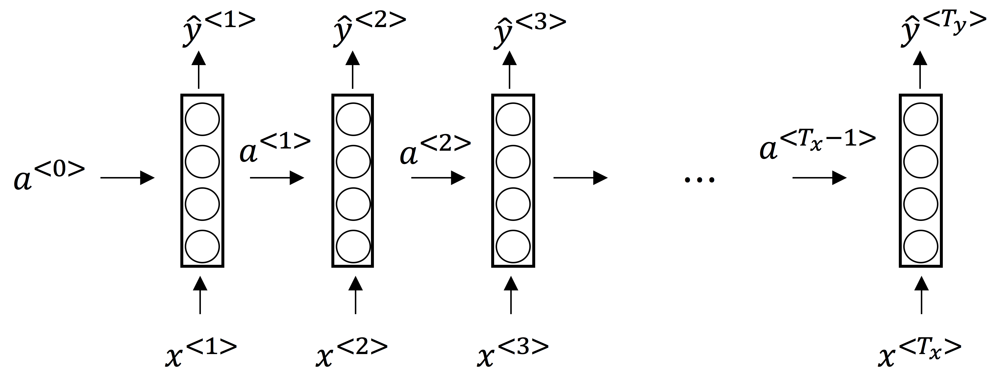
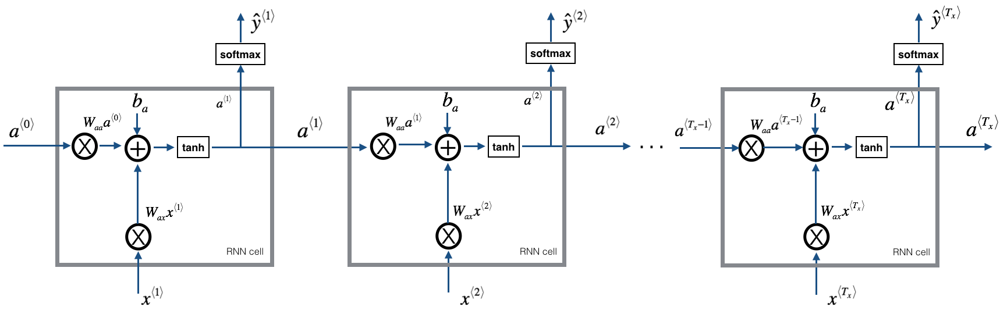
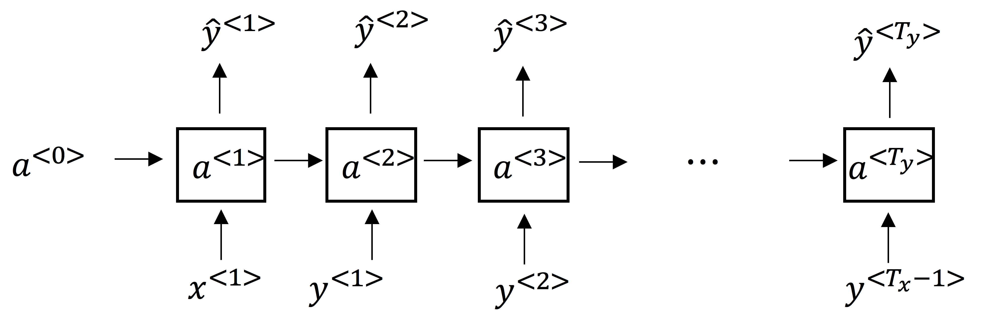
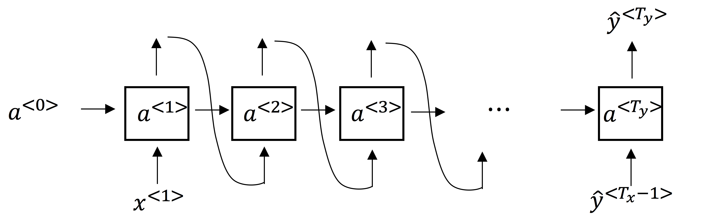
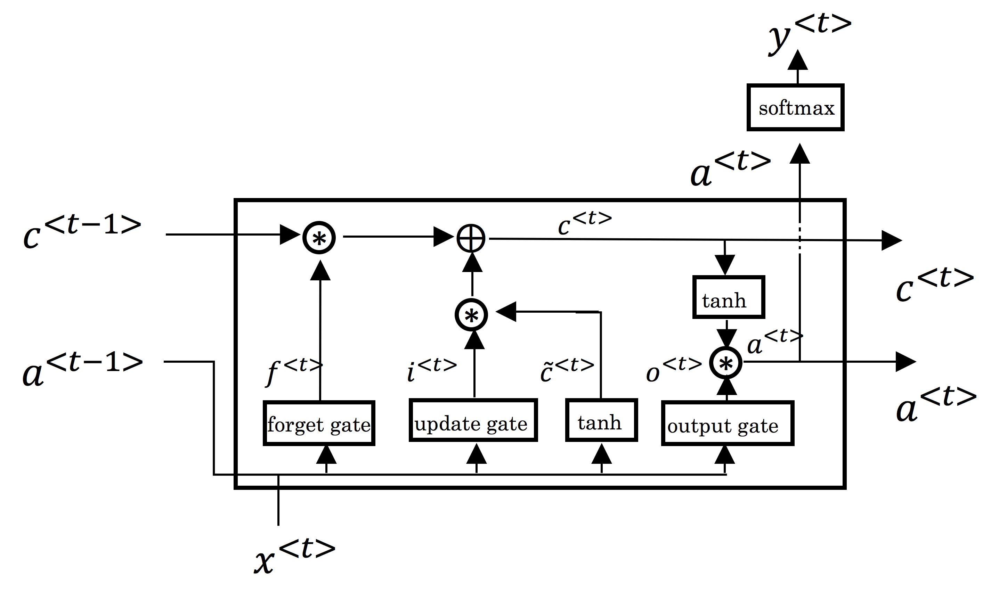
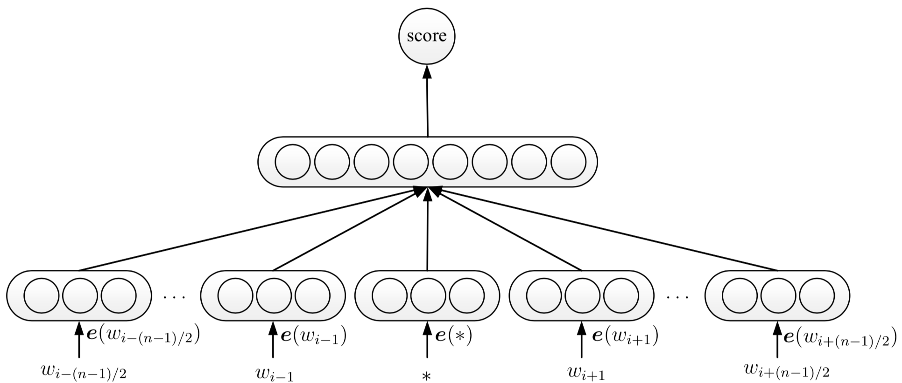
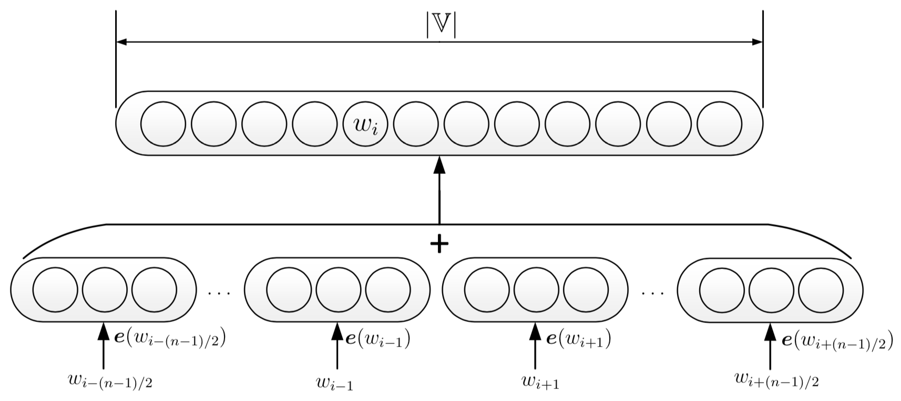
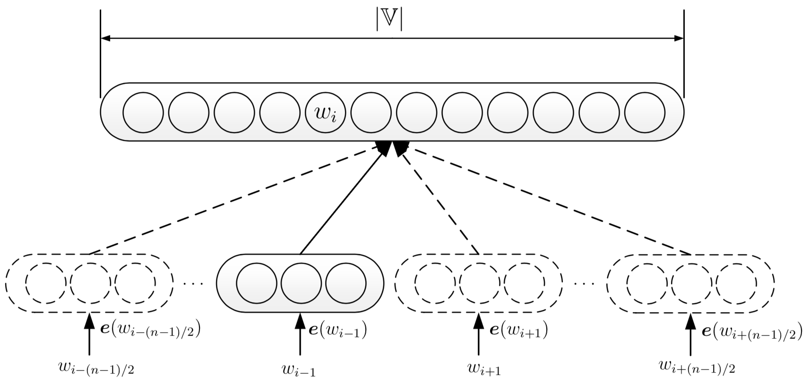
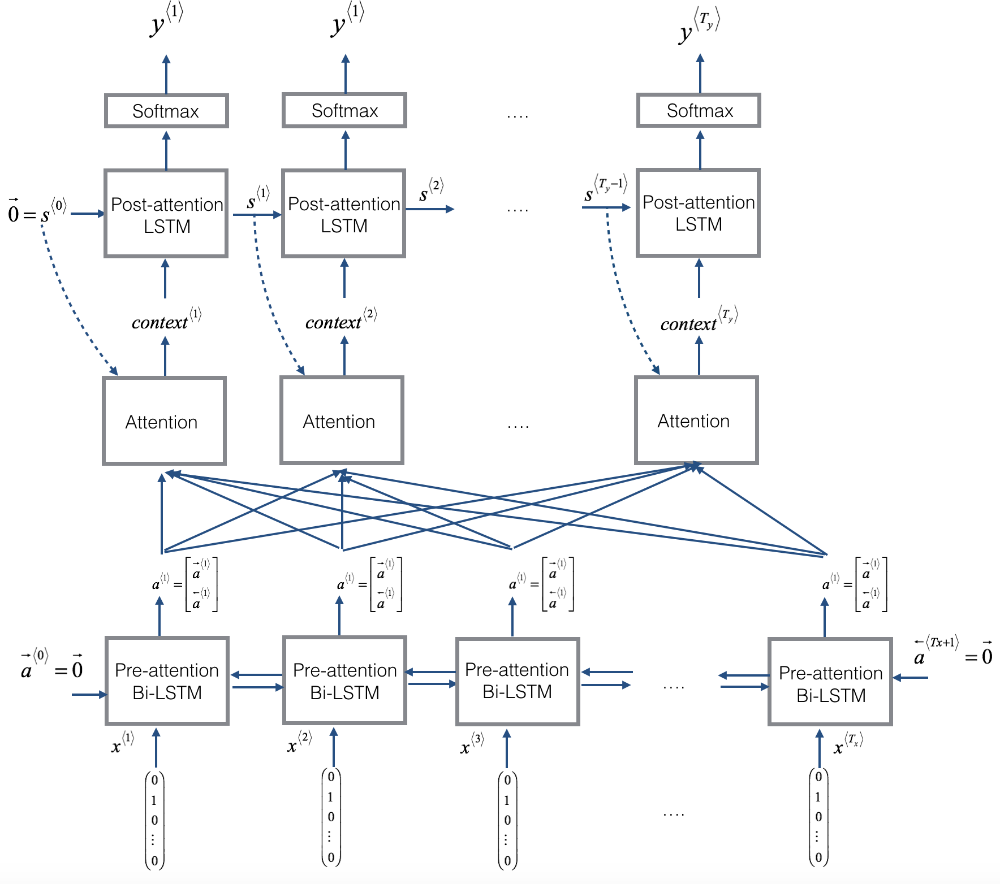
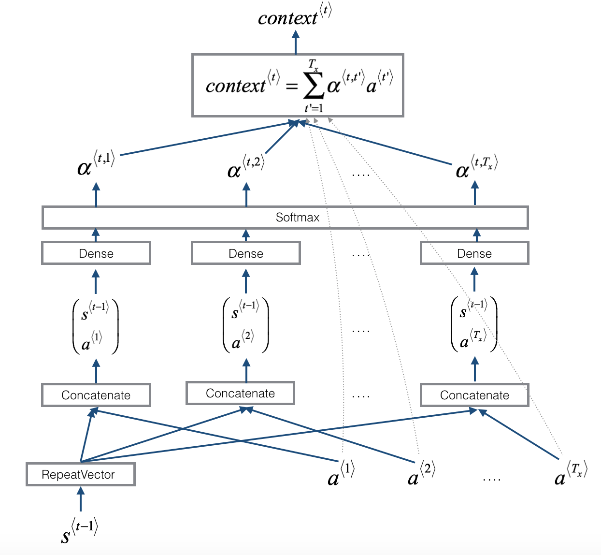

# Coursera: Sequence Models

### 1. Basic RNN

$$
\begin {aligned}
z^{<t>} &= W_{aa} a^{<t-1>} + W_{ax} x^{<t>} + b_a \\
a^{<t>} &= g(z^{<t>}) \\
\hat y^{<t>} &= g(W_{y} a^{<t>} + b_y)
\end {aligned}
$$

Derivative:

$$
\begin {aligned}
da^{<t>} &= \frac {\partial J} {\partial a^{<t>} } \\
dz^{<t>} &= da^{<t>} \frac {\partial a^{<t>} } {\partial z} = da^{<t>} g'(z) \\
dx^{<t>} &= W_{ax}^T dz^{<t>} \\
dW_{ax}^{<t>} &= dz^{<t>} x^{<t>T} \\
da^{<t-1>} &= W_{aa}^T dz^{<t>} \\
dW_{aa}^{<t>} &= dz^{<t>}a^{<t-1>T} \\
dW_{ax} &= \sum_t^{T_x} dW_{ax}^{<t>} \\
dW_{aa} &= \sum_t^{T_x} dW_{aa}^{<t>}
\end {aligned}
$$

### 2. Language Model

* Input: $sentence$
* Output: $P(sentence)$
* Training set: large corpus of text

$$
\begin {aligned}
x^{<1>} &= \vec 0 \\
x^{<t>} &= y^{<t - 1>}, t > 1 \\
\hat y_{[j]}^{<t>} &= P(\text{word}_j | y^{<1>}, \cdots, y^{<t-1>}) \\
\mathcal L(\hat y^{<t>}, y^{<t>}) &= - \sum_i {y_i^{<t>} \log \hat y_i^{<t>}}
\end {aligned}
$$

Sampling a Sequence:

### 3. Gradient

* Exploding: gradient clipping
* Vanishing: GRU, LSTM

### 4. [GRU & LSTM](https://arxiv.org/pdf/1412.3555.pdf)

Gated Recurrent Unit:

$$
\begin{aligned}
\Gamma _u &= \sigma(W_u[c^{<t-1>}, x^{<t>}] + b_u) \\
\Gamma _r &= \sigma(W_r[c^{<t-1>}, x^{<t>}] + b_r) \\
\tilde c^{<t>} &= \tanh (W_c[\Gamma _r * c^{<t - 1>}, x^{<t>}] + b_c) \\
c^{<t>} &= \Gamma _u * \tilde c^{<t>} + (1 - \Gamma _u) * c ^ {<t - 1>} \\
a^{<t>} &= c^{<t>}
\end{aligned}
$$

Long Short Term Memory:

$$
\begin{aligned}
\Gamma _u &= \sigma(W_u[a^{<t-1>}, x^{<t>}] + b_u) \\
\Gamma _f &= \sigma(W_f[a^{<t-1>}, x^{<t>}] + b_f) \\
\Gamma _o &= \sigma(W_o[a^{<t-1>}, x^{<t>}] + b_o) \\
\tilde c^{<t>} &= \tanh (W_c[a^{<t - 1>}, x^{<t>}] + b_c) \\
c^{<t>} &= \Gamma _u * \tilde c^{<t>} + \Gamma _f * c ^ {<t - 1>} \\
a^{<t>} &= \Gamma _o * \tanh c^{<t>}
\end{aligned}
$$

### 5. Word Embeddings 

* Input: content, $c$
* Output: target, $t$
* Vocabulary: $\mathbb V$
* Embedding Matrix: $E$
* One-hot Vector: $o_w$
* Word Embedding: $e_w$

Naive Model:

$$
o_c \rightarrow E \rightarrow e_c \rightarrow \text {Softmax} \rightarrow \hat y
$$

Problem: calculation complexity of softmax

$$
P(t|c) = \frac {\exp({\theta^T_t} e_c)} {\sum_j^{\left | \mathbb V \right |} \exp({\theta ^T_j e_c})}
$$

C&W Model:

CBOW Model:

Skip-Gram Model:

Negtive Sampling:

$$
\underset {\theta} {\arg \max} \log \sigma (e_t \cdot (\theta^T_t e_c)) + \log \sigma (- e_{t'} \cdot (\theta^T_t e_c))
$$

$t'$ is negative sample, randomly select from $\mathbb V$ with:

$$
P(w_i) = \frac {\text {count} (w_{i})^{3/4}} {\sum _j \text {count} (w_j)^{3/4}}
$$

### 6. Beam Search

* only stores a predetermined number, $\beta$, of best states at each level
* greedy algorithm

Optimize:

$$
\underset {y} {\arg \max} \frac {1} {T_y^{\alpha}} \sum _{t=1} ^{T_y} {\log P(y^{<t>} | x, y^{<1>}, \cdots, y^{<t-1>})}
$$

### 7. Attention

$\alpha ^{<t, t'>}$: amount of attention $y^{<t>}$ should pay to $a^{<t'>}$:

$$
\alpha ^{<t, t'>} = \frac {\exp (e^{<t, t'>})} {\sum _{t'=1} ^{T_x} {\exp (e^{<t, t'>})} }
$$

#### Reference

1. [Sequence Models on Coursera](https://www.coursera.org/learn/nlp-sequence-models)
2. [Lai, Siwei. "Word and Document Embeddings based on Neural Network Approaches." arXiv preprint arXiv:1611.05962 (2016).](https://arxiv.org/pdf/1611.05962.pdf)
3. [Mikolov, Tomas, et al. "Distributed representations of words and phrases and their compositionality." Advances in neural information processing systems. 2013.](http://papers.nips.cc/paper/5021-distributed-representations-of-words-and-phrases-and-their-compositionality.pdf)

