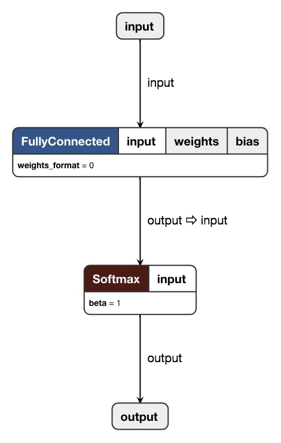

# TensorFlow Lite 与定点量化

### 1. TensorFlow Lite 简介

[TensorFlow Lite](https://www.tensorflow.org/mobile/tflite/)，简称 `TF-Lite`，是 TensorFlow 针对移动端和嵌入式设备提出的解决方案。在尽量保持精度的情况下，极大地优化模型体积，在移动设备上更快地完成 Inference。

TF-Lite 同时支持浮点数模型和定点量化模型，其中浮点数模型可以直接通过[官方提供的 Converter 转换得到](https://www.tensorflow.org/mobile/tflite/devguide)，而量化模型则一般需要进行伪量化 + `fine-tuning` 操作。定点量化模型可以获得更快的推导速度、更小的模型体积，当然精度也下降地更厉害。

TensorFlow 官方提供了一系列 pre-trained 的模型，包括 [`MobileNet`](https://github.com/tensorflow/models/blob/master/research/slim/nets/mobilenet_v1.md) 系列和 [`Inception`](https://github.com/tensorflow/models/tree/master/research/slim/nets) 系列等，并且也提供了[移动端上模型的参考推导时间](https://www.tensorflow.org/mobile/tflite/performance)。从数据上来看，MobileNetV1 这样的轻量级模型经过量化后，在 iPhone8 上完成一次推导仅需 24.4ms，帧率可以做到 40+ 帧/秒，可以应用到实时视频的 App 里了。

### 2. 量化简介

TF-Lite 定点量化的原理可以参考 Google 发表在 CVPR 2018 的论文，[见参考文献 1](http://openaccess.thecvf.com/content_cvpr_2018/papers/Jacob_Quantization_and_Training_CVPR_2018_paper.pdf)。这里简述一下论文中的方案。

#### 2.1 Quantization Scheme

定义 $r$ 为浮点类型的实际值，定义 $q$ 为整型的量化值，量化的模式可以简述为：

$$
q = \frac {r} {S} + Z
$$

反之，量化值也可以恢复为实际浮点值：

$$
r = (q - Z) \times S
$$

这里的 $S$ 和 $Z$ 均为量化参数，前者如字面意思所示，$Z$ 表示浮点数的 0 量化后对应的整型值。由于 0 在神经网络中有着特殊的含义，故必须有精确的整型值对应 0。对于量化后的值 $q$，通过量化参数 $(S, Z)$ 可恢复到所代表的浮点数值。

假设使用 8bit 量化，那么量化后的整型值的范围为 $[0, 255]$，对应的可以表示的浮点数值的范围为：

$$
\begin{aligned}
\min &= (0 - Z) \times S \\
\max &= (255 - Z) \times S
\end{aligned}
$$

对于超过 $[\min, \max]$ 范围的浮点数值，量化后必须要做截断。$\min$ 和 $\max$ 可以通过统计的方式得到，网络中的每一层会有不同的 $\min$ 和 $\max$；而 $[\min, \max]$ 范围的浮点数值经过量化后，可以认为数值精度由原先 float 的 24bit 降低到 uint8 的 8bit。

#### 2.2 Integer-arithmetic-only Matrix Multiplication

考虑两个 $N \times N$ 矩阵 $r_1$ 和 $r_2$ 的乘法，假设 $r_3 = r_1 r_2$。易知：

$$
r_\alpha ^{(i, j)} = S_\alpha \left (q_\alpha ^{(i, j)} - Z_\alpha \right )
$$

则上述的矩阵乘法可以改写为：

$$
S_3 \left (q_3^{(i, k)} - Z_3 \right ) = \sum_{j=1}^N S_1 \left (q_1^{(i, j)}-Z_1 \right ) S_2 \left (q_2^{(j, k)} - Z_2 \right )
$$

移项可得：

$$
q_3^{(i, k)} = Z_3 + M\sum_{j=1}^N \left ( q_1^{(i, j)} - Z_1 \right ) \left ( q_2^{(j, k)} - Z_2 \right )
$$

其中：

$$
M = \frac {S_1 S_2} {S_3} = \frac {M_0} {2^n}
$$

按照经验 $0 \lt M \lt 1$，故可以预处理为一个大整数除 $2^n$，int32 时 $n$ 可取 31，进而将该浮点数乘法转化为一次整数乘法和一次移位操作。至此矩阵乘法可以在全整数运算下完成。

#### 2. 3 Implementation of a Typical Fused Layer

以 FC 为例，假设输入为 $q_1$，量化参数为 $(S_1, Z_1)$；weight 矩阵可以使用上节中的方法量化为整数矩阵 $q_2$ 和一组量化参数 $(S_2, Z_2)$；而 $\text{bias}$ 同样可以量化，使用 int32 存储，其量化参数可以设定为：

$$
S_{\text {bias}} = S_1 S_2, Z_{\text {bias}} = 0
$$

进而可以将量化后的 $\text{bias}$ 加到 $q_1$ 和 $q_2$ 的乘积结果上。

对于 $ReLU$ 操作，其实精准的控制输出中 $Z$ 的值即可；$ReLU6$ 可以通过类似的方法实现；进而可以将 $ReLU$ 层 fused 到上一层中。

### 3. 量化 Example

对于量化，TensorFlow 也有[官方的样例](https://www.tensorflow.org/performance/quantization)，但对新手并不友好。为此笔者在 GitHub 上建立了一个非常简单的样例，并且配置了 CI，可以最简化地体验创建一个量化模型的完整步骤。Repo 地址：[SF-Zhou/tensorflow-quantization-example](https://github.com/SF-Zhou/tensorflow-quantization-example)

核心步骤包括：

1. 创建 FakeQuant Training Graph ([train.py](https://github.com/SF-Zhou/tensorflow-quantization-example/blob/master/train.py))
2. 导出 FakeQuant Inference Graph ([test.py](https://github.com/SF-Zhou/tensorflow-quantization-example/blob/master/test.py))
3. Freeze Graph & Checkpoint ([freeze.sh](https://github.com/SF-Zhou/tensorflow-quantization-example/blob/master/freeze.sh))
4. 导出 TF-Lite 模型 ([quantization.sh](https://github.com/SF-Zhou/tensorflow-quantization-example/blob/master/quantization.sh))

最后会生成后缀为 `.tflite` 的模型文件。该模型文件可以使用 [Netron](https://github.com/lutzroeder/Netron) 工具查看，如下图所示。

TF-Lite 模型可以在 PC 做 Inference 测试，在该 Repo 中也提供了一个简单的示例：[load_tflite.py](https://github.com/SF-Zhou/tensorflow-quantization-example/blob/master/load_tflite.py)。

### 4. TF-Lite 模型存储结构

如果需要对 TF-Lite 模型进行手术般的修改的话，那就一定要了解 TF-Lite 模型的存储结构。TF-Lite 使用了 Google 提出的 [FlatBuffers](https://github.com/google/flatbuffers) 序列化协议，简而言之就是二进制版的 JSON。TF-Lite 模型定义文件可以在 TensorFlow 项目中找到：[schema.fbs](https://github.com/tensorflow/tensorflow/blob/master/tensorflow/contrib/lite/schema/schema.fbs)，通过 schema 文件和 FlatBuffers，可以编译得到解析 TF-Lite 模型文件的头文件，进而对模型进行进一步操作。

同样地，笔者在 GitHub 上建立了一个非常简单的样例，并且配置了 CI，以供参考。Repo 地址：[SF-Zhou/tflite-model-parse](https://github.com/SF-Zhou/tflite-model-parse)。

事实上，如果已经有其他平台的定点量化模型文件，其实可以直接通过复制 weight + bias 和量化数据的方式，制作相同精度的 TF-Lite 模型。笔者近期在工作中就有类似的尝试，验证的结果也确实是可行的。

### 参考文献

1. [Jacob, Benoit, et al. "Quantization and training of neural networks for efficient integer-arithmetic-only inference." *arXiv preprint arXiv:1712.05877* (2017).](http://openaccess.thecvf.com/content_cvpr_2018/papers/Jacob_Quantization_and_Training_CVPR_2018_paper.pdf)

