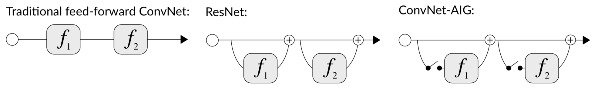
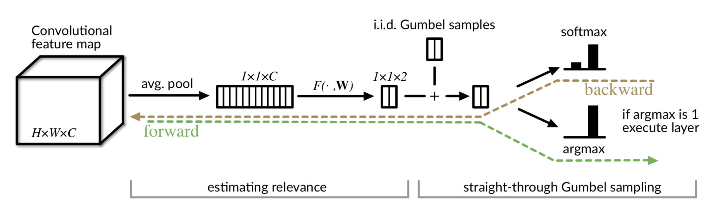
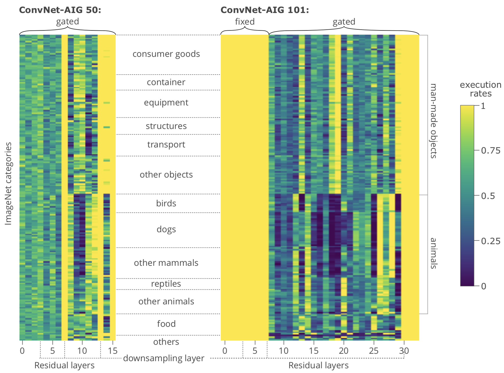
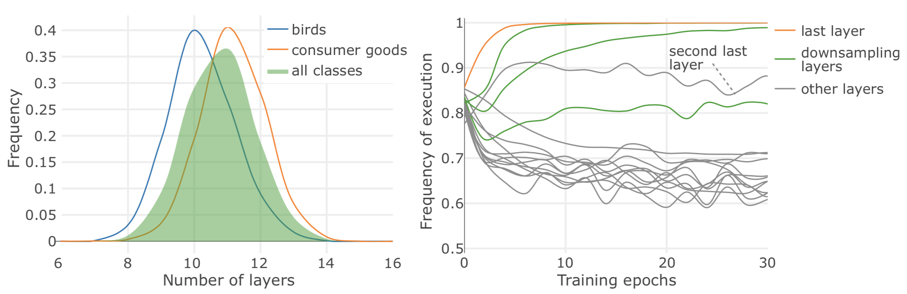

# [Reading] Convolutional Networks with Adaptive Inference Graphs

今年 ECCV 的一篇工作，主题是自适应推导图，简而言之就是在推导阶段自适应的跳过一些层，加快推导速度。[原文下载链接见参考文献 1](http://openaccess.thecvf.com/content_ECCV_2018/papers/Andreas_Veit_Convolutional_Networks_with_ECCV_2018_paper.pdf)。

### 1. ResNet Structure

传统的神经网络的层可以这样表示：

$$
x_l = \mathcal F_l(x_{l - 1})
$$

$x_{l-1}$ 为上一层的输出、该层的输入，$x_l$ 为该层的输出。而典型 ResNet 的层可以这样表示：

$$
x_l = x_{l - 1} + \mathcal F_l(x_{l - 1})
$$

在后续的研究中发现，ResNet 中的层虽然是连接在一起训练的，但各个层表现出高度的独立性。进一步地，几乎可以在不损失性能的情况下，删掉 ResNet 中的任意一独立层。

### 2. Gated Inference

文中提出 ConvNet-AIG，一个可以在运行时定义拓扑结构的网络。相较于 ResNet，ConvNet-AIG 增加了一个门，定义如下：

$$
x_l = x_{l - 1} + z(x_{l-1}) \cdot \mathcal F_l(x_{l - 1}) \text{ where } z(x_{l-1}) \in \{0, 1\}
$$

$z(x_{l-1})$ 取决于该层的输入 $x_{l - 1}$，其输出为 0 或着 1，分别表示跳过该层和使用该层，也可以理解为硬注意机制（hard attention mechanism）。

为了避免陷入某个固定的状态（始终跳过或者始终执行），作者发现加速随机是十分必要的。通过在近似的关联数组中增加噪声实现这样的随机。再者，该门需要做出一个离散的决策，故而作者提出使用 `Gumbel-Max trick` 和 `softmax relaxation` 来实现该操作。下图为论文中门单元的结构图。

### 3. Estimating Layer Relevance

如上图的所示，门的计算包括一个 `Average Pool`，两层 `FC`，一个 `Gumbel Samples`，最后在 forward 中使用 `argmax`，在 backward 中使用 `softmax`。

作者表示，在 ResNet 101 这样的网络中，对于 ImageNet 数据集，门的操作仅会增加 0.04% 的计算开销，但却可以平均跳过 33% 的层。

### 4. Greedy Gumbel Sampling

首先，介绍一下 `Gumbel Distribution`，该分布一般用来模拟任意分布的一组采样的最大值（或最小值），可以参考维基百科的定义。实际应用中可以用来估计最大风速、洪水高位等。

对于标准的  `Gumbel Distribution`，其概率密度函数为：

$$
f(x) = e^{-(x+e^{-x})}
$$

其累计分布函数为：

$$
F(x) = e^{-e^{(-x)}}
$$

进而可以求得其反函数以生成 `Gumbel` 变量：

$$
G = \mu -\ln(-\ln(U))
$$

其中 $u$ 为位置参数，$U \sim \text{Unif}[0, 1]$。而 `Gumbel-max Trick` 则是在 $K$ 个 `Gumbel` 分布中，输出的 $K$ 个 $G$ 中 $G_k$ 为最大值的概率恰好是位置参数 $u_k$ 的 Softmax 概率： 

$$
P \left (G_k \text{ is largest} | \{ u_{k'} \}_{k'=1}^{K} \right ) = \frac {e^{u_k}} {\sum_{k'=1}^{K} {e^{u_{k'}}}}
$$

设定 $u_k = 0$，那么 $G_k$ 为最大值的概率恰为 $1/K$。最终该门的输出为：

$$
X = \underset{k \in \{1, \cdots, K\}}{\arg \max } {\log \alpha _k + G_k}
$$

其中 $\log \alpha_k$ 为 FC 输出的、未标准化的 $\log$ 概率。

### 5. Training Loss

由于增加了门操作，故而需要增加相应的 Loss，以鼓励其做合适的跳过操作。引入一个目标比例 $t$，定义 `target rate loss` 为：

$$
\mathcal L _{target} = \sum _{l=1} ^{N} (\overline z_l - t)^2
$$

其中 $\overline z_l$ 为该层在一个 batch 中被执行的比例。再和原先的多分类损失 $L_{MC}$ 结合，最终的 `training loss` 为：

$$
L_{AIG} = L_{MC} + L_{target}
$$

### 6. Experiments Results

在 CIFAR 和 ImageNet 数据集上，作者提出的 ConvNet-AIG 均可以实现在保持性能的前提下，跳过大量的冗余层提高性能，具体的数据可以参看原论文。作者进一步地做了一些有趣的分析，如下图：

黄色表示执行率高，蓝色表示执行率低。可以看到同分类的物体在跳层选择上也较为相近。

人造物体和鸟类在执行层数上也有着不同的分布。另外第一层、最后一层、倒数第二层和下采样层都有着较高的执行率。

### 参考文献

1. [Veit, Andreas, and Serge Belongie. "Convolutional Networks with Adaptive Inference Graphs." *Proceedings of the European Conference on Computer Vision (ECCV)*. 2018.](http://openaccess.thecvf.com/content_ECCV_2018/papers/Andreas_Veit_Convolutional_Networks_with_ECCV_2018_paper.pdf)
2. [[ Paper Summary ] Convolutional Networks with Adaptive Computation Graphs](https://towardsdatascience.com/paper-summary-convolutional-networks-with-adaptive-computation-graphs-d3dcad10f565)
3. [Gumbel Distribution](https://en.wikipedia.org/wiki/Gumbel_distribution)
4. [Gumbel-max Trick](https://timvieira.github.io/blog/post/2014/07/31/gumbel-max-trick/)

