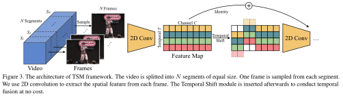

# [Reading] Temporal Shift Module for Efficient Video Understanding

### Abstract

> The explosive growth in online video streaming gives rise to challenges on efficiently extracting the spatial-temporal information to perform video understanding. Conventional 2D CNNs are computationally cheap but cannot capture long-term temporal relationships; 3D CNN based methods can achieve good performance but are computationally intensive, making it expensive to deploy. In this paper, we propose a generic and effective Temporal Shift Module (TSM) that enjoys both high efficiency and high performance. Specifically, it can achieve the performance of 3D CNN but maintain 2D complexity. The central idea of TSM is to shift part of the channels along the temporal dimension, which facilitates information exchange among neighboring frames. TSM can be inserted into 2D CNNs to achieve temporal modeling at the cost of zero FLOPs and zero parameters. On the Something-Something-V1 dataset which focuses on temporal modeling, we achieved better results than I3D family and ECO family using 6X and 2.7X fewer FLOPs respectively. Measured on P100 GPU, our single model achieved 1.8% higher accuracy at 8X lower latency and 12X higher throughput compared to I3D. Remarkably, our framework ranks the first on both Something-Something V1 and V2 leaderboards upon this paper's submission.

### Method




Unofficial implementation: [Pika7ma/Temporal-Shift-Module](https://github.com/Pika7ma/Temporal-Shift-Module)

```python
import torch
import torch.nn.functional as F

def tsm(tensor, duration, version='zero'):
    # tensor [N*T, C, H, W]
    size = tensor.size()
    tensor = tensor.view((-1, duration) + size[1:])
    # tensor [N, T, C, H, W]
    pre_tensor, post_tensor, peri_tensor = tensor.split([size[1] // 4,
                                                         size[1] // 4,
                                                         size[1] // 2], dim=2)
    if version == 'zero':
        pre_tensor  = F.pad(pre_tensor,  (0, 0, 0, 0, 0, 0, 1, 0))[:,  :-1, ...]
        post_tensor = F.pad(post_tensor, (0, 0, 0, 0, 0, 0, 0, 1))[:, 1:  , ...]
    elif version == 'circulant':
        pre_tensor  = torch.cat((pre_tensor [:, -1:  , ...],
                                 pre_tensor [:,   :-1, ...]), dim=1)
        post_tensor = torch.cat((post_tensor[:,  1:  , ...],
                                 post_tensor[:,   :1 , ...]), dim=1)
    else:
        raise ValueError('Unknown TSM version: {}'.format(version))
    return torch.cat((pre_tensor, post_tensor, peri_tensor), dim=2).view(size)
```

### References

1. [Lin, Ji, Chuang Gan, and Song Han. "Temporal Shift Module for Efficient Video Understanding." *arXiv preprint arXiv:1811.08383* (2018).](https://arxiv.org/pdf/1811.08383)
2. [Pika7ma. "Temporal-Shift-Module." GitHub.](https://github.com/Pika7ma/Temporal-Shift-Module)