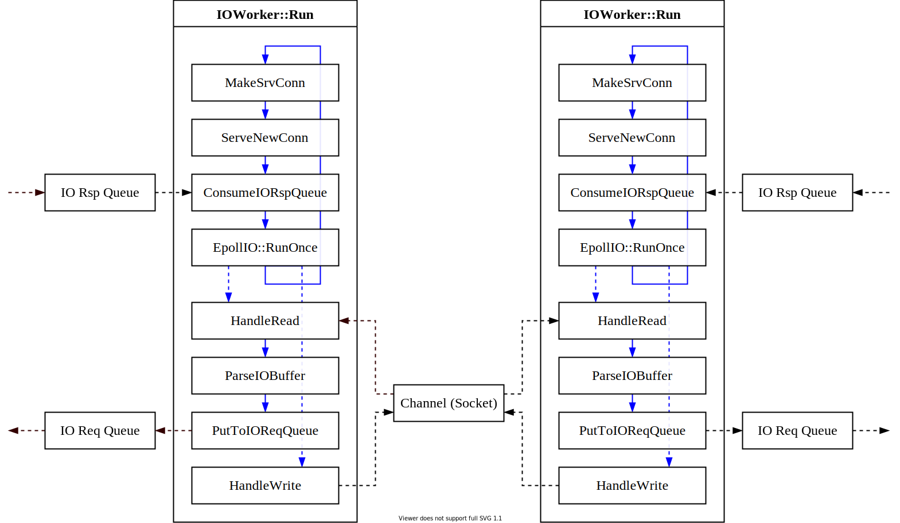

# PaxosStore 源码分析「二、消息传递」

[本系列](/#/Paxos)的[上一篇](/paxos/paxos_store_01_network.html)分析了 PaxosStore 中网络通信部分的实现，本篇将聚焦 PaxosStore 中模块间消息的传递。

### 1. 消息概览

PaxosStore 中定义了一种名为 `Command` 的消息，模块间的通信通过 `Command` 的传递实现。消息传递的方式有两种，一种是通过消息队列传递，一种是使用 Protobuf 序列化后通过网络收发。

`Command` 消息的基类 `clsCmdBase` 定义于 [`src/Command.h`](https://github.com/Tencent/paxosstore/blob/master/certain/src/Command.h)：

```c++
struct IOTracker_t {
  int iFD;
  uint32_t iFDID;
  uint32_t iIOWorkerID;

  IOTracker_t() : iFD(-1), iFDID(-1), iIOWorkerID(-1) {}

  IOTracker_t(int iArgFD, int iArgFDID, int iArgIOWorkerID)
      : iFD(iArgFD), iFDID(iArgFDID), iIOWorkerID(iArgIOWorkerID) {}
};

// Command 基类，包含 UUID / 类型 / EntityID / Entry / IOTracker / 时间戳 / CRC32 / Result
// 实现了 Command 头部的序列化，派生了 PaxosCmd / ClientCmd / WriteBatchCmd / RecoverCmd
class clsCmdBase {
 protected:
  uint64_t m_iUUID;
  uint16_t m_hCmdID;

  uint64_t m_iEntityID;
  uint64_t m_iEntry;

  IOTracker_t m_tIOTracker;

  uint64_t m_iTimestampUS;
  uint32_t m_iRspPkgCRC32;

  int m_iResult;

  // 与 proto:Header 之间的序列化
  void SetFromHeader(const CertainPB::CmdHeader *poHeader) {
    m_iUUID = poHeader->uuid();
    m_iEntityID = poHeader->entity_id();
    m_iEntry = poHeader->entry();
    m_iResult = poHeader->result();
  }

  // 与 proto:Header 之间的序列化
  void SetToHeader(CertainPB::CmdHeader *poHeader) {
    poHeader->set_uuid(m_iUUID);
    poHeader->set_entity_id(m_iEntityID);
    poHeader->set_entry(m_iEntry);
    poHeader->set_result(m_iResult);
  }

 public:
 // 三个接口，序列化与反序列化
  virtual string GetTextCmd() = 0;
  virtual int ParseFromArray(const char *pcBuffer, uint32_t iLen) = 0;
  virtual int SerializeToArray(char *pcBuffer, uint32_t iLen) = 0;

  virtual void CalcEntityID() {}

 public:
  // 构造
  clsCmdBase(uint16_t hCmdID) : m_hCmdID(hCmdID) {
    m_iUUID = 0;

    m_iEntityID = -1;
    m_iEntry = -1;

    m_iTimestampUS = 0;
    m_iRspPkgCRC32 = 0;

    m_iResult = 0;
  }

  virtual ~clsCmdBase() {}

  uint16_t GetCmdID() { return m_hCmdID; }

  uint64_t GetUUID() { return m_iUUID; }
  void SetUUID(uint64_t iUUID) { m_iUUID = iUUID; }

  TYPE_GET_SET(uint64_t, EntityID, iEntityID);
  TYPE_GET_SET(uint64_t, Entry, iEntry);

  IOTracker_t GetIOTracker() { return m_tIOTracker; }
  void SetIOTracker(const IOTracker_t tIOTracker) { m_tIOTracker = tIOTracker; }

  TYPE_GET_SET(uint64_t, TimestampUS, iTimestampUS);
  TYPE_GET_SET(uint32_t, RspPkgCRC32, iRspPkgCRC32);

  TYPE_GET_SET(int, Result, iResult);

  virtual int GenRspPkg(char *pcBuffer, uint32_t iLen, bool bCheckSum);
};

// 序列化，数据头写入 Command 类型 / 校验等基本信息
int clsCmdBase::GenRspPkg(char *pcBuffer, uint32_t iLen, bool bCheckSum) {
  if (iLen < RP_HEADER_SIZE) {
    return -1;
  }

  int iRet = SerializeToArray(pcBuffer + RP_HEADER_SIZE, iLen - RP_HEADER_SIZE);
  if (iRet < 0) {
    CertainLogError("SerializeToArray ret %d", iRet);
    return -2;
  }

  RawPacket_t *lp = (RawPacket_t *)pcBuffer;
  lp->hMagicNum = RP_MAGIC_NUM;
  lp->hVersion = 0;
  lp->hCmdID = GetCmdID();
  lp->hReserve = 0;
  lp->iLen = iRet;

  if (m_iRspPkgCRC32 == 0) {
    if (bCheckSum) {
      m_iRspPkgCRC32 = CRC32(lp->pcData, lp->iLen);
    }
  }

  lp->iCheckSum = m_iRspPkgCRC32;

  ConvertToNetOrder(lp);

  return iRet + RP_HEADER_SIZE;
}
```

其中 `CertainPB::CmdHeader` 由 Protobuf 生成，定义于 [`src/Certain.proto`](https://github.com/Tencent/paxosstore/blob/master/certain/src/Certain.proto)：

```protobuf
package CertainPB;

message EntryRecord {
    optional uint32 prepared_num = 1;
    optional uint32 promised_num = 2;
    optional uint32 accepted_num = 3;

    optional uint64 value_id = 4;
    repeated uint64 value_uuid = 5;
    optional bytes value = 6;

    optional bool chosen = 7;
}

message CmdHeader {
    optional uint64 uuid = 1;

    optional uint64 entity_id = 2;
    optional uint64 entry = 3;

    optional int32 result = 4;
}

message PaxosCmd {
    optional CmdHeader header = 1;

    optional uint32 src_acceptor_id = 2;
    optional uint32 dest_acceptor_id = 3;

    optional EntryRecord src_record = 4;
    optional EntryRecord dest_record = 5;

    optional uint64 max_chosen_entry = 6;

    optional bool check_empty = 7;
    optional bool quick_rsp = 8;
}

message DBEntityMeta {
    optional uint32 flag = 1;
    optional uint64 max_commited_entry = 2;
};

message PLogEntityMeta {
    optional uint64 max_plog_entry = 1;
};
```

`clsPaxosCmd` 派生了 `clsPaxosCmd` / `clsClientCMd` / `clsWriteBatchCmd` / `clsRecoverCmd` 四种类型的 `Command` 消息，其中只有 `clsPaxosCmd` 会经过网络传收发：

```c++
class clsPaxosCmd : public clsCmdBase {
 private:
  bool m_bCheckEmpty;
  bool m_bQuickRsp;
  bool m_bPLogError;
  bool m_bPLogReturn;
  bool m_bPLogLoad;

  bool m_bCheckHasMore;
  bool m_bHasMore;

  uint32_t m_iSrcAcceptorID;
  uint32_t m_iDestAcceptorID;

  EntryRecord_t m_tSrcRecord;
  EntryRecord_t m_tDestRecord;

  uint64_t m_iMaxChosenEntry;
  uint64_t m_iMaxPLogEntry;

  void Init(uint32_t iAcceptorID, uint64_t iEntityID, uint64_t iEntry, const EntryRecord_t *ptSrc,
            const EntryRecord_t *ptDest);

  void ConvertFromPB(EntryRecord_t &tEntryRecord, const CertainPB::EntryRecord *poRecord);

  void ConvertToPB(const EntryRecord_t &tEntryRecord, CertainPB::EntryRecord *poRecord,
                   bool bCopyValue);

 public:
  clsPaxosCmd() : clsCmdBase(kPaxosCmd) { Init(INVALID_ACCEPTOR_ID, 0, 0, NULL, NULL); }

  clsPaxosCmd(uint32_t iAcceptorID, uint64_t iEntityID, uint64_t iEntry, const EntryRecord_t *ptSrc,
              const EntryRecord_t *ptDest)
      : clsCmdBase(kPaxosCmd) {
    Init(iAcceptorID, iEntityID, iEntry, ptSrc, ptDest);
  }

  clsPaxosCmd(uint32_t iAcceptorID, uint64_t iEntityID, uint64_t iEntry) : clsCmdBase(kPaxosCmd) {
    Init(iAcceptorID, iEntityID, iEntry, NULL, NULL);
    m_bCheckEmpty = true;  // For Read Opt.
  }

  virtual ~clsPaxosCmd() {}

  virtual string GetTextCmd();
  virtual int ParseFromArray(const char *pcBuffer, uint32_t iLen);
  virtual int SerializeToArray(char *pcBuffer, uint32_t iLen);

  uint32_t CalcSize() {
    return sizeof(clsPaxosCmd) + m_tSrcRecord.tValue.strValue.size() +
           m_tDestRecord.tValue.strValue.size();
  }

  BOOLEN_IS_SET(PLogError);
  BOOLEN_IS_SET(PLogReturn);
  BOOLEN_IS_SET(PLogLoad);
  BOOLEN_IS_SET(CheckHasMore);
  BOOLEN_IS_SET(HasMore);
  BOOLEN_IS_SET(QuickRsp);

  UINT32_GET_SET(SrcAcceptorID);
  UINT32_GET_SET(DestAcceptorID);

  TYPE_GET_SET(uint64_t, MaxChosenEntry, iMaxChosenEntry);
  TYPE_GET_SET(uint64_t, MaxPLogEntry, iMaxPLogEntry);

  const EntryRecord_t &GetSrcRecord() { return m_tSrcRecord; }
  void SetSrcRecord(const EntryRecord_t &tSrcRecord) { m_tSrcRecord = tSrcRecord; }

  const EntryRecord_t &GetDestRecord() { return m_tDestRecord; }
};
```

`clsPaxosCmd` 通过 Protobuf 实现序列化和反序列化：

```c++
static int SerializeMsgToArray(const ::google::protobuf::Message &pbMsg, char *pcBuffer,
                               uint32_t iLen) {
  int32_t iRealLen = pbMsg.ByteSize();
  if (uint32_t(iRealLen) > iLen) {
    CertainLogError("SerializeToArray iRealLen %d iLen %u", iRealLen, iLen);
    return -1;
  }

  if (!pbMsg.SerializeToArray(pcBuffer, iRealLen)) {
    CertainLogError("SerializeToArray fail");
    return -2;
  }

  return iRealLen;
}

void clsPaxosCmd::ConvertFromPB(EntryRecord_t &tEntryRecord,
                                const CertainPB::EntryRecord *poRecord) {
  tEntryRecord.iPreparedNum = poRecord->prepared_num();
  tEntryRecord.iPromisedNum = poRecord->promised_num();
  tEntryRecord.iAcceptedNum = poRecord->accepted_num();

  vector<uint64_t> vecValueUUID;
  for (int i = 0; i < poRecord->value_uuid_size(); ++i) {
    vecValueUUID.push_back(poRecord->value_uuid(i));
  }
  tEntryRecord.tValue =
      PaxosValue_t(poRecord->value_id(), vecValueUUID, poRecord->has_value(), poRecord->value());
  tEntryRecord.bChosen = poRecord->chosen();

  tEntryRecord.bCheckedEmpty = false;
  tEntryRecord.iStoredValueID = 0;
}

void clsPaxosCmd::clsPaxosCmd::ConvertToPB(const EntryRecord_t &tEntryRecord,
                                           CertainPB::EntryRecord *poRecord, bool bCopyValue) {
  poRecord->set_prepared_num(tEntryRecord.iPreparedNum);
  poRecord->set_promised_num(tEntryRecord.iPromisedNum);
  poRecord->set_accepted_num(tEntryRecord.iAcceptedNum);
  poRecord->set_value_id(tEntryRecord.tValue.iValueID);
  if (bCopyValue) {
    AssertEqual(poRecord->value_uuid_size(), 0);
    for (uint32_t i = 0; i < tEntryRecord.tValue.vecValueUUID.size(); ++i) {
      poRecord->add_value_uuid(tEntryRecord.tValue.vecValueUUID[i]);
    }
    poRecord->set_value(tEntryRecord.tValue.strValue);
  }
  poRecord->set_chosen(tEntryRecord.bChosen);
}

// 反序列化
int clsPaxosCmd::ParseFromArray(const char *pcBuffer, uint32_t iLen) {
  CertainPB::PaxosCmd oPaxosCmd;
  if (!oPaxosCmd.ParseFromArray(pcBuffer, iLen)) {
    CertainLogError("ParseFromArray fail");
    return -1;
  }

  SetFromHeader(oPaxosCmd.mutable_header());

  m_iSrcAcceptorID = oPaxosCmd.src_acceptor_id();
  m_iDestAcceptorID = oPaxosCmd.dest_acceptor_id();

  ConvertFromPB(m_tSrcRecord, &oPaxosCmd.src_record());
  ConvertFromPB(m_tDestRecord, &oPaxosCmd.dest_record());

  if (oPaxosCmd.check_empty()) {
    Assert(IsEntryRecordEmpty(m_tSrcRecord));
    Assert(IsEntryRecordEmpty(m_tDestRecord));
    m_tDestRecord.iPromisedNum = INVALID_PROPOSAL_NUM;
  }

  m_bQuickRsp = oPaxosCmd.quick_rsp();

  m_iMaxChosenEntry = oPaxosCmd.max_chosen_entry();

  return 0;
}

// Paxos 序列化
int clsPaxosCmd::SerializeToArray(char *pcBuffer, uint32_t iLen) {
  CertainPB::PaxosCmd oPaxosCmd;

  SetToHeader(oPaxosCmd.mutable_header());

  oPaxosCmd.set_src_acceptor_id(m_iSrcAcceptorID);
  oPaxosCmd.set_dest_acceptor_id(m_iDestAcceptorID);

  bool bCopyValue = false;
  if (m_tSrcRecord.tValue.iValueID != m_tDestRecord.tValue.iValueID &&
      m_tSrcRecord.tValue.bHasValue) {
    bCopyValue = true;
  }

  if (!IsEntryRecordEmpty(m_tSrcRecord)) {
    ConvertToPB(m_tSrcRecord, oPaxosCmd.mutable_src_record(), bCopyValue);
    Assert(oPaxosCmd.src_record().has_value() == bCopyValue);
  }

  if (!IsEntryRecordEmpty(m_tDestRecord)) {
    ConvertToPB(m_tDestRecord, oPaxosCmd.mutable_dest_record(), false);
  }

  if (m_bCheckEmpty) {
    oPaxosCmd.set_check_empty(true);
  }

  oPaxosCmd.set_quick_rsp(m_bQuickRsp);

  if (m_iMaxChosenEntry > 0) {
    oPaxosCmd.set_max_chosen_entry(m_iMaxChosenEntry);
  }

  return SerializeMsgToArray(oPaxosCmd, pcBuffer, iLen);
}
```

### 2. 消息队列

PaxosStore 中线程间消息的传递通过消息队列实现。这里消息队列由循环队列 `clsCircleQueue` 实现，定义于 [utils/CircleQueue.h](https://github.com/Tencent/paxosstore/blob/master/certain/utils/CircleQueue.h)，通过 CAS 实现多线程下的并发写入：

```c++
template <typename Type>
int clsCircleQueue<Type>::TakeByOneThread(Type *ptElt) {
  AssertNotEqual(m_iSize, 0);

  if (m_ulHead <= m_ulTail) {
    return -1;
  }

  *ptElt = m_ptElt[m_ulTail % m_iSize];
  if (*ptElt == 0) {
    return -2;
  }

  m_ptElt[m_ulTail % m_iSize] = 0;

  m_ulTail++;

  return 0;
}

template <typename Type>
int clsCircleQueue<Type>::PushByMultiThread(Type tElt, uint32_t iRetryTime) {
#if CERTAIN_DEBUG
  static __thread clsRandom *__poRandom = new clsRandom(uint32_t(pthread_self()));
  if (__poRandom->Next() % 10 == 0) {
    return -7999;
  }
#endif

  int iFinalRet = -1;

  for (uint32_t i = 0; i < iRetryTime; ++i) {
    int iRet = PushByMultiThreadInner(tElt);

    if (iRet == 0) {
      return 0;
    }

    if (iRet == -2) {
      iFinalRet = -2;
    }
  }

  return iFinalRet;
}

template <typename Type>
int clsCircleQueue<Type>::PushByMultiThreadInner(Type tElt) {
  AssertNotEqual(m_iSize, 0);
  AssertNotEqual(tElt, 0);

  volatile unsigned long ulHead = m_ulHead;

  if (ulHead >= m_iSize + m_ulTail) {
    return -1;
  }

  if (__sync_bool_compare_and_swap(&m_ulHead, ulHead, ulHead + 1)) {
    m_ptElt[ulHead % m_iSize] = tElt;
    return 0;
  }

  return -2;
}
```

PaxosStore 定义了一个全局的消息队列单例 `clsAsyncQueueMng`，统一管理各个组件使用的消息队列，定义于 [src/AsyncQueueMng.h](https://github.com/Tencent/paxosstore/blob/master/certain/src/AsyncQueueMng.h)：

```c++
class clsCmdBase;
class clsClientCmd;
class clsPaxosCmd;

typedef clsCircleQueue<clsCmdBase *> clsIOReqQueue;
typedef clsCircleQueue<clsCmdBase *> clsIORspQueue;

typedef clsCircleQueue<clsCmdBase *> clsPLogReqQueue;
typedef clsCircleQueue<clsCmdBase *> clsPLogRspQueue;

typedef clsCircleQueue<clsClientCmd *> clsDBReqQueue;

typedef clsCircleQueue<clsPaxosCmd *> clsGetAllReqQueue;
typedef clsCircleQueue<clsPaxosCmd *> clsGetAllRspQueue;

typedef clsCircleQueue<clsPaxosCmd *> clsCatchUpReqQueue;

typedef clsCircleQueue<clsPaxosCmd *> clsPLogWriteReqQueue;

class clsAsyncQueueMng : public clsSingleton<clsAsyncQueueMng> {
 private:
  uint32_t m_iIOWorkerNum;
  uint32_t m_iEntityWorkerNum;
  uint32_t m_iPLogWorkerNum;
  uint32_t m_iDBWorkerNum;
  uint32_t m_iGetAllWorkerNum;
  uint32_t m_iPLogWriteWorkerNum;

  uint32_t m_iIOQueueSize;
  uint32_t m_iPLogQueueSize;
  uint32_t m_iDBQueueSize;
  uint32_t m_iCatchUpQueueSize;
  uint32_t m_iGetAllQueueSize;
  uint32_t m_iPLogWriteQueueSize;

  clsIOReqQueue **m_ppIOReqQueue;
  clsIORspQueue **m_ppIORspQueue;

  clsPLogReqQueue **m_ppPLogReqQueue;
  clsPLogRspQueue **m_ppPLogRspQueue;

  clsDBReqQueue **m_ppDBReqQueue;

  clsGetAllReqQueue **m_ppGetAllReqQueue;
  clsGetAllRspQueue **m_ppGetAllRspQueue;

  clsCatchUpReqQueue **m_ppCatchUpReqQueue;

  clsPLogWriteReqQueue **m_ppPLogWriteReqQueue;

  // No outside instance allowed
  friend class clsSingleton<clsAsyncQueueMng>;
  clsAsyncQueueMng()
      : m_ppIOReqQueue(NULL),
        m_ppIORspQueue(NULL),
        m_ppPLogReqQueue(NULL),
        m_ppPLogRspQueue(NULL),
        m_ppDBReqQueue(NULL),
        m_ppGetAllReqQueue(NULL),
        m_ppGetAllRspQueue(NULL),
        m_ppPLogWriteReqQueue(NULL) {}

 public:
  virtual ~clsAsyncQueueMng() {}

#define NEW_QUEUE_ARRAY(name, arr_size, que_size) \
  do {                                            \
    assert(m_pp##name == NULL);                   \
    m_pp##name = new cls##name *[arr_size];       \
    for (uint32_t i = 0; i < arr_size; ++i) {     \
      m_pp##name[i] = new cls##name(que_size);    \
    }                                             \
  } while (0);

  void PrintAllStat();

  int Init(clsConfigure *poConf) {
    m_iIOWorkerNum = poConf->GetIOWorkerNum();
    m_iEntityWorkerNum = poConf->GetEntityWorkerNum();
    m_iPLogWorkerNum = poConf->GetPLogWorkerNum();
    m_iDBWorkerNum = poConf->GetDBWorkerNum();
    m_iGetAllWorkerNum = poConf->GetGetAllWorkerNum();
    m_iPLogWriteWorkerNum = poConf->GetPLogWriteWorkerNum();

    m_iIOQueueSize = poConf->GetIOQueueSize();
    m_iPLogQueueSize = poConf->GetPLogQueueSize();
    m_iDBQueueSize = poConf->GetDBQueueSize();
    m_iCatchUpQueueSize = poConf->GetCatchUpQueueSize();
    m_iGetAllQueueSize = poConf->GetGetAllQueueSize();
    m_iPLogWriteQueueSize = poConf->GetPLogWriteQueueSize();

    // In IO Worker
    NEW_QUEUE_ARRAY(IORspQueue, m_iIOWorkerNum, m_iIOQueueSize);

    // In Entity Worker
    NEW_QUEUE_ARRAY(IOReqQueue, m_iEntityWorkerNum, m_iIOQueueSize);
    NEW_QUEUE_ARRAY(PLogRspQueue, m_iEntityWorkerNum, m_iPLogQueueSize);
    NEW_QUEUE_ARRAY(GetAllRspQueue, m_iEntityWorkerNum, m_iGetAllQueueSize);

    // In PLog Worker
    NEW_QUEUE_ARRAY(PLogReqQueue, m_iPLogWorkerNum, m_iPLogQueueSize);

    // In DB Worker
    NEW_QUEUE_ARRAY(DBReqQueue, m_iDBWorkerNum, m_iDBQueueSize);

    // In GetAll Worker
    NEW_QUEUE_ARRAY(GetAllReqQueue, m_iGetAllWorkerNum, m_iGetAllQueueSize);

    // In CatchUp Worker
    NEW_QUEUE_ARRAY(CatchUpReqQueue, 1, m_iCatchUpQueueSize);

    // In PLogWrite Worker
    NEW_QUEUE_ARRAY(PLogWriteReqQueue, m_iPLogWriteWorkerNum, m_iPLogWriteQueueSize);

    return 0;
  }

#define DELETE_QUEUE_ARRAY(name, arr_size)        \
  do {                                            \
    assert(m_pp##name != NULL);                   \
    for (uint32_t i = 0; i < arr_size; ++i) {     \
      assert(m_pp##name[i] != NULL);              \
      delete m_pp##name[i], m_pp##name[i] = NULL; \
    }                                             \
    delete m_pp##name, m_pp##name = NULL;         \
  } while (0);

  void Destroy() {
    // In IO Worker
    DELETE_QUEUE_ARRAY(IORspQueue, m_iIOWorkerNum);

    // In Entity Worker
    DELETE_QUEUE_ARRAY(IOReqQueue, m_iEntityWorkerNum);
    DELETE_QUEUE_ARRAY(PLogRspQueue, m_iEntityWorkerNum);
    DELETE_QUEUE_ARRAY(GetAllRspQueue, m_iEntityWorkerNum);

    // In PLog Worker
    DELETE_QUEUE_ARRAY(PLogReqQueue, m_iPLogWorkerNum);

    // In DB Worker
    DELETE_QUEUE_ARRAY(DBReqQueue, m_iDBWorkerNum);

    // In GetAll Worker
    DELETE_QUEUE_ARRAY(GetAllReqQueue, m_iGetAllWorkerNum);

    // In CatchUp Worker
    DELETE_QUEUE_ARRAY(CatchUpReqQueue, 1);

    // In PLogWrite Worker
    DELETE_QUEUE_ARRAY(PLogWriteReqQueue, m_iPLogWriteWorkerNum);
  }

#define GET_QUEUE_FUNC(name, iQueueNum) \
  cls##name *Get##name(uint32_t iID) {  \
    AssertLess(iID, iQueueNum);         \
    return m_pp##name[iID];             \
  }

  GET_QUEUE_FUNC(IORspQueue, m_iIOWorkerNum);

  GET_QUEUE_FUNC(IOReqQueue, m_iEntityWorkerNum);
  GET_QUEUE_FUNC(PLogRspQueue, m_iEntityWorkerNum);
  GET_QUEUE_FUNC(GetAllRspQueue, m_iEntityWorkerNum);

  GET_QUEUE_FUNC(PLogReqQueue, m_iPLogWorkerNum);

  GET_QUEUE_FUNC(DBReqQueue, m_iDBWorkerNum);

  GET_QUEUE_FUNC(GetAllReqQueue, m_iGetAllWorkerNum);

  GET_QUEUE_FUNC(CatchUpReqQueue, 1);

  GET_QUEUE_FUNC(PLogWriteReqQueue, m_iPLogWriteWorkerNum);
};
```

单例的好处是全局可见，如果希望给某个组件发消息，则可以通过单例获取组件对应的队列、调用 `PushByMultiThread` 将消息推入其中即可。使用消息队列也使得组件之间逻辑解耦。

### 3. 网络收发

PaxosStore 中进程间消息的传递通过 Socket 实现，包括收和发两个数据方向。收消息是将从 `IOChannel` 中读取到的字节流反序列化为 `Command` 命令、推入 `IOReqQueue` 队列中；发则是将 `IORsqQueue` 队列中的 `Command` 命令取出、序列化为字节流后通过 `IOChannel` 发送。其代码位于 [`src/IOWorker.h`](https://github.com/Tencent/paxosstore/blob/master/certain/src/IOWorker.h)，流程图如下所示：



首先来看收消息的过程。`clsIOWorker` 继承 `clsIOHandlerBase`，当 `IOChannel` 有新数据可读时会调用 `clsIOWorker::HandleRead`：

```c++
int clsIOWorker::HandleRead(clsFDBase *poFD) {
  int iRet, iBytes;
  int iFD = poFD->GetFD();

  clsIOChannel *poChannel = dynamic_cast<clsIOChannel *>(poFD);

  iRet = poChannel->Read(m_pcIOBuffer, CERTAIN_IO_BUFFER_SIZE);
  if (iRet > 0) {
    iBytes = ParseIOBuffer(poChannel, m_pcIOBuffer, iRet);
    AssertNotMore(0, iBytes);
    AssertNotMore(iBytes, iRet);

    poChannel->AppendReadBytes(m_pcIOBuffer + iBytes, iRet - iBytes);

    if (!poChannel->IsBroken() && poChannel->IsReadable()) {
      // 连接未中断，且仍然可读，说明此时还有数据没有读完
      // 由于 Epoll 使用边缘触发模式，先删除再添加使下次 epoll_wait 时仍然可以获取到该 FD 对象
      poChannel->SetReadable(false);
      AssertEqual(iRet, CERTAIN_IO_BUFFER_SIZE);
      AssertEqual(m_poEpollIO->Remove(poChannel), 0);
      AssertEqual(m_poEpollIO->Add(poChannel), 0);

      CertainLogFatal("BUG maybe Check conn %s", poChannel->GetConnInfo().ToString().c_str());
    }
  } else {
    CertainLogError("poChannel->Read fd %d, ret %d", iFD, iRet);
  }

  if (poChannel->IsBroken()) {
    CleanBrokenChannel(poChannel);
    return 1;
  }

  return 0;
}

// 解析接收到的 Command，并推到 IO Req Queue 中
int clsIOWorker::ParseIOBuffer(clsIOChannel *poChannel, char *pcBuffer, uint32_t iSize) {
  uint32_t iCmdCnt = 0;
  uint32_t iErrorSkipped = 0, iCurr = 0;
  clsCmdBase *poCmd;

  CertainLogDebug("conn %s iSize %u", poChannel->GetConnInfo().ToString().c_str(), iSize);

  clsCmdFactory *poCmdFactory = clsCmdFactory::GetInstance();

  while (iCurr < iSize) {
    if (iCurr + RP_HEADER_SIZE > iSize) {
      break;
    }

    RawPacket_t *ptRP = (RawPacket_t *)(pcBuffer + iCurr);
    ConvertToHostOrder(ptRP);

    if (ptRP->hMagicNum != RP_MAGIC_NUM) {
      ConvertToNetOrder(ptRP);
      CERTAIN_IOWORKER_IO_ERROR_SKIP(1);
      continue;
    }

    uint32_t iTotalLen = RP_HEADER_SIZE + ptRP->iLen;
    if (iCurr + iTotalLen > iSize) {
      ConvertToNetOrder(ptRP);
      break;
    }

    if (m_poConf->GetEnableCheckSum()) {
      if (ptRP->iCheckSum == 0) {
        // (TODO)rock: add one bit for bHasCheckSum
        CertainLogError("Check if CheckSum disable online");
      } else if (ptRP->iCheckSum != CRC32(ptRP->pcData, ptRP->iLen)) {
        CertainLogFatal("BUG checksum err conn: %s", poChannel->GetConnInfo().ToString().c_str());
        ConvertToNetOrder(ptRP);
        CERTAIN_IOWORKER_IO_ERROR_SKIP(1);
        continue;
      }
    }

    poCmd = poCmdFactory->CreateCmd(pcBuffer + iCurr, iTotalLen);
    if (poCmd == NULL) {
      CERTAIN_IOWORKER_IO_ERROR_SKIP(iTotalLen);
      continue;
    }

    poCmd->CalcEntityID();
    if (poCmd->GetCmdID() != kPaxosCmd) {
      poCmd->SetUUID(poCmdFactory->GetNextUUID());
    }

    poCmd->SetTimestampUS(GetCurrTimeUS());

    int iRet = PutToIOReqQueue(poChannel, poCmd);
    if (iRet != 0) {
      CERTAIN_IOWORKER_IO_ERROR_SKIP(iTotalLen);
      delete poCmd, poCmd = NULL;
    } else {
      iCmdCnt++;
      CERTAIN_IOWORKER_IO_SKIP(iTotalLen);
    }
  }

  if (iErrorSkipped > 0 || iCmdCnt > 50) {
    CertainLogError("iCmdCnt %u iCurr %d iErrorSkipped %u iSize %u", iCmdCnt, iCurr, iErrorSkipped,
                    iSize);
  }

  return iCurr;
}
```

再来看发消息的过程。`ConsumeIORspQueue` 从 `IORsqQueue` 队列中取出 `Command` 并执行序列化，拿到对应的 `IOChannel` 执行 `AppendWriteBytes` 写入缓存中；Epoll 对可写的 `IOChannel` 执行 Flush。

```c++
// 从 IO Rsp 队列中获取 Command，并序列化，通过 Channel 发送出去
void clsIOWorker::ConsumeIORspQueue() {
  int iRet;
  clsIORspQueue *poIORspQueue = m_poQueueMng->GetIORspQueue(m_iWorkerID);

  class clsSerializeCB : public clsIOChannel::clsSerializeCBBase {
   private:
    clsCmdBase *m_poCmd;
    int m_iByteSize;
    bool m_bCheckSum;

   public:
    clsSerializeCB(clsCmdBase *poCmd, bool bCheckSum) : m_poCmd(poCmd), m_bCheckSum(bCheckSum) {}

    virtual ~clsSerializeCB() {}

    virtual int Call(char *pcBuffer, uint32_t iSize) {
      m_iByteSize = m_poCmd->GenRspPkg(pcBuffer, iSize, m_bCheckSum);
      return m_iByteSize;
    }

    int GetByteSize() { return m_iByteSize; }
  };

  while (1) {
    clsCmdBase *poCmd = NULL;
    iRet = poIORspQueue->TakeByOneThread(&poCmd);
    if (iRet != 0) {
      break;
    }

    if (poCmd->GetCmdID() == kWriteBatchCmd || poCmd->GetCmdID() == kRecoverCmd) {
      clsClientCmd *poClientCmd = dynamic_cast<clsClientCmd *>(poCmd);
      uint64_t iUseTimeUS = GetCurrTimeUS() - poCmd->GetTimestampUS();

      if (poClientCmd->GetCmdID() == kRecoverCmd) {
        s_poRecoverCmdTimeStat->Update(iUseTimeUS);
      } else if (poClientCmd->IsReadOnly()) {
        s_poReadTimeStat->Update(iUseTimeUS);
      } else {
        s_poWriteTimeStat->Update(iUseTimeUS);
      }

      if (poClientCmd->GetResult() == 0) {
        CertainLogInfo("use_time_us %lu cmd: %s res: %d", iUseTimeUS,
                       poClientCmd->GetTextCmd().c_str(), poClientCmd->GetResult());
      } else {
        CertainLogError("use_time_us %lu cmd: %s res: %d", iUseTimeUS,
                        poClientCmd->GetTextCmd().c_str(), poClientCmd->GetResult());
      }

      // 本进程内的 Command 消息，唤醒其等待管道即可
      uint32_t iPipeIdx = poClientCmd->GetPipeIdx();
      iRet = clsAsyncPipeMng::GetInstance()->SyncWriteByPipeIdx(iPipeIdx, uintptr_t(poClientCmd));
      AssertEqual(iRet, 0);

      continue;
    }

    clsAutoDelete<clsCmdBase> oAuto(poCmd);

    if (poCmd->GetCmdID() == kPaxosCmd) {
      clsPaxosCmd *poPaxosCmd = dynamic_cast<clsPaxosCmd *>(poCmd);
      if (poPaxosCmd->GetDestAcceptorID() == INVALID_ACCEPTOR_ID) {
        // 发送给其他所有 Acceptor
        for (uint32_t i = 0; i < m_poConf->GetAcceptorNum(); ++i) {
          if (i == poPaxosCmd->GetSrcAcceptorID()) {
            continue;
          }

          poPaxosCmd->SetDestAcceptorID(i);

          clsIOChannel *poChannel = GetIOChannel(poCmd);
          if (poChannel == NULL) {
            CertainLogDebug("cmd_id %d GetIOChannel NULL", poCmd->GetCmdID());
            continue;
          }

          const ConnInfo_t &tConnInfo = poChannel->GetConnInfo();

          poPaxosCmd->SetDestAcceptorID(INVALID_SERVER_ID);
          clsSerializeCB oCB(poCmd, m_poConf->GetEnableCheckSum());
          poChannel->AppendWriteBytes(&oCB);
          if (poChannel->IsWritable()) {
            m_tWritableChannelSet.insert(poChannel);
          }

          CertainLogInfo("conn %s cmd: %s packet_size %d", tConnInfo.ToString().c_str(),
                         poCmd->GetTextCmd().c_str(), oCB.GetByteSize());
        }

        continue;
      }
    }

    // 发送给指定 Acceptor
    clsIOChannel *poChannel = GetIOChannel(poCmd);
    if (poChannel == NULL) {
      CertainLogDebug("cmd_id %d GetIOChannel NULL", poCmd->GetCmdID());
      continue;
    }
    const ConnInfo_t &tConnInfo = poChannel->GetConnInfo();

    clsSerializeCB oCB(poCmd, m_poConf->GetEnableCheckSum());
    poChannel->AppendWriteBytes(&oCB);
    // 当前已经可写的 Channel，加入 Set 中
    if (poChannel->IsWritable()) {
      m_tWritableChannelSet.insert(poChannel);
    }

    if (poCmd->GetCmdID() != kPaxosCmd) {
      clsClientCmd *poClientCmd = dynamic_cast<clsClientCmd *>(poCmd);
      uint64_t iUseTimeUS = GetCurrTimeUS() - poCmd->GetTimestampUS();

      CertainLogInfo(
          "use_time_us %lu conn %s cmd: %s "
          "res %d packet_size %d",
          iUseTimeUS, tConnInfo.ToString().c_str(), poClientCmd->GetTextCmd().c_str(),
          poClientCmd->GetResult(), oCB.GetByteSize());
    } else {
      CertainLogInfo("cmd: %s packet_size %d", poCmd->GetTextCmd().c_str(), oCB.GetByteSize());
    }
  }

  FlushWritableChannel();
}

// 遍历所有可写的 Channel 执行 Flush
void clsIOWorker::FlushWritableChannel() {
  uint64_t iFlushTimeoutUS = m_poConf->GetFlushTimeoutUS();

  if (iFlushTimeoutUS > 0) {
    uint64_t iCurrTimeUS = GetCurrTimeUS();

    if (m_iNextFlushTimeUS > iCurrTimeUS) {
      return;
    }

    m_iNextFlushTimeUS = iCurrTimeUS + iFlushTimeoutUS;
  } else {
    m_iNextFlushTimeUS = 0;
  }

  set<clsIOChannel *> tNewChannelSet;

  while (m_tWritableChannelSet.size() > 0) {
    clsIOChannel *poChannel = *m_tWritableChannelSet.begin();
    m_tWritableChannelSet.erase(poChannel);

    Assert(!poChannel->IsBroken() && poChannel->IsWritable());

    int iRet = poChannel->FlushWriteBuffer();
    if (iRet < 0) {
      int iFD = poChannel->GetFD();
      CertainLogError("poChannel->Write fd %d ret %d", iFD, iRet);
    }

    if (poChannel->IsBroken()) {
      CleanBrokenChannel(poChannel);
    } else if (poChannel->IsWritable() && poChannel->GetWriteByteSize() > 0) {
      tNewChannelSet.insert(poChannel);
    }
  }

  m_tWritableChannelSet = tNewChannelSet;
}

// Epoll 检查到 Channel 可写时调用，执行 Flush
int clsIOWorker::HandleWrite(clsFDBase *poFD) {
  int iRet;
  int iFD = poFD->GetFD();

  clsIOChannel *poChannel = dynamic_cast<clsIOChannel *>(poFD);

  iRet = poChannel->FlushWriteBuffer();
  if (iRet < 0) {
    CertainLogError("poChannel->Write fd %d, ret %d", iFD, iRet);
  }

  if (poChannel->IsBroken()) {
    CleanBrokenChannel(poChannel);
    return 1;
  } else if (!poChannel->IsWritable()) {
    m_tWritableChannelSet.erase(poChannel);
  }

  return 0;
}
```

注意代码中 `m_tWritableChannelSet` 的使用。仍然由于边缘触发的原因，需要将当前可写的 `IOChannel` 加入该集合中，通过 `FlushWritableChannel` 执行 Flush。读写两部分都因为边缘触发的原因做了特殊化处理，理论上应该有更好的解决方案。

最后来看下 `IOChannel` 的建立和获取的过程。

```c++
// 作为 Client 创建与其他 Server 通信的 IOChannel
int clsIOWorker::MakeSrvConn() {
  uint64_t iCurrTimeMS = GetCurrTimeMS();
  uint32_t iReconnIntvMS = m_poConf->GetReconnIntvMS();
  if (iCurrTimeMS < m_iLastMakeSrvConnTimeMS + iReconnIntvMS) {
    return -1;
  }
  m_iLastMakeSrvConnTimeMS = iCurrTimeMS;

  int iRet;
  uint32_t iFailCnt = 0;

  // only server with min num to connect
  for (uint32_t i = 0; i < m_iServerNum; ++i) {
    if (i == m_iLocalServerID) {
      continue;
    }

    // Compatable to the very old version
    if (m_poConf->GetEnableConnectAll() == 0 && i < m_iLocalServerID) {
      continue;
    }

    for (uint32_t j = m_vecIntChannel[i].size(); j < m_iIntConnLimit; ++j) {
      iRet = MakeSingleSrvConn(i);
      if (iRet != 0) {
        iFailCnt++;
        CertainLogError("InitSingleSrvConn ret %d iServerID %u", iRet, i);
      }
    }
  }

  if (iFailCnt > 0) {
    CertainLogError("iFailCnt %u", iFailCnt);
    return -2;
  }

  return 0;
}

// 作为 Client 连接 ServerID 对应的 Server
int clsIOWorker::MakeSingleSrvConn(uint32_t iServerID) {
  int iRet;

  int iFD = CreateSocket(NULL);
  if (iFD == -1) {
    CertainLogError("CreateSocket ret %d", iFD);
    return -1;
  }

  ConnInfo_t tConnInfo;
  tConnInfo.iFD = iFD;

  uint32_t iLocalServerID = m_poConf->GetLocalServerID();
  tConnInfo.tLocalAddr = m_vecServerAddr[iLocalServerID];

  tConnInfo.tPeerAddr = m_vecServerAddr[iServerID];

  iRet = Connect(iFD, tConnInfo.tPeerAddr);
  if (iRet != 0) {
    CertainLogError("Connect ret %d", iRet);
    return -2;
  }

  CertainLogDebug("try conn: %s", tConnInfo.ToString().c_str());

  clsIOChannel *poChannel = new clsIOChannel(this, tConnInfo, iServerID);

  // Flush nego msg when it's writable auto.
  uint8_t acNego[3];
  *(uint16_t *)acNego = htons(RP_MAGIC_NUM);
  acNego[2] = uint8_t(m_iLocalServerID);
  poChannel->AppendWriteBytes((char *)acNego, 3);

  iRet = m_poEpollIO->Add(poChannel);
  if (iRet != 0) {
    CertainLogError("m_poEpollIO->Add ret %d", iRet);
    delete poChannel, poChannel = NULL;

    return -3;
  } else {
    AssertNotEqual(iServerID, INVALID_SERVER_ID);
    m_vecIntChannel[iServerID].push_back(poChannel);
    clsIOWorkerRouter::GetInstance()->GetAndAddIntChannelCnt(m_iWorkerID, iServerID, 1);
  }

  return 0;
}

// 作为 Server 创建与 Client 通信的 IOChannel
void clsIOWorker::ServeNewConn() {
  int iRet;
  uint32_t iConnCnt = 0, iFailCnt = 0, iServerID;
  ConnInfo_t tConnInfo;

  while (1) {
    iRet = m_poConnMng->TakeByMultiThread(m_iWorkerID, m_vecIntChannel, tConnInfo, iServerID);
    if (iRet != 0) {
      break;
    }

    iConnCnt++;

    clsIOChannel *poChannel = new clsIOChannel(this, tConnInfo, iServerID, m_iNextFDID);
    m_iNextFDID += m_poConf->GetIOWorkerNum();

    CertainLogImpt("m_iWorkerID %u Serve new conn %s", m_iWorkerID, tConnInfo.ToString().c_str());

    int iRet = m_poEpollIO->Add(poChannel);
    if (iRet != 0) {
      CertainLogError("m_poEpollIO->Add ret %d", iRet);
      delete poChannel, poChannel = NULL;

      iFailCnt++;
    } else if (iServerID != INVALID_SERVER_ID) {
      AssertLess(iServerID, m_iServerNum);
      m_vecIntChannel[iServerID].push_back(poChannel);
      int32_t iCurrCnt =
          clsIOWorkerRouter::GetInstance()->GetAndAddIntChannelCnt(m_iWorkerID, iServerID, 1);

      if (uint32_t(iCurrCnt) >= m_iIntConnLimit) {
        CertainLogZero("m_iWorkerID %u iCurrCnt %d add peer iServerID %u conn %s", m_iWorkerID,
                       iCurrCnt, iServerID, tConnInfo.ToString().c_str());
      }
    }
  }

  // Update s_aaIdleWorkerMap
  // 检查当前所有连接，如果 buffer 使用小于 1/8，定义为 Idle
  for (uint32_t i = 0; i < m_vecIntChannel.size(); ++i) {
    clsIOWorkerRouter::GetInstance()->SetIdleWorkerMap(m_iWorkerID, i, false);
    for (uint32_t j = 0; j < m_vecIntChannel[i].size(); ++j) {
      if (!m_vecIntChannel[i][j]->IsBufferBusy()) {
        clsIOWorkerRouter::GetInstance()->SetIdleWorkerMap(m_iWorkerID, i, true);
        break;
      }
    }
  }

  if (iConnCnt > 0) {
    CertainLogImpt("iConnCnt %u iFailCnt %u", iConnCnt, iFailCnt);
  }

  if (iFailCnt > 0) {
    CertainLogError("iConnCnt %u iFailCnt %u", iConnCnt, iFailCnt);
  }
}

// 根据 ServerID 获取 Channel
clsIOChannel *clsIOWorker::GetIOChannelByServerID(uint32_t iServerID) {
  AssertLess(iServerID, m_iServerNum);
  uint32_t iSize = m_vecIntChannel[iServerID].size();
  if (iSize == 0) {
    // Avoid too many log when a acceptor down.
    CertainLogDebug("iServerID %u iSize 0", iServerID);
    return NULL;
  }

  uint32_t iChannelSelected = m_vecChannelRouter[iServerID]++;
  iChannelSelected %= iSize;

  clsIOChannel *poChannel = m_vecIntChannel[iServerID][iChannelSelected];
  AssertNotEqual(poChannel, NULL);

  return poChannel;
}

// 根据 Command 获取 Channel
clsIOChannel *clsIOWorker::GetIOChannel(clsCmdBase *poCmd) {
  if (poCmd->GetCmdID() == kPaxosCmd) {
    clsPaxosCmd *poPaxosCmd = dynamic_cast<clsPaxosCmd *>(poCmd);

    uint32_t iDestAcceptorID = poPaxosCmd->GetDestAcceptorID();
    uint64_t iEntityID = poPaxosCmd->GetEntityID();
    uint32_t iServerID = -1;

    AssertEqual(m_poCertainUser->GetServerID(iEntityID, iDestAcceptorID, iServerID), 0);

    return GetIOChannelByServerID(iServerID);
  } else {
    const IOTracker_t &tIOTracker = poCmd->GetIOTracker();
    clsFDBase *poFD = m_poEpollIO->GetFDBase(tIOTracker.iFD, tIOTracker.iFDID);
    if (poFD == NULL) {
      CertainLogError("GetFDBase error fd %d fd_id %u", tIOTracker.iFD, tIOTracker.iFDID);
    }
    return dynamic_cast<clsIOChannel *>(poFD);
  }
}
```

### 4. 总结

PaxosStore 单个 Server 进程内会启动多个 Worker 线程，线程间通过消息队列传递消息；而多个 Server 进程间则通过 Protobuf + Socket 传递消息。通信部分由于使用 Epoll 边缘触发的原因，对仍然可读可写的 fd 都做了特殊化处理。至此 PaxosStore 中消息传递的代码分析完毕，下一篇将继续分析组件间消息传递实现的 Paxos 协议过程。

### References

1. ["Tencent/PaxosStore", *GitHub*](https://github.com/Tencent/paxosstore)

