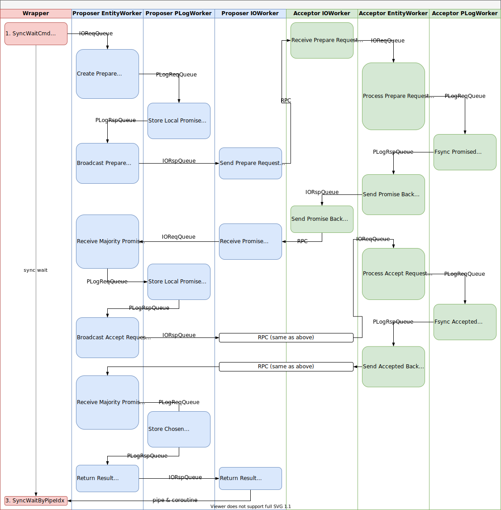

# PaxosStore 源码分析「六、流程细节」

本篇继续来看 PaxosStore 中 Paxos 流程的细节。

### 1. Paxos 流程

PaxosStore 中一次普通的 Paxos 协议过程如下图所示：



假设现在有 A / B / C 三个节点的集群，由 A 发起 Paxos 过程，首先会调用 `RunPaxos`：

```c++
int clsCertainWrapper::RunPaxos(uint64_t iEntityID, uint64_t iEntry, uint16_t hSubCmdID,
                                const vector<uint64_t> &vecWBUUID, const string &strWriteBatch) {
  if (m_poConf->GetEnableLearnOnly()) {
    // Learner 模式下不允许发起 Paxos 过程
    CertainLogError("E(%lu, %lu) reject if learn only %u", iEntityID, iEntry,
                    m_poConf->GetEnableLearnOnly());
    return eRetCodeRejectAll;
  }

  for (uint32_t i = 0; i < vecWBUUID.size(); ++i) {
    // 检查 UUID 是否重复，之后会分析 UUID 的作用
    if (clsUUIDGroupMng::GetInstance()->IsUUIDExist(iEntityID, vecWBUUID[i])) {
      return eRetCodeDupUUID;
    }
  }

  // 检查 WriteBatch 的长度限制，默认 20MB
  if (strWriteBatch.size() + vecWBUUID.size() * 32 > MAX_WRITEBATCH_SIZE) {
    CertainLogError("BUG maybe strWriteBatch.size %lu vecWBUUID.size %lu", strWriteBatch.size(),
                    vecWBUUID.size());
    return eRetCodeSizeExceed;
  }

  TIMERMS_START(iUseTimeMS);

  uint64_t iUUID = 0;
  if (strWriteBatch.size() == 0) {
    AssertEqual(0, vecWBUUID.size());
    iUUID = clsCmdFactory::GetInstance()->GetNextUUID();
  } else {
    // AssertLess(0, vecWBUUID.size());
  }

  // 构造一个新的 WriteBatch Cmd
  clsWriteBatchCmd *poWB = new clsWriteBatchCmd(hSubCmdID, iUUID, vecWBUUID, strWriteBatch);
  clsAutoDelete<clsWriteBatchCmd> oAuto(poWB);

  poWB->SetTimestampUS(GetCurrTimeUS());

  poWB->SetEntityID(iEntityID);
  poWB->SetEntry(iEntry);
  poWB->SetEvalOnly(true);
  // WriteBatch 为空时为 ReadOnly 模式
  poWB->SetReadOnly(strWriteBatch.size() == 0);

  // 同步等待 Cmd 执行完成
  int iRet = SyncWaitCmd(poWB);
  TIMERMS_STOP(iUseTimeMS);
  OSS::ReportRunPaxosTimeMS(iRet, iUseTimeMS);

  return iRet;
}
```

`SyncWaitCmd` 的代码[上一篇中](/paxos/paxos_store_05_details.html)分析过，直接跳到 `DoWithClientCmd`：

```c++
// 处理 Client Cmd，转为 Paxos Cmd 并塞入 PLogReq
int clsEntityWorker::DoWithClientCmd(clsClientCmd *poCmd) {
  int iRet;
  uint64_t iEntityID = poCmd->GetEntityID();
  EntityInfo_t *ptEntityInfo = m_poEntityMng->FindEntityInfo(iEntityID);
  // 确定非空
  if (ptEntityInfo == NULL) {
    // CheckDBStatus may not refresh the entity LRU,
    // and the ptEntityInfo is at the tail of the entity LRU.
    CertainLogError("BUG maybe check it cmd: %s", poCmd->GetTextCmd().c_str());

    InvalidClientCmd(poCmd, eRetCodeEntityEvicted);
    return eRetCodePtrReuse;
  }

  // 确保 Recovering 完成
  if (ptEntityInfo->iMaxPLogEntry == INVALID_ENTRY) {
    InvalidClientCmd(poCmd, eRetCodeRecovering);
    return eRetCodePtrReuse;
  }

  // 确保非 GetAll 等待状态
  if (ptEntityInfo->bGetAllPending) {
    InvalidClientCmd(poCmd, eRetCodeGetAllPending);
    return eRetCodePtrReuse;
  }

  uint32_t iLocalAcceptorID = ptEntityInfo->iLocalAcceptorID;

  if (iLocalAcceptorID == INVALID_ACCEPTOR_ID) {
    InvalidClientCmd(poCmd, eRetCodeRouteErr);
    return eRetCodePtrReuse;
  }

  // 当前没有处理其他 ClientCmd
  if (ptEntityInfo->poClientCmd != NULL) {
    CertainLogFatal("BUG probably cmd: %s", ptEntityInfo->poClientCmd->GetTextCmd().c_str());
    InvalidClientCmd(poCmd, eRetCodeUnkown);
    return eRetCodePtrReuse;
  }

  // 要求 WirteBatchCmd 的 Entry 刚好是下一个 Chosen 目标
  // 前者必定满足（ClientCmd 目前仅有 WriteBatchCmd
  if (poCmd->GetCmdID() == kWriteBatchCmd || poCmd->IsEvalOnly()) {
    if (poCmd->GetEntry() != ptEntityInfo->iMaxChosenEntry + 1) {
      // Use suggested lease to avoid this error.
      CertainLogError("Check iEntityID %lu Entrys: %lu %lu cmd: %s", iEntityID,
                      ptEntityInfo->iMaxContChosenEntry, ptEntityInfo->iMaxChosenEntry,
                      poCmd->GetTextCmd().c_str());
      InvalidClientCmd(poCmd, eRetCodeTurnErr);
      return eRetCodePtrReuse;
    }
  }

  AssertEqual(ptEntityInfo->poClientCmd, NULL);

  Assert(m_poEntityMng->Refresh(ptEntityInfo));

  uint64_t iEntry = ptEntityInfo->iMaxChosenEntry + 1;

  EntryInfo_t *ptInfo = m_poEntryMng->FindEntryInfo(iEntityID, iEntry);
  if (ptInfo == NULL) {
    // 当前 EntryInfo 为空
    if (CheckIfEntryNumLimited()) {
      InvalidClientCmd(poCmd, eRetCodeEntryLimited);
      return eRetCodePtrReuse;
    }

    ptInfo = m_poEntryMng->CreateEntryInfo(ptEntityInfo, iEntry);
    m_poEntryMng->AddTimeout(ptInfo, m_poConf->GetCmdTimeoutMS());

    // 如果已经有 MaxChosenEntry + 1 的 PLog，那么此处可以判断是忙碌状态
    if (iEntry <= ptEntityInfo->iMaxPLogEntry) {
      if (LoadFromPLogWorker(ptInfo) != 0) {
        m_poEntryMng->DestroyEntryInfo(ptInfo);
      }

      CertainLogError("E(%lu, %lu) iMaxPLogEntry %lu ref %d Check if Busy", iEntityID, iEntry,
                      ptEntityInfo->iMaxPLogEntry, ptEntityInfo->iRefCount);

      InvalidClientCmd(poCmd, eRetCodeBusy);
      return eRetCodePtrReuse;
    }
  }

  // Uncertain 状态，需要等待 PLog 恢复完成
  if (ptInfo->bUncertain) {
    InvalidClientCmd(poCmd, eRetCodePLogPending);
    return eRetCodePtrReuse;
  }

  clsEntryStateMachine *poMachine = ptInfo->poMachine;
  int iEntryState = poMachine->GetEntryState();

  CertainLogInfo("E(%lu, %lu) state %d", iEntityID, iEntry, iEntryState);
  AssertNotEqual(iEntryState, kEntryStateChosen);

  AssertEqual(ptInfo->bRemoteUpdated, false);
  AssertEqual(ptInfo->bBroadcast, false);

  poCmd->SetEntry(iEntry);
  m_poEntryMng->AddTimeout(ptInfo, m_poConf->GetCmdTimeoutMS());

  ptEntityInfo->poClientCmd = poCmd;

  if (poCmd->IsReadOnly()) {
    if (poMachine->IsLocalEmpty()) {
      poMachine->ResetAllCheckedEmpty();
      poMachine->SetCheckedEmpty(iLocalAcceptorID);
      BroadcastToRemote(ptInfo, NULL, poCmd);
      m_poEntryMng->AddTimeout(ptInfo, m_poConf->GetCmdTimeoutMS());
      OSS::ReportCheckEmpty();
      return eRetCodePtrReuse;
    } else {
      OSS::ReportPaxosForRead();
    }
  } else {
    OSS::ReportPaxosForWrite();
  }

  if (ptEntityInfo->poLeasePolicy->GetLeaseTimeoutMS() > 0) {
    if (ptEntityInfo->iLocalAcceptorID != 0) {
      CertainLogError("Check if master busy E(%lu, %lu)", iEntityID, iEntry);
    }
    ptEntityInfo->poClientCmd = NULL;
    m_poEntryMng->AddTimeout(ptInfo, 10000);
    InvalidClientCmd(poCmd, eRetCodeLeaseReject);
    OSS::ReportLeaseReject();
    return eRetCodePtrReuse;
  }

  // 计算 Proposal 编号
  uint32_t iProposalNum = poMachine->GetNextPreparedNum(iLocalAcceptorID);

  EntryRecord_t tTempRecord;
  InitEntryRecord(&tTempRecord);

  bool bSetValue = false;
  // 预授权优化相关，下一节会介绍
  if (m_poConf->GetEnablePreAuth() && iProposalNum == iLocalAcceptorID + 1 &&
      iEntry == ptEntityInfo->iLocalPreAuthEntry) {
    if (!poMachine->IsLocalEmpty()) {
      CertainLogFatal("BUG probably Check E(%lu, %lu)", iEntityID, iEntry);
    }
    if (m_poConf->GetLocalAcceptFirst()) {
      tTempRecord.iAcceptedNum = iProposalNum;
    }
    bSetValue = true;
  } else if (iProposalNum == iLocalAcceptorID + 1) {
    iProposalNum = poMachine->GetNextPreparedNum(iLocalAcceptorID);
  }

  // 本地当然 Promised
  tTempRecord.iPreparedNum = iProposalNum;
  tTempRecord.iPromisedNum = iProposalNum;

  // 生成 ValueID
  poCmd->SetWriteBatchID(clsEntityInfoMng::GenerateValueID(ptEntityInfo, tTempRecord.iPreparedNum));

  // 预授权的会直接在这里赋值
  if (bSetValue) {
    tTempRecord.tValue =
        PaxosValue_t(poCmd->GetWriteBatchID(), poCmd->GetWBUUID(), true, poCmd->GetWriteBatch());
  }

  if (m_poMemCacheCtrl->IsOverLoad()) {
    CertainLogError("E(%lu, %lu) TotalSize %lu", iEntityID, iEntry,
                    m_poMemCacheCtrl->GetTotalSize());
    InvalidClientCmd(ptEntityInfo, eRetCodeMemCacheLimited);
    return eRetCodePtrReuse;
  }

  // 更新状态机
  iEntryState =
      poMachine->Update(iEntityID, iEntry, iLocalAcceptorID, iLocalAcceptorID, tTempRecord);
  m_poMemCacheCtrl->UpdateTotalSize(ptInfo);
  if (iEntryState < 0) {
    CertainLogFatal("poMachine->Update ret %d cmd: %s state: %s", iEntryState,
                    poCmd->GetTextCmd().c_str(), poMachine->ToString().c_str());
    InvalidClientCmd(ptEntityInfo, eRetCodeUnkown);
    return eRetCodePtrReuse;
  }

  const EntryRecord_t &tUpdatedRecord = poMachine->GetRecord(iLocalAcceptorID);

  // 构造 PaxosCmd
  clsPaxosCmd *poPaxosCmd =
      new clsPaxosCmd(iLocalAcceptorID, iEntityID, iEntry, &tUpdatedRecord, NULL);
  poPaxosCmd->SetUUID(poCmd->GetUUID());
  poPaxosCmd->SetMaxPLogEntry((uint64_t)ptEntityInfo->iMaxPLogEntry);

  CertainLogDebug("record: %s state %d", EntryRecordToString(tUpdatedRecord).c_str(), iEntryState);

  // 进入 PLog 队列前均为 Uncertain 状态
  ptInfo->bUncertain = true;
  // 需要广播
  ptInfo->bBroadcast = true;

  // 塞入 PLog Req 队列进行持久化
  iRet = clsPLogWorker::EnterPLogReqQueue(poPaxosCmd);
  if (iRet != 0) {
    CertainLogError("EnterPLogReqQueue ret %d", iRet);

    delete poPaxosCmd, poPaxosCmd = NULL;
    ptInfo->bUncertain = false;
    CleanUpEntry(ptInfo);
  }

  return eRetCodePtrReuse;
}
```

PLog 持久化部分在[第四篇博文](/paxos/paxos_store_04_paxos_log.html)中有分析，这里跳过。继续来看 PLog 持久化完成后的处理：

```c++
// 处理 PLog 中的 PaxosCmd
// 1. 更新 MaxPLogEntry
// 2. SyncRecord
// 3. Chosen Update
// 4. Response Client
// 5. Do Waiting Msg
int clsEntityWorker::DoWithPaxosCmdFromPLog(clsPaxosCmd *poPaxosCmd) {
  int iRet;
  uint64_t iEntityID = poPaxosCmd->GetEntityID();
  uint64_t iEntry = poPaxosCmd->GetEntry();
  AssertEqual(Hash(iEntityID) % m_poConf->GetEntityWorkerNum(), m_iWorkerID);

  CertainLogDebug("E(%lu, %lu)", iEntityID, iEntry);

  // 必然有 Entry
  EntryInfo_t *ptInfo = m_poEntryMng->FindEntryInfo(iEntityID, iEntry);
  AssertNotEqual(ptInfo, NULL);
  // 必然有 Entity
  EntityInfo_t *ptEntityInfo = ptInfo->ptEntityInfo;
  AssertNotEqual(ptEntityInfo, NULL);

  // 注册定时器
  if (!m_poEntryMng->WaitForTimeout(ptInfo)) {
    m_poEntryMng->AddTimeout(ptInfo, 15000);
  }

  uint32_t iLocalAcceptorID = ptEntityInfo->iLocalAcceptorID;
  AssertLess(iLocalAcceptorID, m_iAcceptorNum);

  AssertEqual(ptInfo->bUncertain, true);

  // 如果持久化出错，及时退出
  if (poPaxosCmd->IsPLogError()) {
    CertainLogError("plog error cmd: %s", poPaxosCmd->GetTextCmd().c_str());
    ptInfo->bUncertain = false;
    CleanUpEntry(ptInfo);
    return -1;
  }

  // IsPLogLoad 模式，这里无关
  if (poPaxosCmd->IsPLogLoad()) {
    return RecoverFromPLogWorker(poPaxosCmd);
  }

  // PLog 持久化完成，为 Certain 的状态
  ptInfo->bUncertain = false;

  // 更新 MaxPLogEntry
  // Keep iMaxPLogEntry consistent with data in disk.
  if (poPaxosCmd->IsCheckHasMore() && !poPaxosCmd->IsHasMore()) {
    // MARK: MaxLogEntry
    // 从 PLog 读取回来，此时确定没有更多的记录
    // 那么 EntityInfo->MaxPLogEntry 无论是没有初始化，还是小于当前 Cmd 的 Entry
    // 都可以被更新掉。这是合理的
    if (ptEntityInfo->iMaxPLogEntry == INVALID_ENTRY || ptEntityInfo->iMaxPLogEntry < iEntry) {
      ptEntityInfo->iMaxPLogEntry = iEntry;
    }
  } else if (ptEntityInfo->iMaxPLogEntry != INVALID_ENTRY && ptEntityInfo->iMaxPLogEntry < iEntry) {
    // 此时不确定有没有更多的记录（可能有，可能没检查
    // 如果 MaxPLogEntry 已经初始化过，且小于当前 Cmd 的 Entry，才可以更新
    ptEntityInfo->iMaxPLogEntry = iEntry;
  }

  clsEntryStateMachine *poMachine = ptInfo->poMachine;

  // 本地已经拿到的 Entry，状态机还不是 Chosen，那么一定报错
  if (iEntry <= ptEntityInfo->iMaxContChosenEntry &&
      poMachine->GetEntryState() != kEntryStateChosen) {
    clsClientCmd *poClientCmd = ptEntityInfo->poClientCmd;

    CertainLogError("E(%lu, %lu) MaxContChosenEntry %lu ClientNull %d", iEntityID, iEntry,
                    ptEntityInfo->iMaxContChosenEntry, poClientCmd == NULL);

    if (poClientCmd != NULL && poClientCmd->GetEntry() == iEntry) {
      InvalidClientCmd(ptEntityInfo);
    }
    return -2;
  }

  // 和其他节点同步状态
  SyncEntryRecord(ptInfo, poPaxosCmd->GetDestAcceptorID(), poPaxosCmd->GetUUID());

  const EntryRecord_t &tSrcRecord = poMachine->GetRecord(iLocalAcceptorID);
  if (!(poPaxosCmd->GetSrcRecord() == tSrcRecord)) {
    AssertEqual(true, false);
  }

  poMachine->SetStoredValueID(iLocalAcceptorID);

  // 如果已经 Chosen 了
  if (poMachine->GetEntryState() == kEntryStateChosen) {
    // 此时已经 Chosen，不需要再 CatchUp 该 Entry 了
    m_poEntryMng->RemoveCatchUpFlag(ptInfo);

    OSS::ReportChosenProposalNum(tSrcRecord.iAcceptedNum);

    if (tSrcRecord.iAcceptedNum > m_iAcceptorNum) {
      CertainLogInfo("Not PreAuth record: %s", EntryRecordToString(tSrcRecord).c_str());
    }

    // Update iLocalPreAuthEntry.
    // 更新预授权 Entry 编号，下一节会分析
    if (clsEntryStateMachine::GetAcceptorID(tSrcRecord.tValue.iValueID) ==
        ptEntityInfo->iLocalAcceptorID) {
      if (ptEntityInfo->iLocalPreAuthEntry < iEntry + 1) {
        ptEntityInfo->iLocalPreAuthEntry = iEntry + 1;
      }
    }

    // 已知的 MaxChosenEntry
    if (ptEntityInfo->iMaxChosenEntry < iEntry) {
      ptEntityInfo->iMaxChosenEntry = iEntry;

      // Remove Lease for the slave when chosen.
      if (ptEntityInfo->iLocalAcceptorID != 0) {
        ptEntityInfo->poLeasePolicy->Reset(m_poConf->GetLeaseDurationMS());
      }
    }

    clsClientCmd *poClientCmd = ptEntityInfo->poClientCmd;
    AssertNotEqual(tSrcRecord.tValue.iValueID, 0);

    // wb.size == 0 <==> readonly cmd
    if (tSrcRecord.tValue.strValue.size() > 0) {
      const vector<uint64_t> &vecUUID = tSrcRecord.tValue.vecValueUUID;
      CertainLogInfo("uuid num %lu cmd: %s", vecUUID.size(), poPaxosCmd->GetTextCmd().c_str());

      for (uint32_t i = 0; i < vecUUID.size(); ++i) {
        m_poUUIDMng->AddUUID(iEntityID, vecUUID[i]);
      }
    }

    // 检查 ClientCmd 中的值与实际写入的值是否一致
    if (poClientCmd != NULL && poClientCmd->GetEntry() == iEntry) {
      CertainLogDebug("cli_cmd: %s chosen: %s", poClientCmd->GetTextCmd().c_str(),
                      EntryRecordToString(tSrcRecord).c_str());
      AssertEqual(poClientCmd->GetEntityID(), iEntityID);

      if (poClientCmd->GetWriteBatchID() == tSrcRecord.tValue.iValueID) {
#if CERTAIN_DEBUG
        if (tSrcRecord.tValue.strValue != ptEntityInfo->poClientCmd->GetWriteBatch()) {
          CertainLogFatal("BUG record: %s cli_cmd: %s", EntryRecordToString(tSrcRecord).c_str(),
                          ptEntityInfo->poClientCmd->GetTextCmd().c_str());
          AssertEqual(CRC32(tSrcRecord.tValue.strValue),
                      CRC32(ptEntityInfo->poClientCmd->GetWriteBatch()));
        }
#endif
        // 一致则 OK
        InvalidClientCmd(ptEntityInfo, eRetCodeOK);
      } else {
        CertainLogError("wb_id(%lu, %lu) cmd %s", poClientCmd->GetWriteBatchID(),
                        tSrcRecord.tValue.iValueID, poClientCmd->GetTextCmd().c_str());
        // 不一致则返回版本错误
        InvalidClientCmd(ptEntityInfo, eRetCodeOtherVChosen);
      }
    }
  }

  // 处理 WaitingMsg
  uint32_t iWaitingMsgPtrSize = sizeof(clsPaxosCmd *) * m_iAcceptorNum;
  clsPaxosCmd **apWaitingMsg = (clsPaxosCmd **)malloc(iWaitingMsgPtrSize);
  std::unique_ptr<char> oAutoFreeWaitingMsgPtr((char *)apWaitingMsg);

  memcpy(apWaitingMsg, ptInfo->apWaitingMsg, iWaitingMsgPtrSize);
  memset(ptInfo->apWaitingMsg, 0, iWaitingMsgPtrSize);

  iRet = DoWithWaitingMsg(apWaitingMsg, m_iAcceptorNum);
  if (iRet != 0) {
    CertainLogError("DoWithWaitingMsg ret %d", iRet);
  } else {
    m_poMemCacheCtrl->UpdateTotalSize(ptInfo);
  }

  // 检查是否进行 CatchUp
  CheckForCatchUp(ptEntityInfo, poPaxosCmd->GetDestAcceptorID(), 0);

  return 0;
}
```

`SyncEntryRecord` 会和其他节点同步 Entry Record：

```c++
void clsEntityWorker::SyncEntryRecord(EntryInfo_t *ptInfo, uint32_t iDestAcceptorID,
                                      uint64_t iUUID) {
  EntityInfo_t *ptEntityInfo = ptInfo->ptEntityInfo;
  AssertNotEqual(ptEntityInfo, NULL);

  uint64_t iEntityID = ptEntityInfo->iEntityID;
  uint64_t iEntry = ptInfo->iEntry;

  uint32_t iLocalAcceptorID = ptEntityInfo->iLocalAcceptorID;

  clsEntryStateMachine *poMachine = ptInfo->poMachine;
  const EntryRecord_t &tSrcRecord = poMachine->GetRecord(iLocalAcceptorID);

  CertainLogDebug("state %d bRemoteUpdated %u bBroadcast %u record %s", poMachine->GetEntryState(),
                  ptInfo->bRemoteUpdated, ptInfo->bBroadcast,
                  EntryRecordToString(tSrcRecord).c_str());

  // 如果需要广播
  if (ptInfo->bBroadcast) {
    AssertEqual(iDestAcceptorID, INVALID_ACCEPTOR_ID);

    // 广播给所有节点
    BroadcastToRemote(ptInfo, poMachine);
    ptInfo->bBroadcast = false;
    ptInfo->bRemoteUpdated = false;
  }

  // 如果 DestAcceptorID 需要更新
  if (ptInfo->bRemoteUpdated) {
    AssertNotEqual(iDestAcceptorID, INVALID_ACCEPTOR_ID);

    const EntryRecord_t &tDestRecord = poMachine->GetRecord(iDestAcceptorID);

    // If dest has been chosen, it's no use to send msg.
    if (!tDestRecord.bChosen) {
      // 构造回复
      clsPaxosCmd *po =
          new clsPaxosCmd(iLocalAcceptorID, iEntityID, iEntry, &tSrcRecord, &tDestRecord);

      po->SetUUID(iUUID);
      po->SetDestAcceptorID(iDestAcceptorID);

      po->SetMaxChosenEntry(uint64_t(ptEntityInfo->iMaxChosenEntry));
      // 通过 IO Worker 发送回去
      m_poIOWorkerRouter->GoAndDeleteIfFailed(po);
    }
    ptInfo->bRemoteUpdated = false;
  }
}
```

A 节点广播出去后，B 节点和 C 节点收到会调用 `DoWithPaxosCmd` 处理：

```c++
// 处理接收到的 PaxosCmd
int clsEntityWorker::DoWithPaxosCmd(clsPaxosCmd *poPaxosCmd) {
  int iRet;

  uint32_t iRandomDropRatio = m_poConf->GetRandomDropRatio();
  if (iRandomDropRatio > 0 && m_poRandom->Next() % 100 < iRandomDropRatio) {
    return eRetCodeRandomDrop;
  }

  // 请求超时，直接拒绝
  uint32_t iIOReqTimeoutUS = m_poConf->GetIOReqTimeoutMS() * 1000;
  if (iIOReqTimeoutUS > 0) {
    uint64_t iCurrTimeUS = GetCurrTimeUS();
    if (iCurrTimeUS >= poPaxosCmd->GetTimestampUS() + iIOReqTimeoutUS) {
      CertainLogError("reject cmd: %s", poPaxosCmd->GetTextCmd().c_str());
      return eRetCodeReject;
    }
  }

  uint32_t iAcceptorID = poPaxosCmd->GetSrcAcceptorID();
  uint64_t iEntityID = poPaxosCmd->GetEntityID();
  uint64_t iEntry = poPaxosCmd->GetEntry();

  EntityInfo_t *ptEntityInfo = m_poEntityMng->FindEntityInfo(iEntityID);
  if (ptEntityInfo == NULL) {
    // 如果当前内存中没有该 Entity 的 Info
    // 检查能否清理，失败则上报，并返回错误
    if (!m_poEntityMng->CheckAndEliminate()) {
      if (!EvictEntity(NULL)) {
        OSS::ReportEvictFail();
        OSS::ReportEntityLimited();
        return eRetCodeEntityLimited;
      } else {
        OSS::ReportEvictSucc();
      }
    }

    // 创建新的 EntityInfo
    ptEntityInfo = m_poEntityMng->CreateEntityInfo(iEntityID);
    if (ptEntityInfo == NULL) {
      CertainLogFatal("CreateEntityInfo failed cmd: %s", poPaxosCmd->GetTextCmd().c_str());
      return eRetCodeRouteErr;
    }

    // 后台从 PLog 中尝试恢复信息
    RangeLoadFromPLog(ptEntityInfo);
  }

  Assert(m_poEntityMng->Refresh(ptEntityInfo));

  ptEntityInfo->iActiveAcceptorID = iAcceptorID;

  if (poPaxosCmd->GetResult() == eRetCodeNotFound) {
    CertainLogError(
        "E(%lu %lu) not found, need get all, "
        "bGetAllPending %d MaxPLogEntry %lu MaxContChosenEntry %lu",
        iEntityID, iEntry, ptEntityInfo->bGetAllPending, ptEntityInfo->iMaxPLogEntry,
        ptEntityInfo->iMaxContChosenEntry);

    if (ptEntityInfo->bGetAllPending) {
      return eRetCodeGetAllPending;
    }

    if (ptEntityInfo->iMaxContChosenEntry >= iEntry) {
      return 0;
    }

    ptEntityInfo->bGetAllPending = true;
    InvalidClientCmd(ptEntityInfo, eRetCodeGetAllPending);

    iRet = clsGetAllWorker::EnterReqQueue(poPaxosCmd);
    if (iRet == 0) {
      return eRetCodePtrReuse;
    }

    ptEntityInfo->bGetAllPending = false;
    return eRetCodeQueueFailed;
  }

  uint32_t iLocalAcceptorID = ptEntityInfo->iLocalAcceptorID;
  AssertNotEqual(iAcceptorID, iLocalAcceptorID);

  // INVALID_ACCEPTOR_ID was used to get a identical packet.
  if (poPaxosCmd->GetDestAcceptorID() == INVALID_ACCEPTOR_ID) {
    poPaxosCmd->SetDestAcceptorID(iLocalAcceptorID);
  }

  if (!ptEntityInfo->bRangeLoaded) {
    // 还没有完成 RangeLoad 的步骤
    // RangeLoadFromPLog first, which will GetMaxPLogEntry.
    if (!ptEntityInfo->bRangeLoading) {
      // 还没有启动 RangeLoad，则启动
      RangeLoadFromPLog(ptEntityInfo);

      if (!ptEntityInfo->bRangeLoading) {
        CertainLogError("ignore cmd: %s", poPaxosCmd->GetTextCmd().c_str());
        return eRetCodeMsgIngnored;
      }
    }
  }

  // Wait for resolving uncertain status.
  EntryInfo_t *ptInfo = m_poEntryMng->FindEntryInfo(iEntityID, iEntry);
  if (ptInfo != NULL && ptInfo->bUncertain) {
    if (m_poMemCacheCtrl->IsOverLoad()) {
      CertainLogError("E(%lu, %lu) TotalSize %lu", iEntityID, iEntry,
                      m_poMemCacheCtrl->GetTotalSize());
      return eRetCodeMemCacheLimited;
    }

    if (ptInfo->apWaitingMsg[iAcceptorID] != NULL) {
      CertainLogInfo("cmd: %s replaced with new cmd: %s",
                     ptInfo->apWaitingMsg[iAcceptorID]->GetTextCmd().c_str(),
                     poPaxosCmd->GetTextCmd().c_str());

      delete ptInfo->apWaitingMsg[iAcceptorID];
      ptInfo->apWaitingMsg[iAcceptorID] = NULL;
    }

    CertainLogInfo("waiting cmd: %s", poPaxosCmd->GetTextCmd().c_str());

    // 设定 WaitingMsg，之后会介绍作用
    ptInfo->apWaitingMsg[iAcceptorID] = poPaxosCmd;
    m_poMemCacheCtrl->UpdateTotalSize(ptInfo);
    return eRetCodePtrReuse;
  }

  CertainLogDebug("iAcceptorID %u E(%lu, %lu) entrys: %lu %lu", iAcceptorID, iEntityID, iEntry,
                  ptEntityInfo->iMaxChosenEntry, ptEntityInfo->iMaxContChosenEntry);

  if (ptEntityInfo->bRangeLoading) {
    // 如果还处理 RangeLoad 的阶段
    if (m_poMemCacheCtrl->IsOverLoad()) {
      CertainLogError("E(%lu, %lu) TotalSize %lu", iEntityID, iEntry,
                      m_poMemCacheCtrl->GetTotalSize());
      return eRetCodeMemCacheLimited;
    }

    // The first loading could contain the entry probably.
    if (ptEntityInfo->iMaxChosenEntry == 0) {
      if (ptEntityInfo->apWaitingMsg[iAcceptorID] == NULL) {
        CertainLogInfo("pending cmd: %s", poPaxosCmd->GetTextCmd().c_str());

        ptEntityInfo->apWaitingMsg[iAcceptorID] = poPaxosCmd;
        m_poMemCacheCtrl->UpdateTotalSize(ptEntityInfo);
        return eRetCodePtrReuse;
      } else if (ptEntityInfo->apWaitingMsg[iAcceptorID]->GetEntry() < iEntry) {
        CertainLogError("cmd: %s replaced with new cmd: %s",
                        ptEntityInfo->apWaitingMsg[iAcceptorID]->GetTextCmd().c_str(),
                        poPaxosCmd->GetTextCmd().c_str());
        delete ptEntityInfo->apWaitingMsg[iAcceptorID];
        ptEntityInfo->apWaitingMsg[iAcceptorID] = poPaxosCmd;
        m_poMemCacheCtrl->UpdateTotalSize(ptEntityInfo);
        return eRetCodePtrReuse;
      } else {
        CertainLogError("ignore cmd: %s", poPaxosCmd->GetTextCmd().c_str());
        return eRetCodeMsgIngnored;
      }
    }

    if (!ptEntityInfo->bRangeLoaded) {
      // Avoid GetMaxPLogEntry before PutRecord.
      CertainLogError("ignore cmd: %s", poPaxosCmd->GetTextCmd().c_str());
      return eRetCodeMsgIngnored;
    }
  }

  CertainLogDebug("iAcceptorID %u E(%lu, %lu) iMaxChosenEntry %lu", iAcceptorID, iEntityID, iEntry,
                  ptEntityInfo->iMaxChosenEntry);

  if (m_poConf->GetEnableLearnOnly() && !poPaxosCmd->GetSrcRecord().bChosen) {
    // 学习者模式，Cmd 非 chosen 状态
    CheckForCatchUp(ptEntityInfo, iAcceptorID, poPaxosCmd->GetMaxChosenEntry());
    CertainLogError("learn only, ignore cmd: %s", poPaxosCmd->GetTextCmd().c_str());
    return eRetCodeMsgIngnored;
  }

  if (ptEntityInfo->iMaxChosenEntry >= iEntry && poPaxosCmd->IsQuickRsp()) {
    // 如果 Cmd 中的 Entry 比全局已经 Chosen 的 Entry 小，说明发送消息的节点进度慢了，快速回复告诉它最新的进度
    clsPaxosCmd *po = new clsPaxosCmd(iLocalAcceptorID, iEntityID, iEntry, NULL, NULL);
    po->SetDestAcceptorID(iAcceptorID);
    po->SetResult(eRetCodeRemoteNewer);
    po->SetUUID(poPaxosCmd->GetUUID());
    po->SetMaxChosenEntry(uint64_t(ptEntityInfo->iMaxChosenEntry));

    OSS::ReportFastFail();
    m_poIOWorkerRouter->GoAndDeleteIfFailed(po);

    CheckForCatchUp(ptEntityInfo, iAcceptorID, 0);

    CertainLogError("E(%lu %lu) QuickRsp iMaxChosenEntry %lu", iEntityID, iEntry,
                    ptEntityInfo->iMaxChosenEntry);
    return 0;
  }

  if (poPaxosCmd->GetResult() == eRetCodeRemoteNewer) {
    if (ptEntityInfo->poClientCmd != NULL) {
      if (ptEntityInfo->poClientCmd->GetUUID() == poPaxosCmd->GetUUID() &&
          ptEntityInfo->poClientCmd->GetEntry() == poPaxosCmd->GetEntry()) {
        assert(ptEntityInfo->poClientCmd->IsReadOnly());
        InvalidClientCmd(ptEntityInfo, eRetCodeRemoteNewer);
      }
    }

    if (ptInfo != NULL && !ptInfo->bUncertain) {
      if (ptEntityInfo->poClientCmd != NULL && ptEntityInfo->poClientCmd->GetEntry() == iEntry) {
        InvalidClientCmd(ptEntityInfo);
      }
      m_poEntryMng->RemoveTimeout(ptInfo);
      CertainLogError("E(%lu, %lu) Remove For CatchUp", iEntityID, iEntry);
    }
    CheckForCatchUp(ptEntityInfo, iAcceptorID, poPaxosCmd->GetMaxChosenEntry());
    return 0;
  }

  if (ptEntityInfo->iMaxChosenEntry >= iEntry) {
    if (ptInfo != NULL && ptInfo->poMachine->GetEntryState() == kEntryStateChosen) {
      if (poPaxosCmd->GetSrcRecord().bChosen) {
        return 0;
      }

      const EntryRecord_t &tLocalRecord = ptInfo->poMachine->GetRecord(iLocalAcceptorID);
      const EntryRecord_t &tRemoteRecord = poPaxosCmd->GetSrcRecord();
      clsPaxosCmd *po =
          new clsPaxosCmd(iLocalAcceptorID, iEntityID, iEntry, &tLocalRecord, &tRemoteRecord);

      po->SetDestAcceptorID(iAcceptorID);
      po->SetMaxChosenEntry(uint64_t(ptEntityInfo->iMaxChosenEntry));
      po->SetUUID(poPaxosCmd->GetUUID());

      m_poIOWorkerRouter->GoAndDeleteIfFailed(po);

      return 0;
    }

    // Entry not more than iMaxContChosenEntry must be chosen.
    if (ptEntityInfo->iMaxContChosenEntry >= iEntry) {
      if (poPaxosCmd->GetSrcRecord().bChosen) {
        return 0;
      }

      clsPaxosCmd *po =
          new clsPaxosCmd(iLocalAcceptorID, iEntityID, iEntry, NULL, &poPaxosCmd->GetSrcRecord());

      po->SetDestAcceptorID(iAcceptorID);
      po->SetPLogReturn(true);
      po->SetMaxChosenEntry(uint64_t(ptEntityInfo->iMaxChosenEntry));
      po->SetUUID(poPaxosCmd->GetUUID());

      iRet = clsPLogWorker::EnterPLogReqQueue(po);
      if (iRet != 0) {
        delete po, po = NULL;
        CertainLogError("EnterPLogReqQueue ret %d", iRet);
        return -1;
      }

      return 0;
    }

    CertainLogInfo("Check if msg delay cmd: %s", poPaxosCmd->GetTextCmd().c_str());
  }

  if (ptInfo == NULL) {
    // Entry Info 为空
    if (CheckIfEntryNumLimited(iEntityID)) {
      return eRetCodeEntryLimited;
    }

    // 创建新的 Entry Info
    ptInfo = m_poEntryMng->CreateEntryInfo(ptEntityInfo, iEntry);
    m_poEntryMng->AddTimeout(ptInfo, 10000);

    if (ptEntityInfo->iMaxPLogEntry == INVALID_ENTRY || iEntry <= ptEntityInfo->iMaxPLogEntry) {
      if (LoadFromPLogWorker(ptInfo) != 0) {
        m_poEntryMng->DestroyEntryInfo(ptInfo);
        return -2;
      } else {
        ptInfo->apWaitingMsg[iAcceptorID] = poPaxosCmd;
        m_poMemCacheCtrl->UpdateTotalSize(ptInfo);
        return eRetCodePtrReuse;
      }
    }
  } else if (ptInfo->bNotFound) {
    AssertNotMore(iEntry, ptEntityInfo->iMaxContChosenEntry);

    clsPaxosCmd *po = new clsPaxosCmd(iLocalAcceptorID, iEntityID, iEntry, NULL, NULL);

    po->SetResult(eRetCodeNotFound);
    po->SetDestAcceptorID(iAcceptorID);
    po->SetMaxChosenEntry(uint64_t(ptEntityInfo->iMaxChosenEntry));
    po->SetUUID(poPaxosCmd->GetUUID());

    m_poIOWorkerRouter->GoAndDeleteIfFailed(po);

    CertainLogInfo("E(%lu %lu) not found and MaxContChoseEntry %lu", iEntityID, iEntry,
                   ptEntityInfo->iMaxContChosenEntry);
    return 0;

  } else if (ptInfo->poMachine->GetEntryState() != kEntryStateChosen &&
             ptEntityInfo->iMaxContChosenEntry >= iEntry) {
    clsPaxosCmd *po = new clsPaxosCmd(iLocalAcceptorID, iEntityID, iEntry, NULL, NULL);
    po->SetResult(eRetCodeNotFound);
    po->SetDestAcceptorID(iAcceptorID);
    po->SetMaxChosenEntry(uint64_t(ptEntityInfo->iMaxChosenEntry));
    po->SetUUID(poPaxosCmd->GetUUID());

    m_poIOWorkerRouter->GoAndDeleteIfFailed(po);

    CertainLogFatal("E(%lu %lu) not found and MaxContChoseEntry %lu", iEntityID, iEntry,
                    ptEntityInfo->iMaxContChosenEntry);
    return 0;
  }

  if (ptEntityInfo->poClientCmd == NULL || ptEntityInfo->poClientCmd->GetEntry() != iEntry) {
    // 1. Avoid multi create for concurrent read.
    // 2. When timeout, cleanup if empty, otherwise to get chosen.
    m_poEntryMng->AddTimeout(ptInfo, 10000);
  }

  AssertNotEqual(ptInfo->poMachine->GetEntryState(), kEntryStateChosen);
  // 更新 Entry Record
  iRet = UpdateRecord(poPaxosCmd);
  if (iRet != 0) {
    CertainLogError("UpdateRecord ret %d", iRet);
    return -3;
  }

  // 检查是否进行 CatchUp
  CheckForCatchUp(ptEntityInfo, iAcceptorID, max(iEntry - 1, poPaxosCmd->GetMaxChosenEntry()));

  return 0;
}
```

`DoWithPaxosCmd` 中大部分都是对于 `EntityInfo` 和 `EntryInfo` 的判断，有些细节笔者也在理解中，之后可能会补上。核心的调用自然是 `UpdateRecord`：

```c++
int clsEntityWorker::UpdateRecord(clsPaxosCmd *poPaxosCmd) {
  uint32_t iAcceptorID = poPaxosCmd->GetSrcAcceptorID();
  uint64_t iEntityID = poPaxosCmd->GetEntityID();
  uint64_t iEntry = poPaxosCmd->GetEntry();

  CertainLogDebug("iAcceptorID %u E(%lu, %lu)", iAcceptorID, iEntityID, iEntry);

  EntityInfo_t *ptEntityInfo = m_poEntityMng->FindEntityInfo(iEntityID);
  AssertNotEqual(ptEntityInfo, NULL);

  uint32_t iLocalAcceptorID = ptEntityInfo->iLocalAcceptorID;

  EntryInfo_t *ptInfo = m_poEntryMng->FindEntryInfo(iEntityID, iEntry);
  AssertNotEqual(ptInfo, NULL);

  clsEntryStateMachine *poMachine = ptInfo->poMachine;
  const EntryRecord_t tOldRecord = poMachine->GetRecord(iLocalAcceptorID);

  CertainLogDebug("before update cmd: %s state %u", poPaxosCmd->GetTextCmd().c_str(),
                  poMachine->GetEntryState());

  const EntryRecord_t &tSrcRecord = poPaxosCmd->GetSrcRecord();
  const EntryRecord_t &tDestRecord = poPaxosCmd->GetDestRecord();

  if (m_poMemCacheCtrl->IsOverLoad()) {
    CertainLogError("E(%lu, %lu) TotalSize %lu", iEntityID, iEntry,
                    m_poMemCacheCtrl->GetTotalSize());
    return eRetCodeMemCacheLimited;
  }

  // 根据 Cmd 携带的本地和远端的状态，Update 状态机
  int iRet = poMachine->Update(iEntityID, iEntry, iLocalAcceptorID, iAcceptorID, tSrcRecord);
  m_poMemCacheCtrl->UpdateTotalSize(ptInfo);
  if (iRet < 0) {
    CertainLogFatal("poMachine->Update ret %d cmd: %s state: %s", iRet,
                    poPaxosCmd->GetTextCmd().c_str(), poMachine->ToString().c_str());
    return -1;
  }

  CertainLogDebug("after  update cmd: %s state %u", poPaxosCmd->GetTextCmd().c_str(),
                  poMachine->GetEntryState());

  // 当前处于获得了 MajorityPromise 的状态，则尝试往内部写入值
  if (poMachine->GetEntryState() == kEntryStateMajorityPromise) {
    PaxosValue_t tValue;

    if (ptEntityInfo->poClientCmd != NULL && ptEntityInfo->poClientCmd->GetEntry() == iEntry) {
      tValue.bHasValue = true;
      tValue.iValueID = ptEntityInfo->poClientCmd->GetWriteBatchID();
      tValue.strValue = ptEntityInfo->poClientCmd->GetWriteBatch();
      tValue.vecValueUUID = ptEntityInfo->poClientCmd->GetWBUUID();
    } else {
      tValue.bHasValue = true;
      tValue.iValueID = clsEntityInfoMng::GenerateValueID(
          ptEntityInfo, poMachine->GetRecord(iLocalAcceptorID).iPreparedNum);
    }

    bool bAcceptPreparedValue = false;
    iRet = poMachine->AcceptOnMajorityPromise(iLocalAcceptorID, tValue, bAcceptPreparedValue);
    if (iRet != 0) {
      CertainLogFatal("state: %s", poMachine->ToString().c_str());
      return -2;
    }

    // 没有接收该 Value，并且有对应的 ClientCmd，则返回拒绝
    if (!bAcceptPreparedValue && ptEntityInfo->poClientCmd != NULL &&
        ptEntityInfo->poClientCmd->GetEntry() == iEntry) {
      InvalidClientCmd(ptEntityInfo, eRetCodeMajPromFailed);
    }
  }

  // 获取更新后的状态
  const EntryRecord_t &tNewRecord = poMachine->GetRecord(iLocalAcceptorID);
  const EntryRecord_t &tRemoteRecord = poMachine->GetRecord(iAcceptorID);

  // 判断是否存在远端 Record 更新
  bool bRemoteUpdated = IsEntryRecordUpdated(tDestRecord, tNewRecord);

  // 判断是否存在本地 Record 更新
  bool bLocalUpdated = IsEntryRecordUpdated(tOldRecord, tNewRecord);

  // 构造 PaxosCmd，附带最新的 Record 信息
  clsPaxosCmd *po =
      new clsPaxosCmd(iLocalAcceptorID, iEntityID, iEntry, &tNewRecord, &tRemoteRecord);
  po->SetUUID(poPaxosCmd->GetUUID());
  po->SetMaxPLogEntry((uint64_t)ptEntityInfo->iMaxPLogEntry);

  AssertEqual(ptInfo->bBroadcast, false);
  po->SetDestAcceptorID(iAcceptorID);

  if (bLocalUpdated) {
    // 本地有更新，则需要落盘
    ptInfo->bRemoteUpdated = bRemoteUpdated;

    ptInfo->bUncertain = true;

    // Opt for req on the newest entry.
    if (ptEntityInfo->iMaxPLogEntry == INVALID_ENTRY && ptEntityInfo->iMaxChosenEntry <= iEntry) {
      po->SetCheckHasMore(true);
    }

    // 加到 PLogReq 队列中
    iRet = clsPLogWorker::EnterPLogReqQueue(po);
    if (iRet != 0) {
      CertainLogError("EnterPLogReqQueue ret %d", iRet);

      delete po, po = NULL;
      ptInfo->bUncertain = false;
      CleanUpEntry(ptInfo);

      return -3;
    }

    // Only slave has lease, as requests go to master first.
    if (iEntry > ptEntityInfo->iMaxChosenEntry && poMachine->IsRemoteCompeting()) {
      ptEntityInfo->poLeasePolicy->OnRecvMsgSuccessfully();
    }
  } else {
    // 通知 DB 落盘
    CheckIfNeedNotifyDB(ptEntityInfo);
    clsAutoDelete<clsPaxosCmd> oAuto(po);

    if (ptEntityInfo->poClientCmd != NULL && ptEntityInfo->poClientCmd->IsReadOnly()) {
      if (ptEntityInfo->poClientCmd->GetUUID() == poPaxosCmd->GetUUID() &&
          poMachine->IsLocalEmpty()) {
        poMachine->SetCheckedEmpty(poPaxosCmd->GetSrcAcceptorID());
      }

      if (poMachine->IsReadOK()) {
        InvalidClientCmd(ptEntityInfo, eRetCodeOK);
        return 0;
      } else if (!poMachine->IsLocalEmpty()) {
        InvalidClientCmd(ptEntityInfo, eRetCodeReadFailed);
      }
    }

    // 同步状态
    ptInfo->bRemoteUpdated = bRemoteUpdated;
    SyncEntryRecord(ptInfo, po->GetDestAcceptorID(), po->GetUUID());
  }

  return 0;
}
```

如果是本地有更新，会先进行 PLog 持久化，再去和其他节点同步状态。例如 A 节点给 B 和 C 发送 Prepare 后，B 先 Promise，进入 `EntryStatePromiseRemote` 的状态，会先进行 PLog 持久化，再给 A 发送回复。A 收到 B 的 Promised 后，获得多数派支持进入 `EntryStateMajorityPromise` 状态，同样会先进行 PLog 持久化，给 B 回复 Accept 请求。此时如果收到 C 的 Promised，A 本地是不需要进行 PLog 持久化的，会直接给 C 回复最新的状态。

上面走完一轮就完成了一半的 Paxos 过程。下面发送 Accept、接受并回复 Accepted 和上面的过程是类似的。PaxosStore 中通过消息队列和 RPC 将整个流程彻底异步化，提高了并发性能。可以看到，总的 Latency 至少包括 2 次 RPC RTT。对于 3 个节点的集群，共计 8 次 fsync，单节点平均执行 2.67 次 fsync，Latency 里至少包含 5 次 fsync 的时间。对于高并发系统这样的性能表现仍然是不够的，所以 PaxosStore 中额外使用了预授权优化提高性能。

### 2. 预授权优化

回忆一下 Paxos 流程：第一阶段 Proposer 发起 Prepare 请求，Acceptor 接受后回复 Promised；Proposer 获得多数派支持后，进入第二阶段发送 Accept 请求，Acceptor 接受后回复 Accepted，多数派通过后值被 Chosen。

PaxosStore 通过下面两个简单的操作实现一阶段提交：

1. 如果当前节点 $i$ 发起的 Paxos 过程成功，记录 LocalPreAuthEntry = Entry + 1；
2. 如果当前节点 $i$ 发起 Paxos 过程的 Entry = LocalPreAuthEntry，则将 PreparedNum / ProposalNum / AcceptedNum 设定为 $i$，直接发送 Accept 请求；否则将 PreparedNum / ProposalNum 设定为 $i + N$，走正常流程发送 Prepare 请求。

简单来想，就是 Acceptor 在 Accept Entry 的请求时，已经 Promise 了 Entry + 1 且 PreparedNum < N 的请求。另一个角度看，只有上一轮成功发起 Paxos 流程的唯一节点会发送 PreparedNum < N 的请求，可以在不违反 Paxos 协议的前提下直接发送 Accept 请求。

理解了这个操作后就会感受到这个优化的精妙。经过优化后整个 Paxos 过程的 Latency 降低到 1 次 RPC RTT，对于 3 节点集群，单节点平均执行 1.33 次 fsync。

### 3. 总结

PaxosStore 整个项目还是比较艰深的，从一月开始断断续续一遍读一边总结，之后应该也会慢慢查漏补缺更新这些博文。写博文的时候自己也在加深理解，同时也会体会到 PaxosStore 项目中的些许精妙。

PS：如果你对 Paxos、分布式存储系统、基础架构等有兴趣，我或许可以帮你内推到开发 PaxosStore 的小组，坐标广州微信技术架构部。

