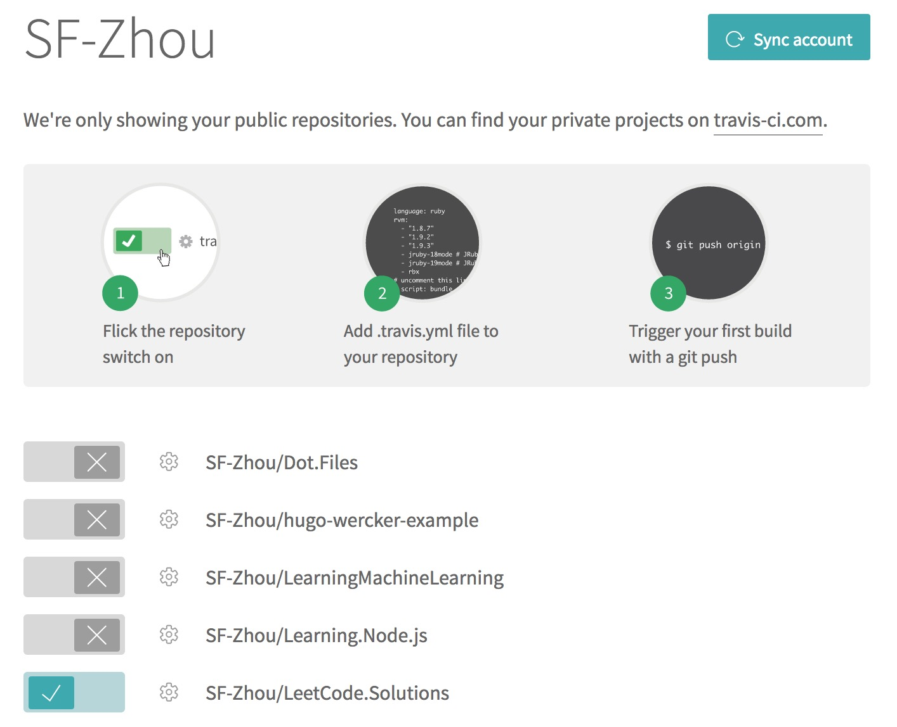
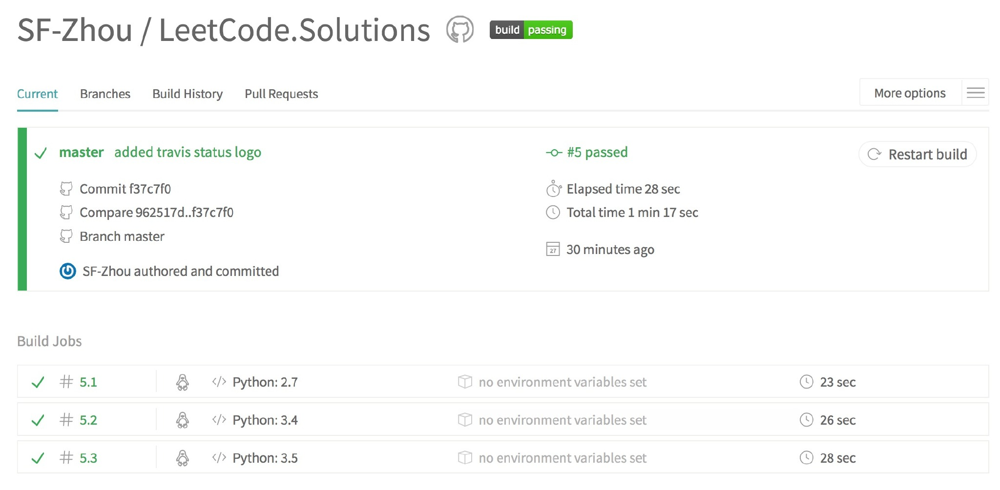
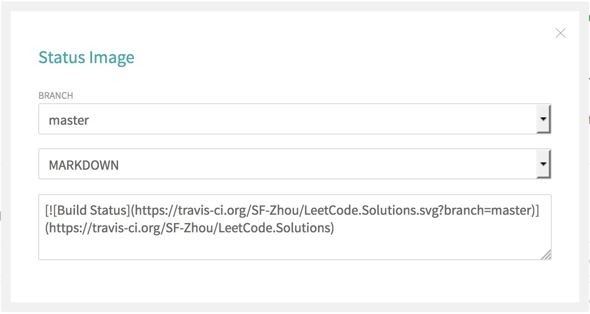
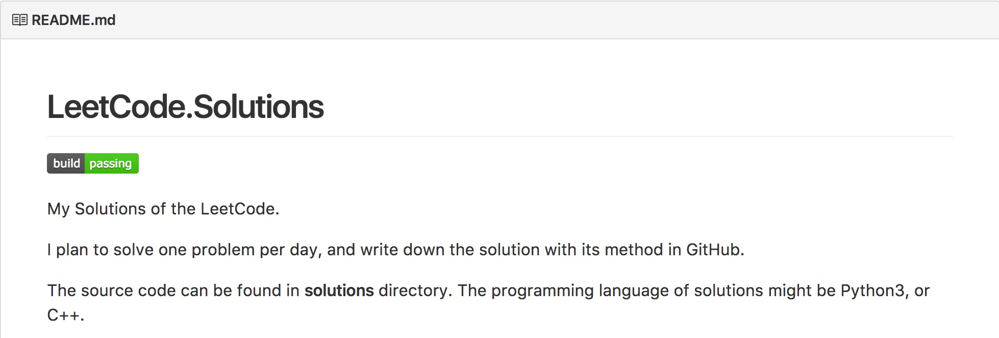
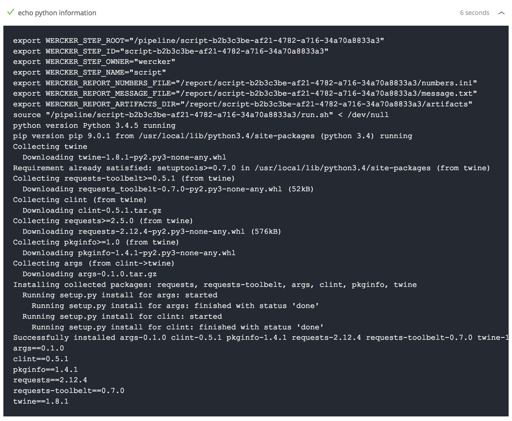
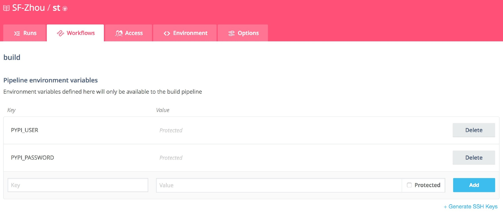
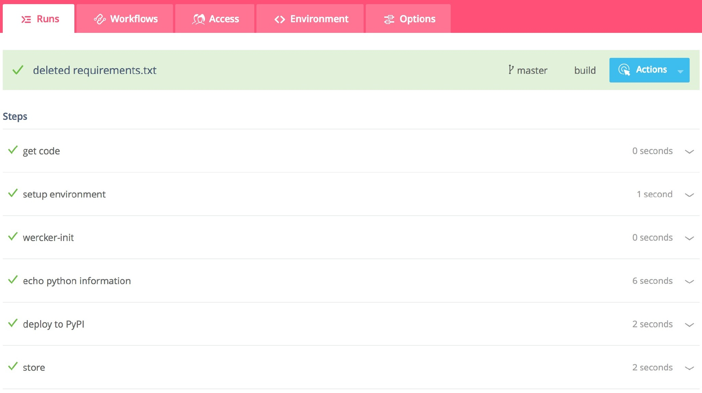
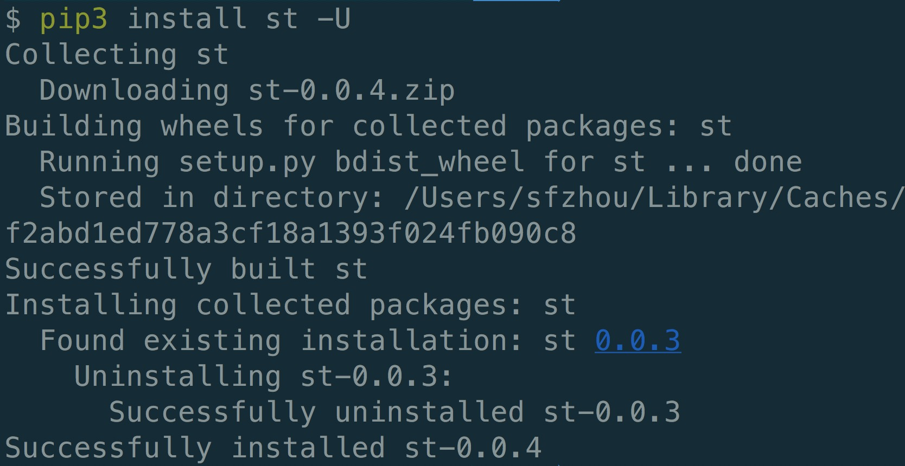

# GitHub CI & CD 体验

GitHub 作为全球最大的“同♂性♂交友平台”，在用户体验方面全球无出其右。在自动化测试、部署和集成的工具集成上也做得也相当出色。今天就来一次自动化工具的初体验。

### 1. 持续集成工具：[Travis](https://travis-ci.org/)

首先简单介绍一下持续集成（Continuous Integration，CI）。

> 持续集成指的是，频繁地将代码集成到主干。 —— 阮一峰

可以参考博文：[持续集成是什么？](https://www.ruanyifeng.com/blog/2015/09/continuous-integration.html)

Travis 就是一款著名的持续集成工具。它的图标是一个可爱的工人。


使用 GitHub 登录后，选择要进行自动化测试的项目。



然后在项目根目录下编写`.travis.yml`文件。针对 Python 的一个配置文件样例如下：

```yaml
language: python
python:
    - "2.7"
    - "3.4"
    - "3.5"
script:
    - python -m pytest
```

python 中可以设置需要测试的版本号。script 部分写具体的测试步骤，这里直接使用 pytest 模块。配置文件的规则更详细的介绍点[这里](https://docs.travis-ci.com/user/languages/python/)。

提交该配置文件后，Travis 便会开始自动开始多环境下的测试工作。



测试都完成后，就会显示绿色的 passing 图标啦。点击这个图标，可以生成对应的外链。



可以把这个外链放到项目的 readme 文件中。这里使用的是 MarkDown 格式的。



回过头来看项目的 readme，就有美美哒的绿色小图标了。

每一次 push 代码后，都会触发自动化测试，而 readme 文件上的图标也会显示最新一次的测试结果。针对多系统、多环境下的测试就方便了很多，极大地降低了程序猿的手工劳动。

而测试通过也意味着该分支的代码可以加入主干了。当然这也要求项目的测试覆盖率达到指定的要求。在理想状态下可以认为，跑完所有测试的代码就是没有 BUG 的、可以交付的代码。而持续集成则可以让我们更轻松地维持代码通过所有测试的状态。

Excited！

### 2. 持续集成部署工具：[Wercker](https://www.wercker.com/)

除了测试，有些项目还需要我们做其他操作，例如：构建、打包、部署等。

举个🌰栗子，我有一个自己编写的 Python 包，名叫 [st](https://github.com/sf-zhou/st)，是我自己常用的一些函数和工具的集合，托管于 GitHub 和 PyPI，支持 pip 安装。我希望每次在 GitHub 上提交代码后，都能自动的把最新的代码打包好，并推送到 PyPI 上，这样 PyPI 上一直都会是最新的包了，并且也不用我自己构建、打包、上传了（虽然也就是一行指令）。

Wercker 可以帮助我们实现上面的自动化操作。以下内容参考了博文：[Deploying Python Packages To PyPI With Wercker](https://blog.wercker.com/deploying-python-packages-to-pypi-with-wercker)。

首先在项目中加入配置文件 `wercker.yml`，以下是我自己项目中的配置文件：

```yaml
box: python:3.4-slim
build:
    steps:
        - script:
            name: echo python information
            code: |
                echo "python version $(python --version) running"
                echo "pip version $(pip --version) running"
                pip install twine
                pip freeze
        - script:
          name: deploy to PyPI
          code: ./deploy.sh
```

简单解释一下。第一行 `box: python:3.4-slim` 指定配置文件执行的环境。例如可以使用纯粹的 Ubuntu，或者指定 Python 的使用版本等。这里指定了环境为 virtual env 下的 python 3.4 环境。其他环境可以参考 Wercker 的 [Registry](https://app.wercker.com/explore)。

接下来是 `build` 部分，有两个 `steps`。第一步执行打印信息，打印当前的 Python 版本和 pip 版本，并且安装了 twine，打印了安装了的 Python 包。具体执行时，打印的信息如下：



标题为我们设定的 name，打印内容上可以看到 Python 版本为 3.4.5，pip 版本为 9.0.1。而我们需要安装的 twine 也安装好了。

接下来，执行了 deploy.sh 脚本。该脚本将完成最终的 build 和 deploy 过程，如下：

```sh
echo "[server-login]" > ~/.pypirc
echo "username:" $PYPI_USER >> ~/.pypirc
echo "password:" $PYPI_PASSWORD >> ~/.pypirc
echo "[distutils]" >> ~/.pypirc
echo "index-servers=pypi" >> ~/.pypirc
echo "[pypi]" >> ~/.pypirc
echo "repository = https://pypi.python.org/pypi" >> ~/.pypirc
echo "username =" $PYPI_USER >> ~/.pypirc
echo "password =" $PYPI_PASSWORD >> ~/.pypirc
python3 setup.py sdist --formats=zip
python3 -m twine upload dist/* --skip-existing
```

前面数行为 PyPI 要求的配置文件内容，包括上传的链接、PyPI 上的用户名和密码。这里用户名和密码用 `$PYPI_USER` 和 `$PYPI_PASSWORD` 表示，需要用户自己设置它们的值。

```sh
python3 setup.py sdist --formats=zip
```

使用上面的指令完成源代码的打包工作，打包格式为 zip。接下来执行：

```shell
python3 -m twine upload dist/* --skip-existing
```

使用 `twine` 包将 dist 目录下所有的包上传。注意 `--skip-existing` 选项，PyPI 上如有已经有相同文件名的包，则无法覆盖上传。故而这里的处理是如果存在同名文件，则跳过。

对于用户名和密码，我们肯定不希望在 GitHub 上公开了。Wercker 提供了环境变量的功能，在 Workflows 页面的 build 步骤中加入这两个环境变量和对应的值即可。



在 Wercker 上建立项目，关联 GitHub 上的项目，然后将代码 push 到 GitHub 上，Wercker 将自动触发 build 流程。



等待执行完成后，PyPI 上就会有最新的 st 包了！而我们每一次推送代码都会触发上面的流程，这样 pip install st 总会安装最新的包。


唯一需要注意的是，修改代码后，需要修改对应的版本号，否则对于同名文件，PyPI 并不会进行覆盖。



而修改版本号提交后，会打包成新的包。再次使用 pip 安装，可以看到已经是新的版本号 0.0.4 了。
