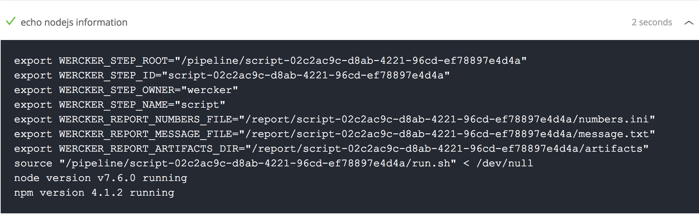

# Node v7.6.0 发布

Node V7.6.0 于 2017 年 2 月 21 日[正式发布](https://github.com/nodejs/node/blob/master/doc/changelogs/CHANGELOG_V7.md#2017-02-21-version-760-current-italoacasas)！

我在逛知乎的时候无意间看[别人提起了这个](https://www.zhihu.com/question/24847805/answer/148714624)。这次更新，带来的最大变化是，将 JavaScript 的 V8 引擎升级到了 [5.5](https://v8project.blogspot.co.id/2016/10/v8-release-55.html) 版本。5.5 版本的 V8，带来的最大特性是原生支持 async/await，而我一直是 async/await 的重度使用者！并且 babel 给我代码的改变也只有 async/await！Node 的这次更新，无疑可以让我摆脱 babel 家族了。所以，自己的开发环境、项目和网站也要依次更新。

## 本地开发环境

MacBook 直接执行：

```shell
brew upgrade node
```

对于项目，之前一直是使用 babel + babel-register，自己编写启动脚本 `start.js`，类似于：

```javascript
require("babel-register");
require("./main.js");
```

并且在 `package.json` 中，将字段 main 设置为 `start.js`。

新版本 Node 下可直接删除 `start.js`，将字段 main 重新设为 `main.js` 即可。

移除 babel，可执行：

```shell
npm rm [babel家族] --save-d
rm .babelrc
```

最后用 Git 提交代码即可。

## 服务器环境

穷学生，有一台每个月 1 元的腾讯云服务器，装有 Ubuntu 14.04，上面配置了一个基于 Node + Express 的网站。

升级 Node：

```shell
sudo apt-get install nodejs
```

服务器上项目使用 pm2 管理的，现在就需要把 pm2 中的项目重启下。先把更新的项目代码拉下来，再执行：

```shell
sudo pm2 stop project_id
sudo pm2 start [original_entry]
```

测试通过后，可以把原先 project_id 删除。

## 持续集成环境

本博客是基于 GitHub Pages + Wercker 实现的，Wercker 上使用 Node 编译 MarkDown 为静态 HTML 页面，这里也使用了 async/await。那么首先要确定 Wercker 上使用的 Node 版本。

Wercker 配置文件中加入打印 Node 版本的流程：

```yaml
- script:
    name: echo nodejs information
    code: |
      echo "node version $(node -v) running"
      echo "npm version $(npm -v) running"
```

提交使 Wercker 触发执行，然后观察 Wercker 在 build 过程中的输出。



好在 Wercker 十分与时俱进，Node 版本更新够快。所以可以放心地把博客中的 babel 相关文件也删除了。

## 结束

移除 babel 后，最明显的变化是启动速度快了很多。

送走 babel，感谢在没有原生 async/await 支持的时候给我带来的效率提升。

收工。