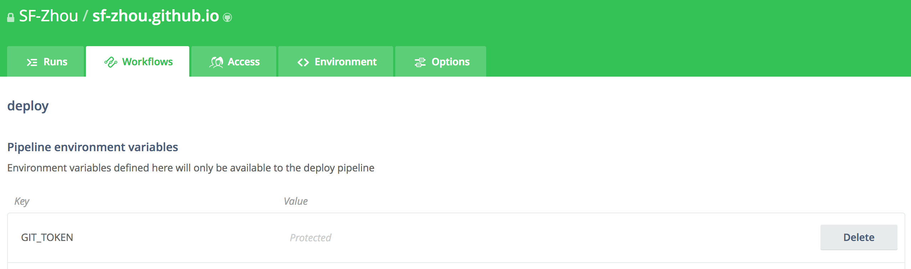
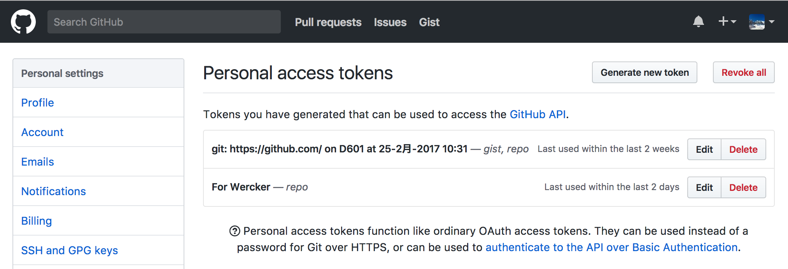
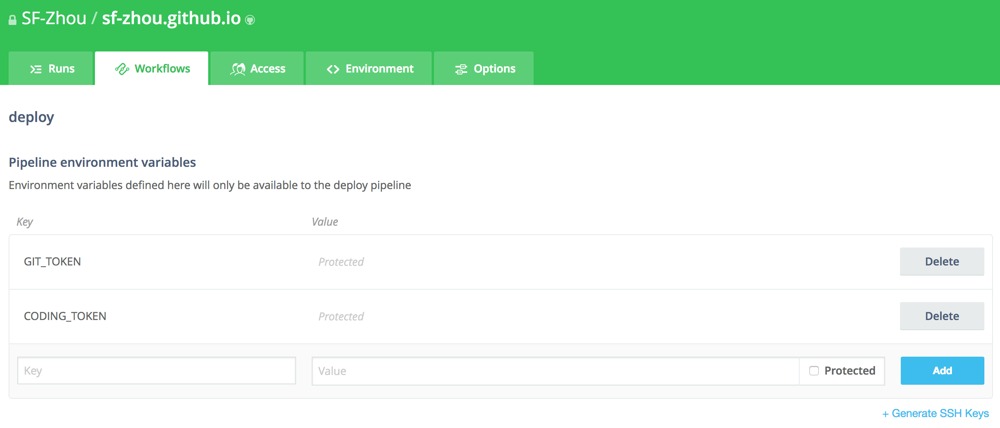
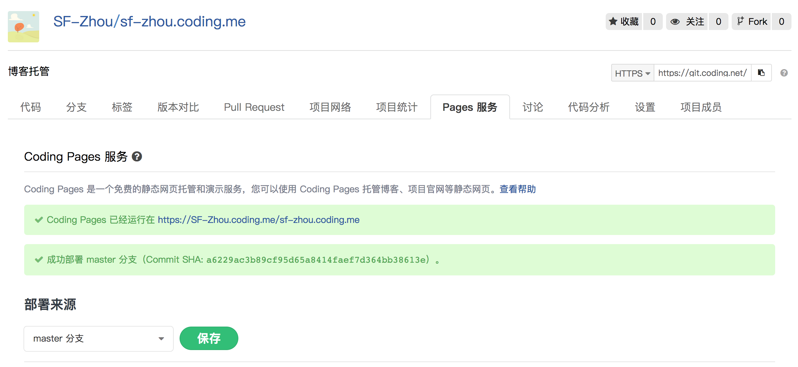
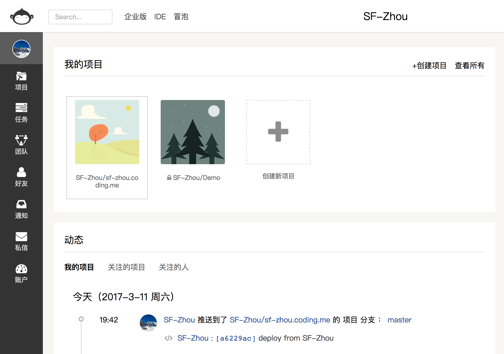

# Coding.net 上博客的同步部署

[Coding.net](https://coding.net)，可以看作是国产的 GitHub。本博客当前部署于 GitHub Pages 上，然后有些时候因为“网络”的原因，一般情况下并不能直接访问该博客。而使用国内的 Pages 服务自然就没有什么大问题了。故而这里考虑同时将博客部署到 GitHub 和 Coding.net 上。

### 当前的部署步骤：

1. 提交代码到 GitHub 上；
2. Wercker 自动获取到 commit，执行 build 步骤，生成静态站点；
3. 执行 deploy 步骤，读取关键信息，包括项目名、提交地址以及个人访问 Token，依此将静态站点的所有文件提交到 GitHub 上。

deploy 过程中，使用的是 [lukevivier/gh-pages](https://github.com/lvivier/step-gh-pages) 步骤。该 step 使用 token 参数读取 Personal Access Tokens。

```yaml
deploy:
    steps:
        - install-packages:
            packages: git ssh-client
        - sf-zhou/gh-pages@0.2.6:
            token: $GIT_TOKEN
            basedir: public
            branch: master
```



该 Token 可以在 GitHub 的[设置项](https://github.com/settings/tokens)中生成。



### 提交到 Coding.net 的步骤

查看了一遍 Coding.net 的设置项，并没有找到对应的 Token 项，所以没法直接使用上面的方法了。不过，这个 Token 我们也可以换成用户名和密码的串，类似于 `username:password`。安全性的话，我还是相信 Wercker 的（主要是 Coding.net 我并不放其他东西……）。

在 Wercker 的 deploy 步骤中，加入 CODING_TOKEN 变量，格式如上所述。例如用户名为：Alice，密码：password，就填写："Alice:password"。



勾选 protected，更加安全 :D

另外，[lukevivier/gh-pages](https://github.com/lvivier/step-gh-pages) 是针对 GitHub 中的库的，没法直接提交到 Coding.net 中。这里在 [lukevivier/gh-pages](https://github.com/lvivier/step-gh-pages) 的基础上，增加了一些属性，包括用户名、邮箱和提交的站点，[发布到 Wercker 上了](https://app.wercker.com/applications/58942d18c668d5010033c6c0/tab/details/)。

最后 deploy 步骤的配置文件如下：

```yaml
deploy:
    steps:
        - install-packages:
            packages: git ssh-client
        - sf-zhou/gh-pages@0.2.6:
            token: $GIT_TOKEN
            basedir: public
            branch: master
        - sf-zhou/gh-pages@0.2.6:
            user: SF-Zhou
            email: sf-zhou.scut@gmail.com
            server: git.coding.net
            repo: sf-zhou/sf-zhou.coding.me
            token: $CODING_TOKEN
            branch: master
            basedir: public
```

配置文件中均为可以公开的内容，可以放心提交。

在 Coding.net 中建立对应的项目，项目名为 `${username}.coding.me`，打开对应的 Pages 服务：



做好一切，将代码提交到 GitHub 即可。因为 Wercker 的服务器在国外，部署到 Coding 的时间稍微久一点，可以同步看 Wercker 的输出内容，没有问题即可。



最后，就可以看到 Coding.net 上推送成功的消息了。访问 https://${username}.coding.me/ 测试即可。本博客的国内镜像站点就是 https://sf-zhou.coding.me。