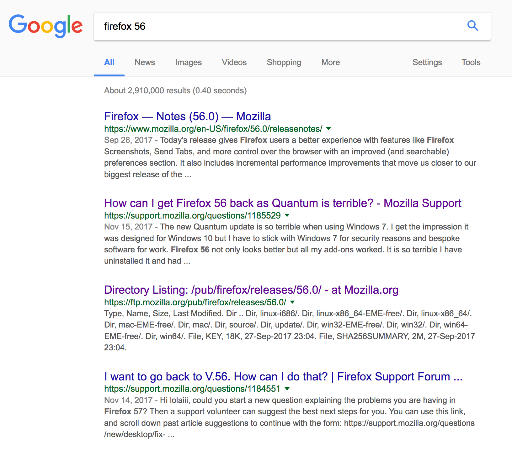
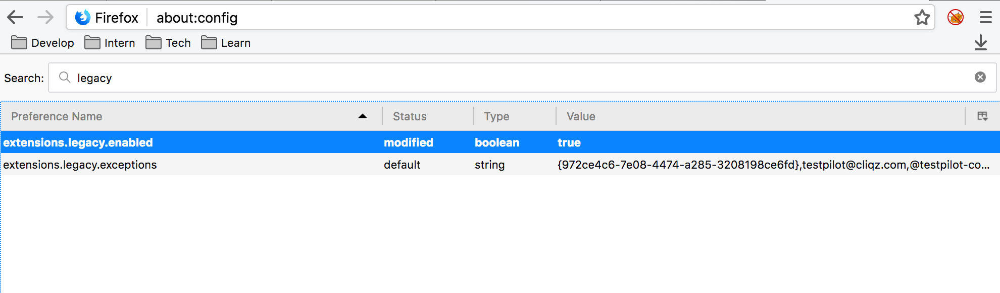
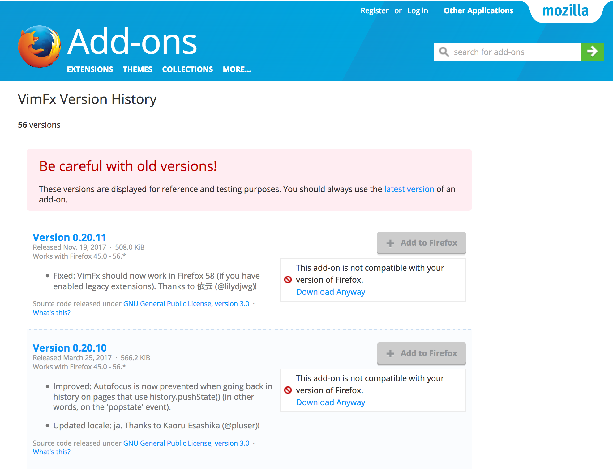

# Firefox Quantum 57 降级指南

去年 11 月中旬的时候，收到了来自 Firefox 的一封邮件：

> **The new Firefox, Fast for good.**
>
> Today we're thrilled to introduce you to our brand new browser — Firefox Quantum.
>
> What you'll notice first is that the new Firefox is blazing fast. In fact, you'll enjoy speeds up to twice as fast as a year ago. It's also more powerful. We've rebuilt Firefox from the ground up to focus on how you use the Web today to watch, listen, create and play without limits. We're excited to deliver a browser that feels completely different — modern, quick and efficient. We think you'll agree: It's a quantum leap forward in how you'll experience the internet.

大意就是，发布了新版本 Quantum，更快更强。笔者的 Firefox 一直是自动更新，升级到新版本后，确实能看到变化：包括界面、设置、标签页等。然而笔者并不是特别关心这些，带来的新问题也不是笔者想要的：

1. VimFx 不能使用了；
2. FoxyProxy 换新版后也不好用了。

### 适应

对于各类新版本，笔者一向是包容有耐心的。所以首先是适应。

查找 VimFx 插件，看到作者写明了：

> Note: VimFx is a legacy Firefox extension, which is not compatible with Firefox 57+. (And **never** will be.)
>
> VimFx won't be updated to work with newer Firefox versions, because it is a big task that nobody has felt like tackling. However, the source code is free, so if you feel like giving it a shot you can totally do so!

这个 Never 真是让人绝望。还好作者非常良心地提供了 Replacement。笔者都体验了一下之后，选择了 Vimium-FF。

对于 FoxyProxy，换上新版后确实不适应，但是笔者也没动它，因为正常情况下笔者都是选择 Disable 模式的。Firefox 在网络设置里有 Proxy 的设置，而笔者在下面自己建了白名单。所以正常情况下都是走代理，白名单里的国内网站走直通。有时候白名单没有的，就切到大家一般使用的黑名单模式。然而新版的用起来总是怪怪的。

### 降级

最后选择降级的原因，主要还是 Vimium-FF 不好用，详细原因如下：

1. 该插件基于 JavaScript，在网页加载完成后才会响应；
2. 对于 Firefox 原生的地址栏没有很好的支持；
3. Chrome 也有这个插件，那不如用 Chrome 得了。

降级的步骤也很简单：

1. 在 Firefox 的设置中搜索 Update，选择 Never check for updates；
2. 在 https://ftp.mozilla.org/pub/firefox/releases/56.0.2/ 中选择机器对应的版本，下载并安装。

56.0.2 已经是 Quantum 前最新的版本了，相信这个大版本也不会有小更新了。

至于不更新到最新版本的缺点，主要还是安全方面欠佳，以及失去了小 Bug 的修复。不过还能撑（Gou）个一年半载吧。

Firefox 这次确实是个大更新，插件也是随着这个大版本发生了巨大的变化。虽然在此大更新之前，Firefox 就在很多插件上标记了 Legacy。但是突然改变了用户习惯（起码笔者用 VimFx 度过了三年愉快的时光），而又没有提供合适的替代品，作为用户还是不易接受的。

### 柳暗花明

在 Firefox 56 上愉快了几天，收到了一条 Extension 更新的通知，内容大体如下：

> * [Version 0.20.11](https://addons.mozilla.org/en-US/firefox/addon/vimfx/versions/0.20.11)
> * Released Nov. 19, 2017 508.0 KiB
> * Works with Firefox 45.0 - 56.*
>
> Fixed: VimFx should now **work in Firefox 58** (if you have enabled legacy extensions). Thanks to 依云 (@lilydjwg)!

So，再次升级！

目前官方最新的 Release 版本是 57.0.4，这里说的 58 其实还是 [Beta 版](https://www.mozilla.org/en-US/firefox/58.0beta/releasenotes/)。不过没关系，下载安装就是了。

按照更新提示，需要开启 Legacy Extensions。在 Preference 中搜索 Legacy，并没有找到；所以尝试在地址栏中输入 about:config，弹出确认页，点击确定，继续搜索 Legacy：

双击，使其 Value 为 true。

下一步，找到 VimFx 并安装。点击[这里](https://addons.mozilla.org/en-US/firefox/addon/vimfx/versions/?page=1#version-0.20.11)，到达 VimFx 在 Firefox Add-ons 中的 Version 页面。选择最新版本，Download Anyway。

下载完成后，将下载的文件拖回 Firefox 58 Beta，会提示安装，Add 即可。

进而继续愉快的使用。等正式版升级到 58，笔者再切回去。

