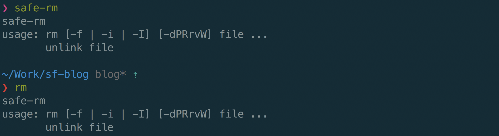
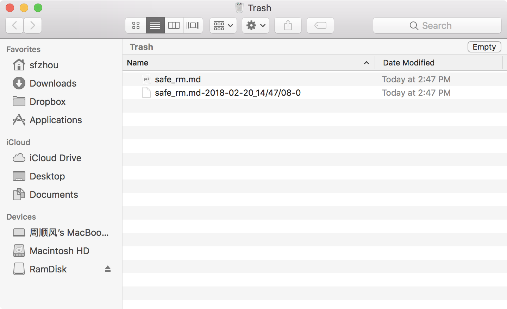

# 血与泪之后，使用安全的 rm 命令吧

偶尔头脑发热，在终端里敲错了命令、删错了文件，造成了不必要的损失。然而命令执行完了，已经很难挽回。

人总会犯错的，想要下次不犯也很难，所以还是靠机器好了。搜索了一下，已经有大神研发了安全的删除命令了，[safe-rm](https://github.com/kaelzhang/shell-safe-rm)。

该删除命令接受的参数与 Mac 中自带的删除命令一致，在执行时并不会真的把文件删除，而是移动到 `~/.Trash` 路径下。该路径下的文件同时也会出现在垃圾桶中。



如果发现删除错了文件，可以在垃圾桶中恢复；偶尔可以手动清空一下垃圾桶。

另外如果删除的项目中有重名的文件和文件夹，该命令会自动为重名的文件名增加日期进而方便用户区分，并不会直接覆盖掉，可以放心使用。

```bash
touch safe_rm.md
safe-rm safe_rm.md

touch safe_rm.md
safe-rm safe_rm.md
```



### 安装和配置

使用以下命令安装：

```bash
npm i -g safe-rm
```

安装完成后在终端执行 `safe-rm` 进行测试，而后在自己的 `~/.bashrc` 文件中加入：

```bash
alias rm='safe-rm'
```

笔者使用 `zsh`，所以在自己的 `~/.zshrc` 中加入了：

```bash
alias rm='safe-rm'
alias rd='safe-rm -rf'
```

其中的 `rd` 命令方便删除文件夹。

配置完成后新建一个 Terminal 或者使用 `source ~/.zshrc` 重新载入配置文件，而后使用下面的命令测试：

```bash
where rm
```

理论上的输出应该是：

```bash
rm: aliased to safe-rm
/bin/rm
```

至此配置完成，可以使用 `rm` 删除文件进行测试了。另外如果希望使用原版的 `rm` 命令，可以使用 `/bin/rm`。

