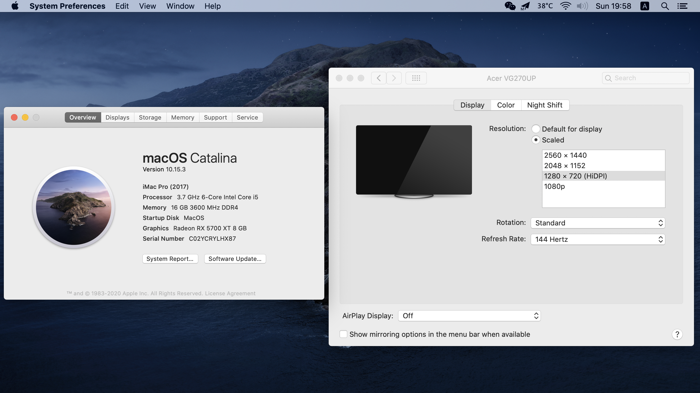
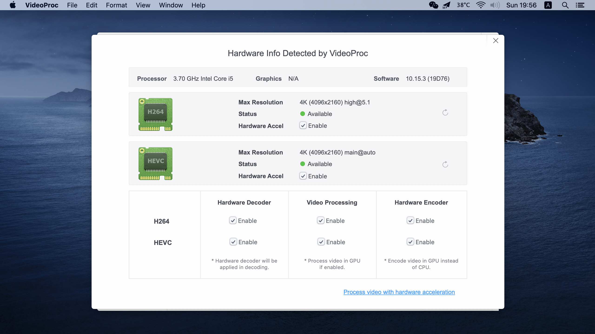

# My Hackintosh 2020.02.29

### 1. 配置

|      |                             型号                             |   价格    |
| :--: | :----------------------------------------------------------: | :-------: |
| CPU  |   [Intel i5-9600KF](https://item.jd.com/100003026162.html)   | 主板套装  |
| 主板 | [华擎 Z390 Phantom Gaming-ITX/ac](https://item.jd.com/100008214786.html) | 京东 2750 |
| 固态 |   [西部数据 SN550](https://item.jd.com/100005926991.html)    | 京东 830  |
| 显卡 | [蓝宝石 RX 5700XT 8G D6 白金版OC](https://item.jd.com/100007306846.html) | 京东 2900 |
| 电源 |       [海盗船 SF600](https://item.jd.com/2654964.html)       | 京东 800  |
| 屏幕 |  [宏碁暗影骑士 VG270U P](https://item.jd.com/8066711.html)   | 京东 1950 |
| 内存 | [海盗船 DDR4 3600 8GB * 2](https://detail.tmall.com/item.htm?spm=a220o.1000855.0.da321h.428e23fchfWFSU&id=609089192845&skuId=4454194051052) | 淘宝 600  |
| 网卡 | [BCM94360CS2](https://item.taobao.com/item.htm?spm=a1z09.2.1997525049.3.69eb2e8dnfrpXr&id=609745593184) + [转接卡](https://item.taobao.com/item.htm?spm=a1z09.2.0.0.69eb2e8dnfrpXr&id=606077440886&_u=mmj2a55959e) | 淘宝 150  |
| 散热 | [ID-Cooling IS-60 55mm](https://item.taobao.com/item.htm?spm=a1z09.2.0.0.69eb2e8dnfrpXr&id=612430071510&_u=mmj2a55dae4) | 淘宝 131  |
| 机箱 | [Sunmilo T03](https://item.taobao.com/item.htm?spm=a1z09.2.0.0.69eb2e8dnfrpXr&id=572918958857&_u=mmj2a550fc2) | 淘宝 839  |
| 延长 | [ADT 显卡延长线双反向 185mm](https://item.taobao.com/item.htm?spm=a1z09.2.1997525049.6.4d362e8dnSOV8f&id=561003619490) |  淘宝 90  |
| 合计 |                                                              |   11040   |

### 2. 安装

直接使用了这个 [EFI](https://github.com/fangf2018/ASRock-Z390-Phantom-ITX-OpenCore-Hackintosh)，安装好后使用 `OpenCore Configurator` 将机型修改为 `iMacPro1,1` 以支持显卡硬件加速。

显示器是 2K 144Hz IPS 的，可以使用[工具](https://comsysto.github.io/Display-Override-PropertyList-File-Parser-and-Generator-with-HiDPI-Support-For-Scaled-Resolutions/)开启 HiDPI，然后纵享 144 Hz Retina 的顺滑。

### 3. 效果

### 4. 超频

BIOS 里折腾了下超频，不改变电压的情况下 CPU 全核心最高睿频设为 4.7GHz（默认 4.3GHz），不改变时序的情况下内存超到 3900MHz，跑 Geekbench 5 还是很稳的。

再往上 CPU 4.8GHz 跑 Geekbench 5 会跪掉，加电压肯定会升温，小风冷不太行就算了。内存 4000MHz 跑 MemTest 很稳，但是玩游戏会崩掉，懒得改时序了。

最近发现 CPU 4.7GHz 压测时能涨到 85 度，小风冷压不住，先调回 4.3GHz 了，等京东做活动上个 240 水冷吧，上 EK AIO 240 感觉还能再超一超。

