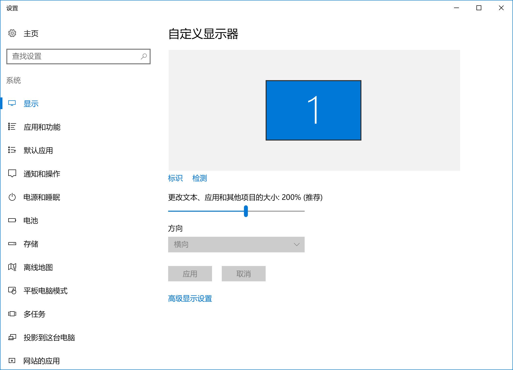
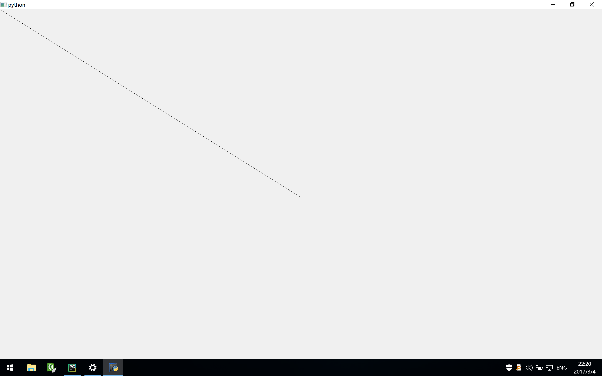
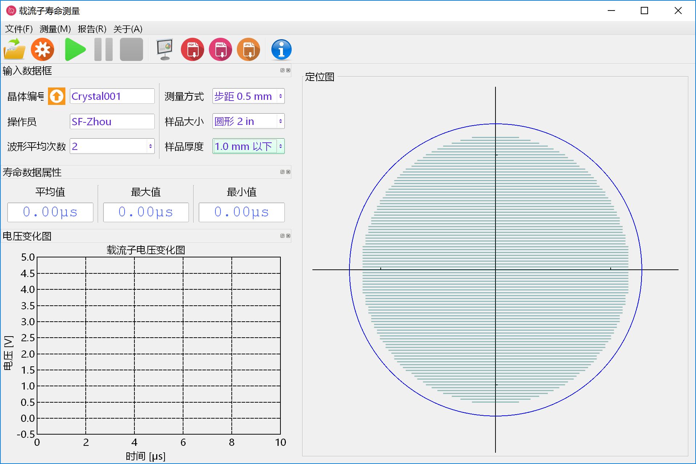
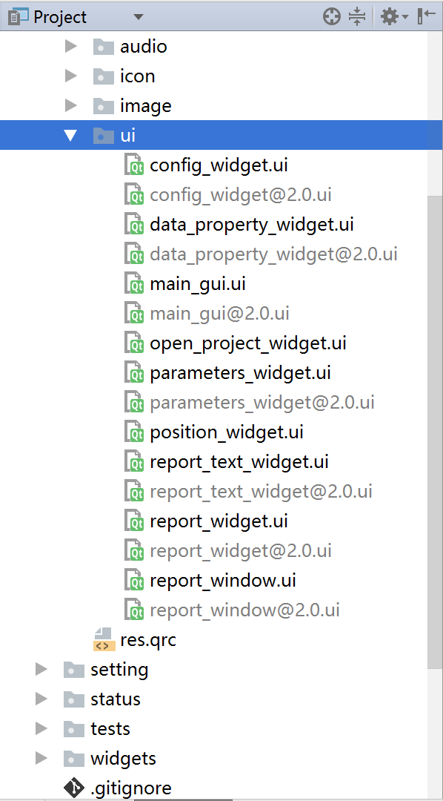

# Windows 下 PySide 对 HiDPI 的支持

至今为止，Windows 下很多应用对高分屏仍然没有很好的适配。对于 PySide 这样一个很久没人维护的包来说更是如此。而我自己有项目就是基于 PySide 的，而目前常用的开发设备是一台 MacBook，Retina 屏幕。

在 Parallel Windows 虚拟机下，我可以关闭 Retina 的支持，然而显示效果无法直视；如果打开 Retina 支持，之前设计的 PySide UI 界面又会变得一团糟。进而，我只有对 PySide 做一些改造了。

### 为什么选择 PySide？

Windows 下，Python 可用的 GUI 库并不多，基本有：

1. PyQt：很完美，但是 GPL 协议，商业使用收费；
2. PySide：有辅助 UI 设计工具 Qt Designer，协议 LGPL，但处于无人维护的状态，有很多 BUG；
3. Tkinter：Python 自带，但太过简单；
4. wxPython：不支持 Python3（更新：如今已经支持了）。

这么来看的话，想要免费开发私有应用并且达到一定的可用性，PySide 是唯一的选择了。

## 1. 改造之前 

改造之前，我们需要做一些准备工作：

1. 分析 Windows 下应用对 HiDPI 的适配原理；
2. 分析 PySide 开发 GUI 应用的流程；

### 1.1 Windows 下 HiDPI 实现原理



高分屏下，Windows 桌面右键菜单中，点击“显示设置”，可以看到“更改文本、应用和其他项目的大小”并非是 100%，我这里是 200%。进行一些其他尝试后，可以确定，Windows 使用这个缩放比例，对矢量图形进行了按比例的缩放。例如 12 号的字体，所占的像素点数则是 100% 情况下的两倍。

而对应的像素点数仍然是没有变化的。这里我们做一个简单的实验：屏幕分辨率 $2880 \times 1800$，缩放比例 200%，自定义绘图控件：

```python
class CustomWidget(QWidget):
    def paintEvent(self, *args, **kwargs):
        painter = QPainter(self)
        painter.drawLine(0, 0, 1440, 900)
        painter.end()
```

显示这个自定义的绘图控件，得到的结果如下：



绘制 $(0, 0)\rightarrow (1440, 900)$ 线条，差不多能显示到屏幕一半的位置。也就是说，Widget 中绘制的像素数仍然是分辨率所示的那么多。

而对于文字，同样是 12 号的字体，200% 的缩放比例下其显示大小是 100% 的两倍。进而问题就出现了：矢量的图像和字体得到了缩放，使用像素确定位置和大小的非矢量元素如图片、控件等没有得到缩放，整个界面就乱了。

### 1.2 PySide 开发 GUI 应用流程

开发流程基本如下：

1. 使用 Qt Designer 设计 GUI 的基本框架；
2. 使用 Python 配合 QWidget 实现自定义显示的 Widgets；
3. 创建 UI Controller 整合 Qt Desinger 设计的 UI 文件和自定义 Widgets；
4. 加入其它处理逻辑。

如果要进行 HiDPI 的适配，Qt Designer 设计的 UI 文件以及自定义的 Widgets 需要进行适当的改造。

## 2. 改造中

改造的过程中，我们需要完成以下几步：

1. 在应用中获得缩放比例；
2. 适配自定义控件；
3. 适配 UI 设计文件。

### 2.1 在应用中获得缩放比例

Google 搜索，使用 Python 获取缩放比例的方法不多。帖子[《Qt界面开发时如何处理不同DPI，有没有什么技巧？》](http://www.dewen.net.cn/q/14485/Qt%E7%95%8C%E9%9D%A2%E5%BC%80%E5%8F%91%E6%97%B6%E5%A6%82%E4%BD%95%E5%A4%84%E7%90%86%E4%B8%8D%E5%90%8CDPI%EF%BC%8C%E6%9C%89%E6%B2%A1%E6%9C%89%E4%BB%80%E4%B9%88%E6%8A%80%E5%B7%A7%EF%BC%9F)里提到，可以使用 PyWin32 计算获得。尝试后发现确实可行，然而需要安装 PyWin32 包，并且这个包无法用 pip 直接安装，而是需要下载 EXE 安装包文件，故而并不方便。

这里提供一种直接使用 PySide 判断的方法：

> Qt 中提供计算绘制文本所占大小的类 QFontMetrics，不同缩放比例下同样字体的文本显示占用的像素数是不同的。获得 100% 缩放比例下的基准像素数，计算当前所占的像素数目，相除可得缩放比例。

例如，100% 缩放比例下，1000 号的 *Courier New* 字体，一个字母所占的宽度是 800 像素。进而计算缩放比例的代码如下：

```python
base = 800.0  # the width of a character when dpi = 96
font = QFont('Courier New')
font_metrics = QFontMetrics(font)
width = font_metrics.width('Q')
ratio = width / base
```

使用 1000 号字体作为基准比例的原因是，字体所占像素数多为整数，小字体所占像素数会有四舍五入，使用大号字体计算更加准确。

### 2.2 适配自定义控件

有了缩放比例，适配自定义控件也简单了很多。需要我们手动计算缩放的主要是各种尺寸，比如图形大小、线宽以及间距等。以前 1 个像素宽度的线条，现在要占用 2 个像素。进而把各种尺寸量乘上缩放比例即可。

如果想一劳永逸，可以对 QPainter、QPen 等进行一次封装，将乘上缩放比例的任务写入封装函数内。

### 2.3 适配 UI 设计文件

首先研究下 Qt Designer 生成的 UI 文件。100% 缩放比例下，创建一个新的 UI 文件，加入少量控件。保存，使用 Notepad++ 打开该文件，是一个典型的 XML 文件：

```xml
<?xml version="1.0" encoding="UTF-8"?>
<ui version="4.0">
 <class>config_widget</class>
 <widget class="QWidget" name="config_widget">
  <property name="geometry">
   <rect>
    <x>0</x>
    <y>0</y>
    <width>370</width>
    <height>528</height>
   </rect>
  </property>
  <property name="font">
   <font>
    <family>微软雅黑</family>
    <pointsize>11</pointsize>
   </font>
  </property>
  <property name="windowTitle">
   <string>设定</string>
  </property>
  <layout class="QVBoxLayout" name="verticalLayout_5">
   <property name="spacing">
    <number>3</number>
   </property>
   <property name="topMargin">
    <number>3</number>
   </property>
   <property name="bottomMargin">
    <number>9</number>
   </property>
    ...
```

可以看到，XML 文件里保存了该窗体的像素点大小、边缘大小，以及使用的其他子控件。假设进行缩放，我们需要对 XML 文件中的各种大小进行缩放，并加载缩放后的内容。

PySide 中提供了动态加载 UI 文件的工具 `QtUiTools.QUiLoader`。在加载 UI 文件前，可以使用 XML 解析工具处理各种大小的缩放，处理代码如下：

```python
from xml.etree import ElementTree


def process_scaling(ui_content: str, ratio: float) -> str:
    tree = ElementTree.fromstring(ui_content)
    for child in tree.iter('width'):
        if child.text != '16777215':
            child.text = str(int(int(child.text) * ratio))
    for child in tree.iter('height'):
        if child.text != '16777215':
            child.text = str(int(int(child.text) * ratio))
    for child in tree.iter("property"):
        name = child.attrib.get('name', None)
        if name == 'spacing' or name[-6:] == 'Margin' and len(child):
            number = child[0]
            number.text = str(int(int(number.text) * ratio))
    ui_content = ElementTree.tostring(tree, encoding='unicode')
    ui_content = ui_content.replace(' />\n', '/>\n')
    return '<?xml version="1.0" encoding="UTF-8"?>\n' + ui_content + '\n'
```

需要注意的几点：

1. 对所有 width 和 height 标签直接乘上缩放比例；
2. 16777215 是 Qt Designer 保存最大值的数值，直接保持即可；
3. 对于 spacing 或者 *Margin 的 property，需要对其子标签 number 中的数值缩放。

完成以上几步后，UI 文件也就可以正常的加载了。例如下图：



## 改造后

当前的改造方案仍然遗留了一个问题：如何使得 UI 文件可以在各种分辨率的屏幕中、各个缩放比例下顺利开发？

对于 200% 的缩放屏幕，直接设计的 UI 文件的大小就是当前屏幕中的像素大小，直接放到低分辨率屏幕中时 UI 就显得太大了。

故而，所有的设计应该以 100% 缩放比例为基准，在运行软件时针对不同的缩放比例进行缩放；而在开发时，同样以 100% 缩放比例为基准，对于 200% 的缩放比例，保存文件时进行逆向缩放。

上面的任务当然要自动化完成。[quite](https://github.com/sf-zhou/quite) 包中，首先会对项目中使用的 UI 文件创建出当前缩放比例下的缩放 UI；对缩放后的 UI 进行设计和修改，重新执行加载时会自动根据缩放 UI 更新 100% 比例下的 UI 文件；执行软件时再乘上缩放系数。



至此，在 HiDPI 下可以顺利地开发和运行 PySide GUI 应用了。