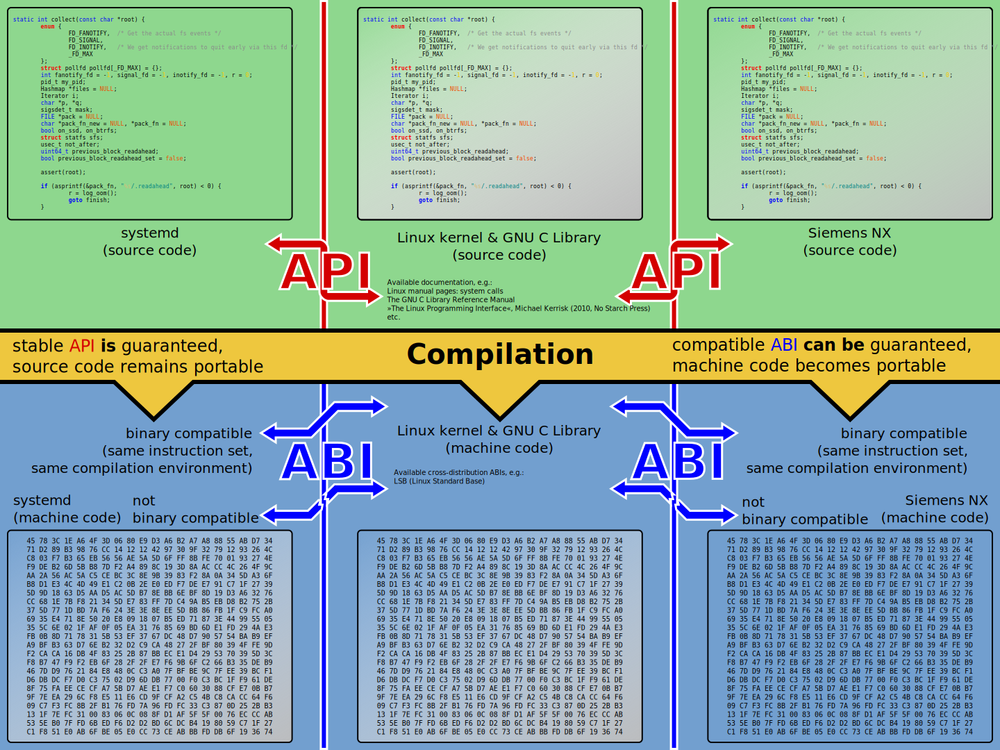

# Practices of C++ Core Guidelines

> [C++ Core Guidelines](http://isocpp.github.io/CppCoreGuidelines/CppCoreGuidelines), a set of core guidelines for modern C++ (currently C++17) taking likely future enhancements and ISO Technical Specifications (TSs) into account. The aim is to help C++ programmers to write simpler, more efficient, more maintainable code.

Today I was confused by the following: Why does our SDK have to use a C-style interface? For this, I looked up the documentation for the SDK and found that one of the core reasons is the ABI issue with C++. [Application binary interface](https://en.wikipedia.org/wiki/Application_binary_interface) (ABI) with C++ has been around for a long time, and there are no signs of improvement in the near future. To figure out this problem, I continue to look for relevant information. And finally, I found a great study material, [C++ Core Guidelines](http://isocpp.github.io/CppCoreGuidelines/CppCoreGuidelines).

It's a long guide, and I will read it carefully and practice it. The relevant code will store in [GitHub](https://github.com/FebruaryBreeze/cpp-core-guideline-practices).

### 1. ABI and PImpl

> An **application binary interface** (**ABI**) is an [interface](https://en.wikipedia.org/wiki/Interface_(computing)) between two binary program modules; often, one of these modules is a [library](https://en.wikipedia.org/wiki/Library_(computing)) or [operating system](https://en.wikipedia.org/wiki/Operating_system) facility, and the other is a program that is being run by a user.



>  ABIs cover details such as:
>
> 1. a processor instruction set
> 2. the sizes, layouts, and alignments of basic data tyeps
> 3. the [calling convention](https://en.wikipedia.org/wiki/Calling_convention)
> 4. how an application should make [system calls](https://en.wikipedia.org/wiki/System_call) to the operating system
> 5. the binary format of [object files](https://en.wikipedia.org/wiki/Object_file), program libraries and so on.

> Because private data members participate in class layout and private member functions participate in overload resolution, changes to those implementation details require recompilation of all users of a class that uses them. A non-polymorphic interface class holding a pointer to implementation (Pimpl) can isolate the users of a class from changes in its implementation at the cost of an indirection.

Example of `PImpl` in [**27_stable_library_abi_with_pimpl_idiom.cpp**](https://github.com/FebruaryBreeze/cpp-core-guideline-practices/blob/master/src/02_interfaces/27_stable_library_abi_with_pimpl_idiom.cpp):

```c++
#include <memory>

#include "gsl/gsl"
#include "gtest/gtest.h"

namespace {

class Widget {
  class impl;
  std::unique_ptr<impl> pimpl;

 public:
  void draw();  // public API that will be forwarded to the implementation
  Widget(int);  // defined in the implementation file
  ~Widget();    // defined in the implementation file, where impl is a complete type
  Widget(Widget&&) = default;
  Widget(const Widget&) = delete;
  Widget& operator=(Widget&&);  // defined in the implementation file
  Widget& operator=(const Widget&) = delete;
  size_t real_size();
};

// in cpp file
class Widget::impl {
  int n;  // private data
  int m;
  int t;

 public:
  void draw(const Widget& w) { std::cout << "Draw (" << n << ", " << m << ")" << std::endl; }
  impl(int n) : n(n), m(n - 7), t(n & m) {}
};

void Widget::draw() { pimpl->draw(*this); }
Widget::Widget(int n) : pimpl{std::make_unique<impl>(n)} {}
Widget::~Widget() = default;
Widget& Widget::operator=(Widget&&) = default;
size_t Widget::real_size() { return sizeof(impl); }

}  // namespace

TEST(interfaces, pimpl_idiom) {
  Widget widget(326);
  widget.draw();

  // the size of Widget is equal to size of std::unique_ptr
  ASSERT_EQ(sizeof(widget), sizeof(std::unique_ptr<void*>));
  // not equal to real object size
  ASSERT_NE(sizeof(widget), widget.real_size());
}
```

[To Be Continued]

### Referencese

1. [Application binary interface](https://en.wikipedia.org/wiki/Application_binary_interface), Wikipedia
2. [C++ Core Guidelines](http://isocpp.github.io/CppCoreGuidelines/CppCoreGuidelines), GitHub
3. [Pointer to implementation](https://en.cppreference.com/w/cpp/language/pimpl), CppReference

