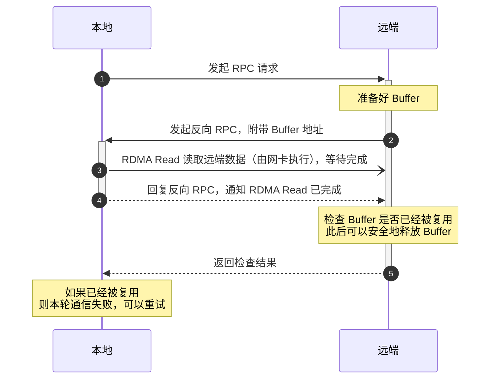
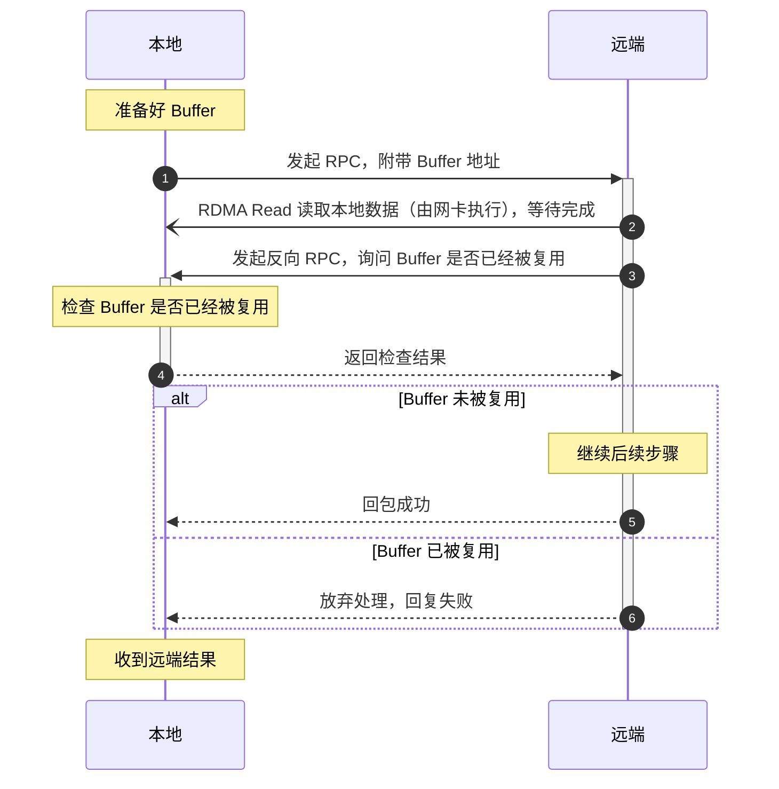
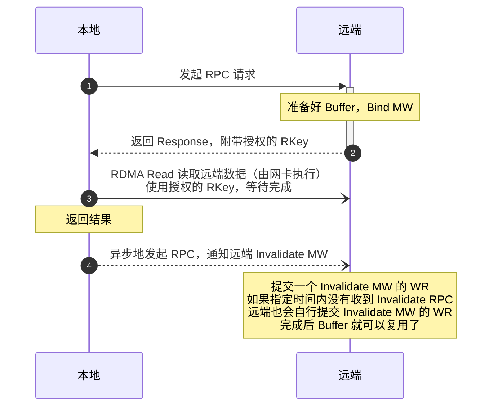
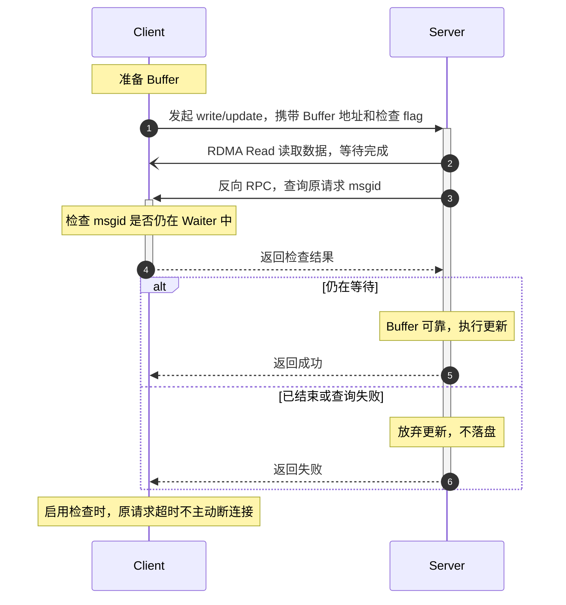
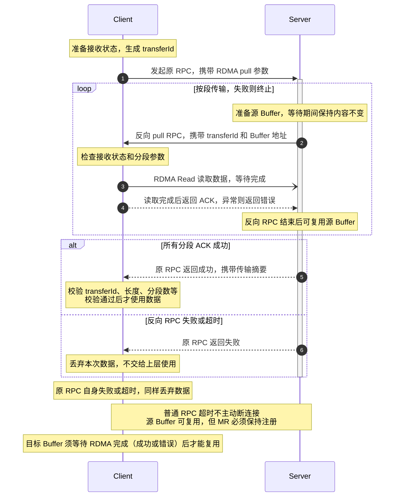

# 一种安全的 RDMA Buffer 复用策略

使用 RDMA Read/Write 时，首先需要交换已经注册过的 Buffer 地址，提交 Read/Write 任务，等待完成事件。为了尽可能的提高性能，一般不会每次都申请 Buffer 再去注册，而是一开始就准备好一批注册好的 Buffer，使用时从池子里取出，用完放回。但当意外发生时，例如请求超时了，此时如何处理这个 Buffer 就会成为一个麻烦的问题。

回顾一下 [3FS](https://github.com/deepseek-ai/3fs) 中的处理方式：

1. 所有 RDMA 操作都是由 Server 端发起，读 chunk 操作会执行 Server 端到 Client 端的 RDMA Write 操作，写 chunk 操作会执行 Server 端向 Client 端的 RDMA Read 操作；
2. 当 Client 端请求超时时，立即关闭当前通信的 RDMA 连接，也就阻止了这条连接上 Server 端后续可能的 RDMA Write/Read 操作，此时 Client 端的 Buffer 就可以安全的被复用、而不至于被远端的 RDMA 操作默默修改掉了。

这样做问题也很明显，当出现请求超时时，连接会断掉，下一轮请求会复用其他连接或者建立新连接，更容易触发下一轮的超时。有什么更好的办法吗？

仔细分析一下 RDMA Write/Read 的流程。首先 RDMA Write 操作，当本地将 Buffer 地址传播给远端后，远端如果准备执行 RDMA Write 操作，那么就有默默改变本地 Buffer 内容的能力，反注册或者断连接都是为了阻止这一步，如果这两种方法都不想使用，可以直接考虑不使用 RDMA Write。

再来看 RDMA Read，本地将 Buffer 地址传播给远端后，远端如果准备执行 RDMA Read，那么本地就必须保持 Buffer 处于安全、不被修改的状态，如果因为超时回收了 Buffer、后续其他操作修改了 Buffer 内容，远端**不知道**这件事，远端后续的数据正确性可能就出问题。换句话说，让远端知道这件事就行。

所以这里提出的安全复用策略就是：禁用 RDMA Write，RDMA Read 成功后向远端确认 Buffer 还未修改。下面详细介绍本地读远端的步骤：

远端读本地的步骤：

通过每次 RDMA Read 完成后，使用一次额外的 RPC 向对方确认 Buffer 是否已经被复用，来避免读到脏数据的可能。代价就是会多出一次 RTT。至于处理流程，则可以像上面两张图一样通过 Server 端给 Client 发反向 RPC 来简化，Server 端的处理步骤可以放到一个协程里顺序执行，[3FS RDMA Control](https://github.com/deepseek-ai/3FS/blob/main/src/common/net/RDMAControl.cc) 有类似的案例（实际上它也会增加一次 RTT😉）。

本质上，这套方案是在 One-sided RDMA + Two-sided RPC 的组合里，用 RPC 来弥补 RDMA 在 buffer 生命周期和错误语义上的不足。

### 进一步的讨论

笔者坚持不使用 RDMA Write 的另一个原因是，远端并发的 RDMA Write 会很容易触发网络上的拥塞。只有 RDMA Read 的话可以很方便地在应用层做 Receiver Driven 的流量控制，避免网络层拥塞。在 3FS 文件系统、KVCache 存储系统上都观察到这一现象：单靠网络层自身的拥塞控制算法是无法避免网络拥塞的。

所以本文中提到的策略实际上是在应用层上解决这两个问题：RDMA Buffer 的生命周期管理和网络拥塞控制。在应用层上做这两件事有一些好处：对 RDMA 网卡本身基本没有要求，不需要强制断掉 QP。

如果你的网络硬件环境很好，例如全 Mellanox 网卡，那么也可以试试我同事教我的另外一招：考虑使用硬件级的 Memory Window 来解决 RDMA Buffer 的生命周期管理问题。同样以本地读远端为例：

Type 2 的 Memory Window 可以将 Bind MW 操作和 RDMA Send 操作一并提交，这样这个请求过程只需要一次 RTT（Invalidate RPC 是异步的，不占用请求的延迟），延迟可以做的更低。极端情况下 Client 还没有来得及进行 RDMA Read，Server 已经超时并且 Invalidate MW 了，那么 Client 的 RDMA Read 操作会因为 MW 已经失效而失败，不会读到脏数据。同时 QP 会陷入错误的状态，需要重新建立连接。

如果你的网络环境不支持 Type 2 的 Memory Window（例如阿里云），本文提到的应用层的 Buffer 管理也仍然是一条可行的退路。笔者是希望将这两套策略都实现在 RPC 框架里，开箱即可用，用户可以根据不同的网络环境自行配置。当然我现在还没有时间完成它：https://github.com/SF-Zhou/ruapc

### 3FS 上线方案

最终决定将线上的 3FS 集群改造为超时不断连接的方案。对写操作改造是比较容易的：

1. 在 Client 端增加一个查询请求状态的服务，可以查询某个请求的 msgid 是否仍处于等待状态，如果处于等待状态则认为 Buffer 仍然是有效的（保持原有契约不变）；
2. 在 Server 端的 RDMA Read 之后调用上述接口，如果 msgid 仍在等待则说明 Buffer 一定是可靠的。

在 Client 端增加一个 feature flag 和开关，等 Server 端升级完启用开关就顺利上线了。

对读操作的改造是类似的：

1. 在 Client 端增加一个 RDMA Pull 的服务，整合之前的 RDMA Control 的逻辑，可以接收 Server 端传过来的 Remote Buffer 信息，并执行 RDMA Read 读取；
2. 在 Server 端将原先的 Apply Transmission + RDMA Write 换成上述的 RDMA Pull RPC 调用，在超时时间内返回则说明 Client 端的 RDMA Read 成功，否则直接返回失败；
3. 唯一要注意的情况是，当 Client 端请求超时时，仍然立即拿回 Buffer 的所有权。如果有 RDMA Read 在 in-flight，可以短时间内等待一下，还是拿不到的话仍然需要强制断连接（保持原有契约不变）。

